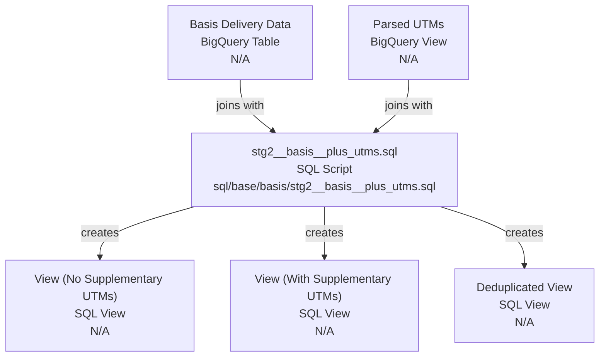
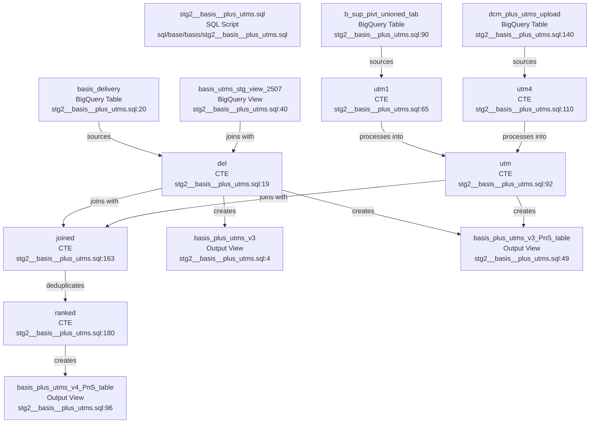

# Codebase Research Report

## Query
track dependancies in /Users/eugenetsenter/Looker_clonedRepo/looker_personal/sql/base/basis/stg2__basis__plus_utms.sql

## Answer
# Codebase Dependency Report

## High-Level Overview

This report details the dependencies of the SQL file [stg2__basis__plus_utms.sql](sql/base/basis/stg2__basis__plus_utms.sql). This file is responsible for joining Basis delivery data with parsed UTM parameters, creating several views for different use cases (with and without supplementary UTMs, and a deduplicated version).

## Mid-Level Dependencies

### [stg2__basis__plus_utms.sql](sql/base/basis/stg2__basis__plus_utms.sql)
This SQL script defines several views that combine delivery data with UTM information. It has multiple sections, each creating a different version of the `basis_plus_utms` view.

#### External Data Sources
The script directly queries the following external BigQuery tables/views:
*   **`looker-studio-pro-452620.repo_stg.basis_delivery`**: This table serves as the primary source for delivery data. Cited in [stg2__basis__plus_utms.sql](sql/base/basis/stg2__basis__plus_utms.sql:20), [stg2__basis__plus_utms.sql](sql/base/basis/stg2__basis__plus_utms.sql:54), and [stg2__basis__plus_utms.sql](sql/base/basis/stg2__basis__plus_utms.sql:100).
*   **`looker-studio-pro-452620.repo_stg.basis_utms_stg_view_2507`**: This view provides parsed UTM data for the first query. Cited in [stg2__basis__plus_utms.sql](sql/base/basis/stg2__basis__plus_utms.sql:40).
*   **`looker-studio-pro-452620.utm_scrap.b_sup_pivt_unioned_tab`**: This table is a source for supplementary UTM data, used in the `utm1` CTE of the second and third queries. Cited in [stg2__basis__plus_utms.sql](sql/base/basis/stg2__basis__plus_utms.sql:90) and [stg2__basis__plus_utms.sql](sql/base/basis/stg2__basis__plus_utms.sql:159).
*   **`looker-studio-pro-452620.repo_stg.dcm_plus_utms_upload`**: This table is another source for UTM data, specifically used in the `utm4` CTE of the third query. Cited in [stg2__basis__plus_utms.sql](sql/base/basis/stg2__basis__plus_utms.sql:140).

#### Internal Common Table Expressions (CTEs)
The script utilizes several CTEs to process and join data:
*   **`del`**: This CTE selects all columns from `basis_delivery` and applies initial filtering. Cited in [stg2__basis__plus_utms.sql](sql/base/basis/stg2__basis__plus_utms.sql:19), [stg2__basis__plus_utms.sql](sql/base/basis/stg2__basis__plus_utms.sql:53), and [stg2__basis__plus_utms.sql](sql/base/basis/stg2__basis__plus_utms.sql:99).
*   **`utm1`**: This CTE processes UTM data from `b_sup_pivt_unioned_tab`, extracting and cleaning various UTM parameters. Cited in [stg2__basis__plus_utms.sql](sql/base/basis/stg2__basis__plus_utms.sql:65) and [stg2__basis__plus_utms.sql](sql/base/basis/stg2__basis__plus_utms.sql:146).
*   **`utm`**: This CTE selects distinct UTM parameters and creates a `utm_utm_key` for joining. It combines data from `utm1` and `utm4` in the third query. Cited in [stg2__basis__plus_utms.sql](sql/base/basis/stg2__basis__plus_utms.sql:92) and [stg2__basis__plus_utms.sql](sql/base/basis/stg2__basis__plus_utms.sql:160).
*   **`utm4`**: This CTE processes UTM data from `dcm_plus_utms_upload`, cleaning creative names and creating a `utm_utm_key`. Cited in [stg2__basis__plus_utms.sql](sql/base/basis/stg2__basis__plus_utms.sql:110).
*   **`joined`**: This CTE performs a full join between the `del` and `utm` CTEs based on `del_key` and `utm_utm_key`. Cited in [stg2__basis__plus_utms.sql](sql/base/basis/stg2__basis__plus_utms.sql:163).
*   **`ranked`**: This CTE applies a deduplication logic using `ROW_NUMBER()` over the `joined` CTE. Cited in [stg2__basis__plus_utms.sql](sql/base/basis/stg2__basis__plus_utms.sql:180).

#### Output Views
The script creates the following views:
*   **`looker-studio-pro-452620.repo_stg.basis_plus_utms_v3`**: This view is created by the first query, joining `del` with `basis_utms_stg_view_2507`. Cited in [stg2__basis__plus_utms.sql](sql/base/basis/stg2__basis__plus_utms.sql:4).
*   **`looker-studio-pro-452620.repo_stg.basis_plus_utms_v3_PnS_table`**: This view is created by the second query, joining `del` with `utm` (derived from `utm1`). Cited in [stg2__basis__plus_utms.sql](sql/base/basis/stg2__basis__plus_utms.sql:49).
*   **`looker-studio-pro-452620.repo_stg.basis_plus_utms_v4_PnS_table`**: This view is created by the third query, which includes deduplication logic and combines UTM data from both `utm1` and `utm4`. Cited in [stg2__basis__plus_utms.sql](sql/base/basis/stg2__basis__plus_utms.sql:96).

---
*Generated by [CodeViz.ai](https://codeviz.ai) on 7/24/2025, 4:07:42 PM*
