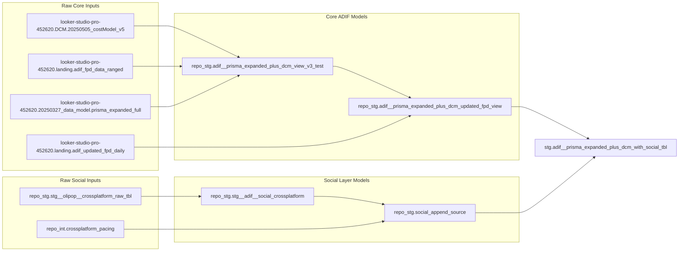

# ADIF Folder Guide

This folder contains the ADIF data collection, validation, and deployment assets.

## Quick Start

```bash
# Collect first-party data
Rscript projects/tv_digital_pipeline/util_collect_fpd_v2.r

# Validate updated integration
bq query --project_id=looker-studio-pro-452620 --use_legacy_sql=false < projects/updated_fpd_integration/validate_updated_fpd_detailed_v2.sql
Rscript projects/updated_fpd_integration/util_validate_updated_fpd_impact.r

# Deploy updated view
bq query --project_id=looker-studio-pro-452620 --use_legacy_sql=false < projects/updated_fpd_integration/deploy_updated_fpd_view.sql
```

## SQL Change Guard Skill

Use the SQL change-guard skill to validate script updates with baseline-vs-candidate comparisons, downstream checks, and summary-first approval output.
The runner checks for an existing live baseline table first and uses it before falling back to baseline query input.
For candidate scripts that are multi-statement, materialize output first and run with `--candidate-table`.
Default backend is MCP (`--query-backend mcp`).
When `--date-column` is provided, the runner now excludes the newest 5 days by default (`--exclude-recent-days 5`) and uses one shared comparison end date for baseline and candidate.

```bash
# Run summary-only (pass/fail first)
python3 skills/sql-change-guard/scripts/run_sql_change_guard.py \
  --project looker-studio-pro-452620 \
  --qa-dataset repo_stg \
  --query-backend mcp \
  --candidate-table looker-studio-pro-452620.repo_stg.adif__prisma_expanded_plus_dcm_with_social_tbl \
  --baseline-table looker-studio-pro-452620.stg.adif__prisma_expanded_plus_dcm_with_social_tbl \
  --date-column date \
  --exclude-recent-days 5 \
  --manifest skills/sql-change-guard/assets/intended_change_manifest.template.json \
  --output-dir /tmp/sql-change-guard-report

# Show at-a-glance comparisons only
python3 skills/sql-change-guard/scripts/run_sql_change_guard.py \
  --project looker-studio-pro-452620 \
  --qa-dataset repo_stg \
  --query-backend mcp \
  --candidate-table looker-studio-pro-452620.repo_stg.adif__prisma_expanded_plus_dcm_with_social_tbl \
  --baseline-table looker-studio-pro-452620.stg.adif__prisma_expanded_plus_dcm_with_social_tbl \
  --date-column date \
  --exclude-recent-days 5 \
  --manifest skills/sql-change-guard/assets/intended_change_manifest.template.json \
  --output-dir /tmp/sql-change-guard-report \
  --show-comparisons
```

Skill docs:
- [skills/sql-change-guard/SKILL.md](skills/sql-change-guard/SKILL.md)
- [skills/sql-change-guard/assets/intended_change_manifest.template.json](skills/sql-change-guard/assets/intended_change_manifest.template.json)
- [skills/sql-change-guard/references/check_catalog.md](skills/sql-change-guard/references/check_catalog.md)
- [skills/sql-change-guard/references/report_format.md](skills/sql-change-guard/references/report_format.md)

## End-to-End Pipeline Lineage (Raw -> Output)

Lineage for `looker-studio-pro-452620.stg.adif__prisma_expanded_plus_dcm_with_social_tbl` was verified with BigQuery MCP from the latest destination-table job in `region-us.INFORMATION_SCHEMA.JOBS_BY_PROJECT` (created `2026-02-13 23:21:53 UTC`).



### Raw Source Inventory (BigQuery MCP)

These tables were captured from BigQuery lineage metadata for the final table path.

#### Direct source inventory from latest final-table job (16)
- `giant-spoon-299605.google_ads_olipop.video_stats`
- `giant-spoon-299605.tiktok_ads.ad_history`
- `giant-spoon-299605.tiktok_ads.adgroup_history`
- `giant-spoon-299605.tiktok_ads.campaign_history`
- `giant-spoon-299605.tiktok_ads.video_history`
- `looker-studio-pro-452620.20250327_data_model.prisma_expanded_full`
- `looker-studio-pro-452620.DCM.20250505_costModel_v5`
- `looker-studio-pro-452620.landing.adif_fpd_data_ranged`
- `looker-studio-pro-452620.landing.adif_updated_fpd_daily`
- `looker-studio-pro-452620.repo_facebook.stg__ad_history_deduped`
- `looker-studio-pro-452620.repo_facebook.stg__ad_set_history_deduped`
- `looker-studio-pro-452620.repo_facebook.stg__campaign_history_deduped`
- `looker-studio-pro-452620.repo_google_ads.stg__ad_group_history_deduped`
- `looker-studio-pro-452620.repo_google_ads.stg__campaign_budget_history_deduped`
- `looker-studio-pro-452620.repo_google_ads.stg__campaign_history_deduped`
- `looker-studio-pro-452620.repo_stg.stg__olipop__crossplatform_raw_tbl`

#### Upstream inputs used to refresh `repo_stg.stg__olipop__crossplatform_raw_tbl` (latest job)
- `giant-spoon-299605.ad_reporting_transformed.ad_reporting__ad_report`
- `giant-spoon-299605.facebook_ads.ad_history`
- `giant-spoon-299605.facebook_ads.ad_reach_lifetime`
- `giant-spoon-299605.facebook_ads.ad_set_history`
- `giant-spoon-299605.facebook_ads.ad_set_reach_lifetime`
- `giant-spoon-299605.facebook_ads.basic_ad`
- `giant-spoon-299605.facebook_ads.basic_ad_actions`
- `giant-spoon-299605.facebook_ads.basic_ad_set`
- `giant-spoon-299605.facebook_ads.basic_campaign`
- `giant-spoon-299605.facebook_ads.campaign_history`
- `giant-spoon-299605.facebook_ads.campaign_reach_lifetime`
- `giant-spoon-299605.facebook_ads.video_ads_actions_video_p_100_watched_actions`
- `giant-spoon-299605.facebook_ads.video_ads_actions_video_p_25_watched_actions`
- `giant-spoon-299605.facebook_ads.video_ads_actions_video_p_50_watched_actions`
- `giant-spoon-299605.facebook_ads.video_ads_actions_video_p_75_watched_actions`
- `giant-spoon-299605.facebook_ads.video_ads_actions_video_p_95_watched_actions`
- `giant-spoon-299605.facebook_ads.video_ads_actions_video_play_actions`
- `giant-spoon-299605.facebook_ads.video_views_3_seconds_actions`
- `giant-spoon-299605.facebook_ads_facebook_ads.facebook_ads__ad_report`
- `giant-spoon-299605.facebook_ads_facebook_ads.facebook_ads__ad_set_report`
- `giant-spoon-299605.facebook_ads_facebook_ads.facebook_ads__campaign_report`
- `giant-spoon-299605.google_ads_olipop.video_stats`
- `giant-spoon-299605.tiktok_ads.ad_report_daily`
- `giant-spoon-299605.tiktok_ads.ad_report_lifetime`
- `giant-spoon-299605.tiktok_ads.adgroup_report_lifetime`
- `giant-spoon-299605.tiktok_ads.campaign_report_lifetime`
- `giant-spoon-299605.tiktok_ads_tiktok_ads.tiktok_ads__ad_report`
- `looker-studio-pro-452620.repo_tiktok.stg__ad_history_deduped`
- `looker-studio-pro-452620.repo_tiktok.stg__adgroup_history_deduped`
- `looker-studio-pro-452620.repo_tiktok.stg__campaign_history_deduped`

#### Upstream inputs used by `repo_int.crossplatform_pacing` (view definition)
- `looker-studio-pro-452620.repo_tables.int__tiktok__combined_history_dedupe_view`
- `looker-studio-pro-452620.repo_facebook.stg__fb_combined_history`
- `looker-studio-pro-452620.repo_google_ads.stg__ga_combined_history`

## Folder Map

### Sub-Projects

#### 1. Updated FPD Integration
- [projects/updated_fpd_integration/DEPLOYMENT_CHECKLIST.md](projects/updated_fpd_integration/DEPLOYMENT_CHECKLIST.md)
- [projects/updated_fpd_integration/README_Updated_FPD_Integration.md](projects/updated_fpd_integration/README_Updated_FPD_Integration.md)
- [projects/updated_fpd_integration/PROJECT_SUMMARY_Updated_FPD_Integration.md](projects/updated_fpd_integration/PROJECT_SUMMARY_Updated_FPD_Integration.md)
- [projects/updated_fpd_integration/deploy_updated_fpd_view.sql](projects/updated_fpd_integration/deploy_updated_fpd_view.sql)
- [projects/updated_fpd_integration/validate_updated_fpd_detailed_v2.sql](projects/updated_fpd_integration/validate_updated_fpd_detailed_v2.sql)
- [projects/updated_fpd_integration/util_validate_updated_fpd_impact.r](projects/updated_fpd_integration/util_validate_updated_fpd_impact.r)
- [projects/updated_fpd_integration/sql/stg__adif__updated_fpd_integrated_v3.sql](projects/updated_fpd_integration/sql/stg__adif__updated_fpd_integrated_v3.sql)

#### 2. TV & Digital Pipeline
- [projects/tv_digital_pipeline/README - ADIF TV & Digital Data Pipeline.md](projects/tv_digital_pipeline/README%20-%20ADIF%20TV%20%26%20Digital%20Data%20Pipeline.md)
- [projects/tv_digital_pipeline/util_collect_fpd_v2.r](projects/tv_digital_pipeline/util_collect_fpd_v2.r)
- [projects/tv_digital_pipeline/util_collect_monthly_estimates.r](projects/tv_digital_pipeline/util_collect_monthly_estimates.r)
- [projects/tv_digital_pipeline/adif__mart__dcm_prisma.sql](projects/tv_digital_pipeline/adif__mart__dcm_prisma.sql)

#### 3. Social Layering
- [projects/social_layering/README.md](projects/social_layering/README.md)
- [projects/social_layering/sql/stg__adif__social_crossplatform.sql](projects/social_layering/sql/stg__adif__social_crossplatform.sql)
- [projects/social_layering/sql/build__adif__prisma_expanded_plus_dcm_with_social_tbl.sql](projects/social_layering/sql/build__adif__prisma_expanded_plus_dcm_with_social_tbl.sql)
- [projects/social_layering/sql/query__adif__prisma_expanded_plus_dcm_with_social_tbl_sched.sql](projects/social_layering/sql/query__adif__prisma_expanded_plus_dcm_with_social_tbl_sched.sql)
- [projects/social_layering/social_mapping_matrix_editable.csv](projects/social_layering/social_mapping_matrix_editable.csv)
- [projects/social_layering/sql/test__adif__social_mapping_v2_vs_current.sql](projects/social_layering/sql/test__adif__social_mapping_v2_vs_current.sql)
