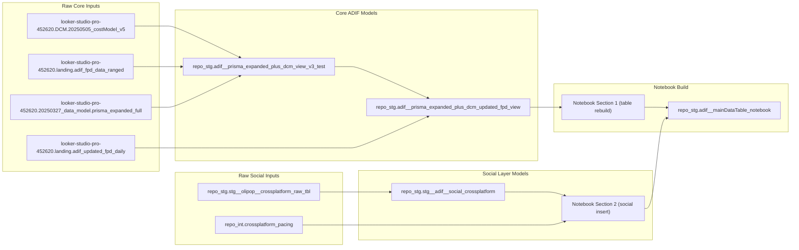

# ADIF Folder Guide

This folder contains the ADIF data collection, validation, and deployment assets.

## Quick Start

```bash
# Collect first-party data
Rscript projects/tv_digital_pipeline/util_collect_fpd_v2.r

# Validate updated integration
bq query --project_id=looker-studio-pro-452620 --use_legacy_sql=false < projects/updated_fpd_integration/validate_updated_fpd_detailed_v2.sql
Rscript projects/updated_fpd_integration/util_validate_updated_fpd_impact.r

# Deploy updated view
bq query --project_id=looker-studio-pro-452620 --use_legacy_sql=false < projects/updated_fpd_integration/deploy_updated_fpd_view.sql
```

## SQL Change Guard Skill

Use the SQL change-guard skill to validate script updates with baseline-vs-candidate comparisons, downstream checks, and summary-first approval output.
The runner checks for an existing live baseline table first and uses it before falling back to baseline query input.
For candidate scripts that are multi-statement, materialize output first and run with `--candidate-table`.
Default backend is MCP (`--query-backend mcp`).
When `--date-column` is provided, the runner now excludes the newest 5 days by default (`--exclude-recent-days 5`) and uses one shared comparison end date for baseline and candidate.
In the examples below, candidate is the notebook output table and baseline is the legacy `stg` output table for regression comparison.

```bash
# Run summary-only (pass/fail first)
python3 skills/sql-change-guard/scripts/run_sql_change_guard.py \
  --project looker-studio-pro-452620 \
  --qa-dataset repo_stg \
  --query-backend mcp \
  --candidate-table looker-studio-pro-452620.repo_stg.adif__mainDataTable_notebook \
  --baseline-table looker-studio-pro-452620.stg.adif__prisma_expanded_plus_dcm_with_social_tbl \
  --date-column date \
  --exclude-recent-days 5 \
  --manifest skills/sql-change-guard/assets/intended_change_manifest.template.json \
  --output-dir /tmp/sql-change-guard-report

# Show at-a-glance comparisons only
python3 skills/sql-change-guard/scripts/run_sql_change_guard.py \
  --project looker-studio-pro-452620 \
  --qa-dataset repo_stg \
  --query-backend mcp \
  --candidate-table looker-studio-pro-452620.repo_stg.adif__mainDataTable_notebook \
  --baseline-table looker-studio-pro-452620.stg.adif__prisma_expanded_plus_dcm_with_social_tbl \
  --date-column date \
  --exclude-recent-days 5 \
  --manifest skills/sql-change-guard/assets/intended_change_manifest.template.json \
  --output-dir /tmp/sql-change-guard-report \
  --show-comparisons
```

Skill docs:
- [skills/sql-change-guard/SKILL.md](skills/sql-change-guard/SKILL.md)
- [skills/sql-change-guard/assets/intended_change_manifest.template.json](skills/sql-change-guard/assets/intended_change_manifest.template.json)
- [skills/sql-change-guard/references/check_catalog.md](skills/sql-change-guard/references/check_catalog.md)
- [skills/sql-change-guard/references/report_format.md](skills/sql-change-guard/references/report_format.md)

## BigQuery Notebook Access (Dataform-backed)

For notebook asset `build__adif__prisma_expanded_plus_dcm_with_social_tbl`, use the permanent Dataform workspace:

- `projects/looker-studio-pro-452620/locations/us-east1/repositories/acfacedf-9d13-4beb-98d4-34f9a2afdba7/workspaces/adif-bq-notebook-permanent`

Read commands:

```bash
TOKEN=$(gcloud auth print-access-token)
WS="projects/looker-studio-pro-452620/locations/us-east1/repositories/acfacedf-9d13-4beb-98d4-34f9a2afdba7/workspaces/adif-bq-notebook-permanent"

bash -lc "curl -s -G \
  -H 'Authorization: Bearer $TOKEN' \
  --data-urlencode 'path=' \
  \"https://dataform.googleapis.com/v1/${WS}:queryDirectoryContents\""

bash -lc "curl -s -G \
  -H 'Authorization: Bearer $TOKEN' \
  --data-urlencode 'path=FILE_PATH' \
  \"https://dataform.googleapis.com/v1/${WS}:readFile\""
```

## Social Production Pipeline

Production social layering now runs from notebook, not the old scheduled SQL script:

- Active: `projects/social_layering/build__adif__prisma_expanded_plus_dcm_with_social_tbl.ipynb`
- Archived legacy SQL and duplicate notebook copy: `projects/social_layering/archive/legacy_scheduled_sql/`

## End-to-End Pipeline Lineage (Notebook Production)

Current production social assembly is notebook-driven and writes to `looker-studio-pro-452620.repo_stg.adif__mainDataTable_notebook`.



### Notebook-Declared Dependencies

- `looker-studio-pro-452620.repo_stg.adif__prisma_expanded_plus_dcm_updated_fpd_view` (Section 1 source)
- `looker-studio-pro-452620.repo_stg.stg__adif__social_crossplatform` (Section 2 social source)
- `looker-studio-pro-452620.repo_int.crossplatform_pacing` (Section 2 pacing source)

`repo_int.crossplatform_pacing` upstream views used by notebook logic:
- `looker-studio-pro-452620.repo_tables.int__tiktok__combined_history_dedupe_view`
- `looker-studio-pro-452620.repo_facebook.stg__fb_combined_history`
- `looker-studio-pro-452620.repo_google_ads.stg__ga_combined_history`

### Notebook Verification Queries

The production notebook includes post-run checks for:
- Target table row/date/spend/impression totals
- Breakdown by `data_source_primary` (2026 filter)
- Breakdown by `supplier_code`, `p_package_friendly` (2026 filter)
- Cross-check against `repo_stg.stg__adif__social_crossplatform` platform totals

## Folder Map

### Sub-Projects

#### 1. Updated FPD Integration
- [projects/updated_fpd_integration/DEPLOYMENT_CHECKLIST.md](projects/updated_fpd_integration/DEPLOYMENT_CHECKLIST.md)
- [projects/updated_fpd_integration/README_Updated_FPD_Integration.md](projects/updated_fpd_integration/README_Updated_FPD_Integration.md)
- [projects/updated_fpd_integration/PROJECT_SUMMARY_Updated_FPD_Integration.md](projects/updated_fpd_integration/PROJECT_SUMMARY_Updated_FPD_Integration.md)
- [projects/updated_fpd_integration/deploy_updated_fpd_view.sql](projects/updated_fpd_integration/deploy_updated_fpd_view.sql)
- [projects/updated_fpd_integration/validate_updated_fpd_detailed_v2.sql](projects/updated_fpd_integration/validate_updated_fpd_detailed_v2.sql)
- [projects/updated_fpd_integration/util_validate_updated_fpd_impact.r](projects/updated_fpd_integration/util_validate_updated_fpd_impact.r)
- [projects/updated_fpd_integration/sql/stg__adif__updated_fpd_integrated_v3.sql](projects/updated_fpd_integration/sql/stg__adif__updated_fpd_integrated_v3.sql)

#### 2. TV & Digital Pipeline
- [projects/tv_digital_pipeline/README - ADIF TV & Digital Data Pipeline.md](projects/tv_digital_pipeline/README%20-%20ADIF%20TV%20%26%20Digital%20Data%20Pipeline.md)
- [projects/tv_digital_pipeline/util_collect_fpd_v2.r](projects/tv_digital_pipeline/util_collect_fpd_v2.r)
- [projects/tv_digital_pipeline/util_collect_monthly_estimates.r](projects/tv_digital_pipeline/util_collect_monthly_estimates.r)
- [projects/tv_digital_pipeline/adif__mart__dcm_prisma.sql](projects/tv_digital_pipeline/adif__mart__dcm_prisma.sql)

#### 3. Social Layering
- [projects/social_layering/README.md](projects/social_layering/README.md)
- [projects/social_layering/build__adif__prisma_expanded_plus_dcm_with_social_tbl.ipynb](projects/social_layering/build__adif__prisma_expanded_plus_dcm_with_social_tbl.ipynb)
- [projects/social_layering/sql/stg__adif__social_crossplatform.sql](projects/social_layering/sql/stg__adif__social_crossplatform.sql)
- [projects/social_layering/social_mapping_matrix_editable.csv](projects/social_layering/social_mapping_matrix_editable.csv)
- [projects/social_layering/sql/test__adif__social_mapping_v2_vs_current.sql](projects/social_layering/sql/test__adif__social_mapping_v2_vs_current.sql)
- [projects/social_layering/archive/legacy_scheduled_sql/README.md](projects/social_layering/archive/legacy_scheduled_sql/README.md)
