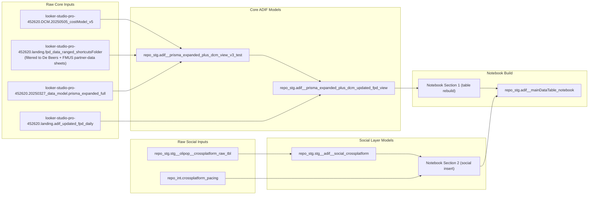

# ADIF Folder Guide

This folder contains the ADIF data collection, validation, and deployment assets.

## Quick Start

```bash
# Collect first-party data
Rscript projects/tv_digital_pipeline/util_collect_fpd_v2.r

# Validate updated integration
bq query --project_id=looker-studio-pro-452620 --use_legacy_sql=false < projects/updated_fpd_integration/validate_updated_fpd_detailed_v2.sql
Rscript projects/updated_fpd_integration/util_validate_updated_fpd_impact.r

# Deploy updated view
bq query --project_id=looker-studio-pro-452620 --use_legacy_sql=false < projects/updated_fpd_integration/deploy_updated_fpd_view.sql
```

## SQL Change Guard Skill

Use the SQL change-guard skill to validate script updates with baseline-vs-candidate comparisons, downstream checks, and summary-first approval output.
The runner checks for an existing live baseline table first and uses it before falling back to baseline query input.
For candidate scripts that are multi-statement, materialize output first and run with `--candidate-table`.
Default backend is MCP (`--query-backend mcp`).
When `--date-column` is provided, the runner now excludes the newest 5 days by default (`--exclude-recent-days 5`) and uses one shared comparison end date for baseline and candidate.
In the examples below, candidate is the notebook output table and baseline is the legacy `stg` output table for regression comparison.

```bash
# Run summary-only (pass/fail first)
python3 skills/sql-change-guard/scripts/run_sql_change_guard.py \
  --project looker-studio-pro-452620 \
  --qa-dataset repo_stg \
  --query-backend mcp \
  --candidate-table looker-studio-pro-452620.repo_stg.adif__mainDataTable_notebook \
  --baseline-table looker-studio-pro-452620.stg.adif__prisma_expanded_plus_dcm_with_social_tbl \
  --date-column date \
  --exclude-recent-days 5 \
  --manifest skills/sql-change-guard/assets/intended_change_manifest.template.json \
  --output-dir /tmp/sql-change-guard-report

# Show at-a-glance comparisons only
python3 skills/sql-change-guard/scripts/run_sql_change_guard.py \
  --project looker-studio-pro-452620 \
  --qa-dataset repo_stg \
  --query-backend mcp \
  --candidate-table looker-studio-pro-452620.repo_stg.adif__mainDataTable_notebook \
  --baseline-table looker-studio-pro-452620.stg.adif__prisma_expanded_plus_dcm_with_social_tbl \
  --date-column date \
  --exclude-recent-days 5 \
  --manifest skills/sql-change-guard/assets/intended_change_manifest.template.json \
  --output-dir /tmp/sql-change-guard-report \
  --show-comparisons
```

Skill docs:
- [skills/sql-change-guard/SKILL.md](skills/sql-change-guard/SKILL.md)
- [skills/sql-change-guard/assets/intended_change_manifest.template.json](skills/sql-change-guard/assets/intended_change_manifest.template.json)
- [skills/sql-change-guard/references/check_catalog.md](skills/sql-change-guard/references/check_catalog.md)
- [skills/sql-change-guard/references/report_format.md](skills/sql-change-guard/references/report_format.md)

## BigQuery Notebook Access (Dataform-backed)

For notebook asset `build__adif__prisma_expanded_plus_dcm_with_social_tbl`, use the permanent Dataform workspace:

- `projects/looker-studio-pro-452620/locations/us-east1/repositories/acfacedf-9d13-4beb-98d4-34f9a2afdba7/workspaces/adif-bq-notebook-permanent`

Default workflow:

1. Use BigQuery MCP first for dataset discovery, schema inspection, and read-only BigQuery query work.
2. Keep the helper below as the repair and advanced access path.
3. Use the helper when you need to refresh Google login state or when you need a token for Dataform notebook file reads.

Advanced notebook read commands:

```bash
TOKEN=$(gcloud auth print-access-token)
WS="projects/looker-studio-pro-452620/locations/us-east1/repositories/acfacedf-9d13-4beb-98d4-34f9a2afdba7/workspaces/adif-bq-notebook-permanent"

bash -lc "curl -s -G \
  -H 'Authorization: Bearer $TOKEN' \
  --data-urlencode 'path=' \
  \"https://dataform.googleapis.com/v1/${WS}:queryDirectoryContents\""

bash -lc "curl -s -G \
  -H 'Authorization: Bearer $TOKEN' \
  --data-urlencode 'path=FILE_PATH' \
  \"https://dataform.googleapis.com/v1/${WS}:readFile\""
```

### Sandbox-Safe Google Cloud Access

If BigQuery MCP is unavailable, or if live reads fail because `gcloud` cannot write to your normal home-folder config inside Codex, use the project helper below. It copies your existing Google Cloud auth into `./.codex-local/gcloud`, points `gcloud` and `bq` at that repo-local copy, and keeps the copied credentials out of git.

```bash
# Prepare the repo-local auth copy and show the active paths
zsh scripts/use_sandbox_gcloud.sh

# Run Google Cloud commands through the helper
zsh scripts/use_sandbox_gcloud.sh gcloud auth list
zsh scripts/use_sandbox_gcloud.sh gcloud auth print-access-token
zsh scripts/use_sandbox_gcloud.sh bq ls --project_id=looker-studio-pro-452620

# Refresh the repo-local copy if your home-folder gcloud login changed
zsh scripts/use_sandbox_gcloud.sh --refresh-copy
```

For notebook reads, fetch the token through the helper first:

```bash
TOKEN=$(zsh scripts/use_sandbox_gcloud.sh gcloud auth print-access-token)
WS="projects/looker-studio-pro-452620/locations/us-east1/repositories/acfacedf-9d13-4beb-98d4-34f9a2afdba7/workspaces/adif-bq-notebook-permanent"

curl -s -G \
  -H "Authorization: Bearer ${TOKEN}" \
  --data-urlencode "path=" \
  "https://dataform.googleapis.com/v1/${WS}:queryDirectoryContents"
```

If the copied login is stale, refresh it through the helper so the updated credentials stay inside `./.codex-local/gcloud`:

```bash
zsh scripts/use_sandbox_gcloud.sh gcloud auth login
zsh scripts/use_sandbox_gcloud.sh gcloud auth application-default login
```

## Social Production Pipeline

Production social layering now runs from scheaduled SQL query

- Active: 
- Archived legacy SQL and duplicate notebook copy: `projects/social_layering/archive/legacy_scheduled_sql/`
`projects/social_layering/build__adif__prisma_expanded_plus_dcm_with_social_tbl.ipynb`

## End-to-End Pipeline Lineage (Notebook Production)

Current production social assembly is notebook-driven and writes to `looker-studio-pro-452620.repo_stg.adif__mainDataTable_notebook`.


```mermaid
flowchart LR
  subgraph raw_core["Raw Core Inputs"]
    dcm["looker-studio-pro-452620.DCM.20250505_costModel_v5"]
    fpd_orig["looker-studio-pro-452620.landing.fpd_data_ranged_shortcutsFolder\n(filtered to De Beers + FMUS partner-data sheets)"]
    prisma["looker-studio-pro-452620.20250327_data_model.prisma_expanded_full"]
    fpd_upd["looker-studio-pro-452620.landing.adif_updated_fpd_daily"]
  end

  subgraph core_models["Core ADIF Models"]
    core_base["repo_stg.adif__prisma_expanded_plus_dcm_view_v3_test"]
    core_upd["repo_stg.adif__prisma_expanded_plus_dcm_updated_fpd_view"]
  end

  dcm --> core_base
  fpd_orig --> core_base
  prisma --> core_base
  core_base --> core_upd
  fpd_upd --> core_upd

  subgraph raw_social["Raw Social Inputs"]
    social_raw["repo_stg.stg__olipop__crossplatform_raw_tbl"]
    pacing["repo_int.crossplatform_pacing"]
  end

  subgraph social_models["Social Layer Models"]
    social_stg["repo_stg.stg__adif__social_crossplatform"]
    social_nb_s2["Notebook Section 2 (social insert)"]
  end

  subgraph notebook["Notebook Build"]
    social_nb_s1["Notebook Section 1 (table rebuild)"]
    target_tbl["repo_stg.adif__mainDataTable_notebook"]
  end

  social_raw --> social_stg
  social_stg --> social_nb_s2
  pacing --> social_nb_s2
  core_upd --> social_nb_s1

  social_nb_s1 --> target_tbl
  social_nb_s2 --> target_tbl
```

### Notebook-Declared Dependencies

- `looker-studio-pro-452620.repo_stg.adif__prisma_expanded_plus_dcm_updated_fpd_view` (Section 1 source)
- `looker-studio-pro-452620.repo_stg.stg__adif__social_crossplatform` (Section 2 social source)
- `looker-studio-pro-452620.repo_int.crossplatform_pacing` (Section 2 pacing source)

### Original FPD Source For ADIF

- Base ADIF original FPD now reads from `looker-studio-pro-452620.landing.fpd_data_ranged_shortcutsFolder`.
- ADIF includes rows where `source_file` contains `De Beers`.
- ADIF also includes rows where `source_file` starts with `FMUS | Partner Data Collection |`.
- The older table `looker-studio-pro-452620.landing.adif_fpd_data_ranged` remains available as a legacy reference, but it is no longer the intended main-ADIF source.

### Prisma Supplier Logo Propagation

- Source lookup: `looker-studio-pro-452620.landing.prisma_supplier_logos.logo_url_final`
- Downstream field name: `supplier_logo`
- Digital Prisma-backed rows inherit `supplier_logo` through `landing.prisma_master_2025` and `20250327_data_model.prisma_expanded_full`
- Social rows appended in notebook Section 2 leave `supplier_logo` as `NULL`

`repo_int.crossplatform_pacing` upstream views used by notebook logic:
- `looker-studio-pro-452620.repo_tables.int__tiktok__combined_history_dedupe_view`
- `looker-studio-pro-452620.repo_facebook.stg__fb_combined_history`
- `looker-studio-pro-452620.repo_google_ads.stg__ga_combined_history`

### Notebook Verification Queries

The production notebook includes post-run checks for:
- Target table row/date/spend/impression totals
- Breakdown by `data_source_primary` (2026 filter)
- Breakdown by `supplier_code`, `p_package_friendly` (2026 filter)
- Cross-check against `repo_stg.stg__adif__social_crossplatform` platform totals

### HTML QA Dashboard (Final vs Upstream)

Use the self-contained HTML dashboard to QA `repo_stg.adif__mainDataTable_notebook` against upstream baseline `stg.adif__prisma_expanded_plus_dcm_with_social_tbl`.

- Dashboard file: `projects/social_layering/adif_mainDataTable_notebook_qa_dashboard.html`
- Upstream definition used in dashboard: prior baseline output table (`stg.adif__prisma_expanded_plus_dcm_with_social_tbl`) used for regression comparison, not raw source-system feeds.
- Included views:
  - Planned vs actual charting grouped by supplier, package, data source, and impression type
  - Dimension rollup table with planned, actual, variance, and upstream reference columns
  - Filters for supplier, package, data source, and impression type
  - Metric toggle for spend or impressions and top-N chart controls

## Folder Map

### Sub-Projects

#### 1. Updated FPD Integration
- [projects/updated_fpd_integration/DEPLOYMENT_CHECKLIST.md](projects/updated_fpd_integration/DEPLOYMENT_CHECKLIST.md)
- [projects/updated_fpd_integration/README_Updated_FPD_Integration.md](projects/updated_fpd_integration/README_Updated_FPD_Integration.md)
- [projects/updated_fpd_integration/PROJECT_SUMMARY_Updated_FPD_Integration.md](projects/updated_fpd_integration/PROJECT_SUMMARY_Updated_FPD_Integration.md)
- [projects/updated_fpd_integration/deploy_updated_fpd_view.sql](projects/updated_fpd_integration/deploy_updated_fpd_view.sql)
- [projects/updated_fpd_integration/sql/stg__adif__prisma_expanded_plus_dcm_view_v3_test.sql](projects/updated_fpd_integration/sql/stg__adif__prisma_expanded_plus_dcm_view_v3_test.sql)
- [projects/updated_fpd_integration/validate_updated_fpd_detailed_v2.sql](projects/updated_fpd_integration/validate_updated_fpd_detailed_v2.sql)
- [projects/updated_fpd_integration/util_validate_updated_fpd_impact.r](projects/updated_fpd_integration/util_validate_updated_fpd_impact.r)
- [projects/updated_fpd_integration/sql/stg__adif__updated_fpd_integrated_v3.sql](projects/updated_fpd_integration/sql/stg__adif__updated_fpd_integrated_v3.sql)

#### 2. TV & Digital Pipeline
- [projects/tv_digital_pipeline/README - ADIF TV & Digital Data Pipeline.md](projects/tv_digital_pipeline/README%20-%20ADIF%20TV%20%26%20Digital%20Data%20Pipeline.md)
- [projects/tv_digital_pipeline/util_collect_fpd_v2.r](projects/tv_digital_pipeline/util_collect_fpd_v2.r)
- [projects/tv_digital_pipeline/util_collect_monthly_estimates.r](projects/tv_digital_pipeline/util_collect_monthly_estimates.r)
- [projects/tv_digital_pipeline/adif__mart__dcm_prisma.sql](projects/tv_digital_pipeline/adif__mart__dcm_prisma.sql)

#### 3. Social Layering
- [projects/social_layering/README.md](projects/social_layering/README.md)
- [projects/social_layering/build__adif__prisma_expanded_plus_dcm_with_social_tbl.ipynb](projects/social_layering/build__adif__prisma_expanded_plus_dcm_with_social_tbl.ipynb)
- [projects/social_layering/sql/stg__adif__social_crossplatform.sql](projects/social_layering/sql/stg__adif__social_crossplatform.sql)
- [projects/social_layering/social_mapping_matrix_editable.csv](projects/social_layering/social_mapping_matrix_editable.csv)
- [projects/social_layering/sql/test__adif__social_mapping_v2_vs_current.sql](projects/social_layering/sql/test__adif__social_mapping_v2_vs_current.sql)
- [projects/social_layering/archive/legacy_scheduled_sql/README.md](projects/social_layering/archive/legacy_scheduled_sql/README.md)

### Archived Side Project

- `streamlit_ad_reporting/` is treated as a parked side project, not part of the active ADIF release path in this repo.
- If it is revived later, review and ship it as its own small project instead of bundling it into ADIF data-pipeline changes.
