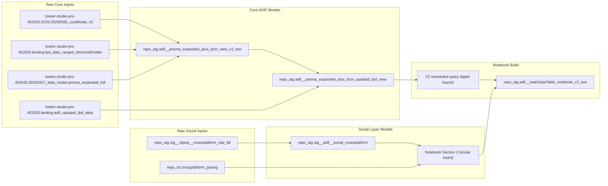

# ADIF Folder Guide

This folder contains the ADIF data collection, validation, and deployment assets.

## Quick Start

```bash
# Collect first-party data
Rscript projects/tv_digital_pipeline/util_collect_fpd_v2.r

# Validate updated integration
bq query --project_id=looker-studio-pro-452620 --use_legacy_sql=false < projects/updated_fpd_integration/validate_updated_fpd_detailed_v2.sql
Rscript projects/updated_fpd_integration/util_validate_updated_fpd_impact.r

# Deploy updated view
bq query --project_id=looker-studio-pro-452620 --use_legacy_sql=false < projects/updated_fpd_integration/deploy_updated_fpd_view.sql
```

## SQL Change Guard Skill

Use the SQL change-guard skill to validate script updates with baseline-vs-candidate comparisons, downstream checks, and summary-first approval output.
The runner checks for an existing live baseline table first and uses it before falling back to baseline query input.
For candidate scripts that are multi-statement, materialize output first and run with `--candidate-table`.
Default backend is MCP (`--query-backend mcp`).
When `--date-column` is provided, the runner now excludes the newest 5 days by default (`--exclude-recent-days 5`) and uses one shared comparison end date for baseline and candidate.
In the examples below, candidate is the notebook output table and baseline is the legacy `stg` output table for regression comparison.

```bash
# Run summary-only (pass/fail first)
python3 skills/sql-change-guard/scripts/run_sql_change_guard.py \
  --project looker-studio-pro-452620 \
  --qa-dataset repo_stg \
  --query-backend mcp \
  --candidate-table looker-studio-pro-452620.repo_stg.adif__mainDataTable_notebook \
  --baseline-table looker-studio-pro-452620.stg.adif__prisma_expanded_plus_dcm_with_social_tbl \
  --date-column date \
  --exclude-recent-days 5 \
  --manifest skills/sql-change-guard/assets/intended_change_manifest.template.json \
  --output-dir /tmp/sql-change-guard-report

# Show at-a-glance comparisons only
python3 skills/sql-change-guard/scripts/run_sql_change_guard.py \
  --project looker-studio-pro-452620 \
  --qa-dataset repo_stg \
  --query-backend mcp \
  --candidate-table looker-studio-pro-452620.repo_stg.adif__mainDataTable_notebook \
  --baseline-table looker-studio-pro-452620.stg.adif__prisma_expanded_plus_dcm_with_social_tbl \
  --date-column date \
  --exclude-recent-days 5 \
  --manifest skills/sql-change-guard/assets/intended_change_manifest.template.json \
  --output-dir /tmp/sql-change-guard-report \
  --show-comparisons
```

Skill docs:
- [skills/sql-change-guard/SKILL.md](skills/sql-change-guard/SKILL.md)
- [skills/sql-change-guard/assets/intended_change_manifest.template.json](skills/sql-change-guard/assets/intended_change_manifest.template.json)
- [skills/sql-change-guard/references/check_catalog.md](skills/sql-change-guard/references/check_catalog.md)
- [skills/sql-change-guard/references/report_format.md](skills/sql-change-guard/references/report_format.md)

## BigQuery Notebook Access (Dataform-backed)

For notebook asset `build__adif__prisma_expanded_plus_dcm_with_social_tbl`, use the permanent Dataform workspace:

- `projects/looker-studio-pro-452620/locations/us-east1/repositories/acfacedf-9d13-4beb-98d4-34f9a2afdba7/workspaces/adif-bq-notebook-permanent`

Read commands:

```bash
TOKEN=$(gcloud auth print-access-token)
WS="projects/looker-studio-pro-452620/locations/us-east1/repositories/acfacedf-9d13-4beb-98d4-34f9a2afdba7/workspaces/adif-bq-notebook-permanent"

bash -lc "curl -s -G \
  -H 'Authorization: Bearer $TOKEN' \
  --data-urlencode 'path=' \
  \"https://dataform.googleapis.com/v1/${WS}:queryDirectoryContents\""

bash -lc "curl -s -G \
  -H 'Authorization: Bearer $TOKEN' \
  --data-urlencode 'path=FILE_PATH' \
  \"https://dataform.googleapis.com/v1/${WS}:readFile\""
```

## Main Scheduled Refresh

The main live ADIF refresh currently runs from a BigQuery scheduled query, not only from the older notebook runbook.

- Transfer config: `projects/671028410185/locations/us/transferConfigs/6a40bbfa-0000-2ee2-a61f-582429bc84e0`
- Display name: `ADIF_FullDataRefresh_2604`
- Schedule: `every 10 hours`
- Verified against live BigQuery on: `2026-04-10`
- Current live output table: `looker-studio-pro-452620.repo_stg.adif__mainDataTable_notebook_v2_test`
- Current older notebook output table: `looker-studio-pro-452620.repo_stg.adif__mainDataTable_notebook`

What the live scheduled query does:

1. Reads the updated digital base view `repo_stg.adif__prisma_expanded_plus_dcm_updated_fpd_view`.
2. Reads normalized social data from `repo_stg.stg__adif__social_crossplatform`.
3. Reads pacing data from `repo_int.crossplatform_pacing`.
4. Rebuilds `repo_stg.adif__mainDataTable_notebook_v2_test` in one pass using the V2 single-query flow.

Why this matters:

- The notebook file is still useful as a reference and history artifact.
- The live transfer config is the best source of truth for the current automated refresh path.
- The scheduled query currently targets the V2 shadow table, so docs should not describe `repo_stg.adif__mainDataTable_notebook` as the only live refresh target.

Related files:

- Active reference notebook: `projects/social_layering/build__adif__prisma_expanded_plus_dcm_with_social_tbl.ipynb`
- One-page lineage guide: `projects/social_layering/ADIF_MAIN_PIPELINE_LINEAGE_1PAGER.md`
- Archived legacy SQL and duplicate notebook copy: `projects/social_layering/archive/legacy_scheduled_sql/`
- Snapshot QA dashboard for the V2 test output:
  `projects/social_layering/dashboard/adif__mainDataTable_notebook_v2_test_qa_dashboard.html`
  - Includes a clickable lineage map with per-table snapshot metrics such as last load, row count, total cost, and total impressions.

## FPD Layering

ADIF currently uses two separate FPD branches that meet in the ADIF view layer.

### Original FPD Branch

This is the broad partner-sheet branch.

- ADIF-specific loader script: `projects/tv_digital_pipeline/util_collect_fpd_v2.r`
- Shortcut-aware shared loader script: `/Users/eugenetsenter/Looker_clonedRepo/looker_personal/FPD/FPD_loader/util_collect_fpd_shortcutsFolder.r`
- Current base ADIF SQL source table:
  `looker-studio-pro-452620.landing.fpd_data_ranged_shortcutsFolder`

How it works:

1. Google Sheets partner files are discovered and normalized by the R loaders.
2. Rows are expanded to daily grain and uploaded to a BigQuery landing table.
3. The current base ADIF SQL reads `landing.fpd_data_ranged_shortcutsFolder`.
4. That SQL filters the broad table down to ADIF-only partner sheets:
   - `source_file` contains `De Beers`
   - or `source_file` starts with `FMUS | Partner Data Collection |`
5. The filtered rows are aggregated to one row per `package_id + date`.
6. That daily FPD layer is FULL OUTER JOINed with DCM, then FULL OUTER JOINed with Prisma.

Result:

- Original FPD is the first actuals layer.
- In the base ADIF view, original FPD overrides DCM when both exist on the same package/date row.
- In the live scheduled main table, `fpd_source_sheet_modified_date` now reads from both FPD branches:
  - updated FPD uses `landing.adif_updated_fpd_daily.source_sheet_modified_time` on `package_id + date`
  - original shortcuts FPD uses `landing.fpd_data_ranged_shortcutsFolder.last_modified_time` on `package_id + date_final`

### Updated FPD Branch

This is the corrected package-level overlay branch.

- Script: `projects/updated_fpd_integration/util_process_updated_fpd.r`
- Output table:
  `looker-studio-pro-452620.landing.adif_updated_fpd_daily`

How it works:

1. Read package-level corrected totals from one Google Sheet.
2. Query Prisma for each package's start and end dates.
3. Spread each package total evenly across the Prisma date range.
4. Upload the daily rows to `landing.adif_updated_fpd_daily`.
5. Join that daily table onto the base ADIF view in `repo_stg.adif__prisma_expanded_plus_dcm_updated_fpd_view`.

Result:

- Updated FPD is layered on top of the original FPD + DCM base view.
- Updated FPD becomes the highest-priority actuals source when present.

### Effective Priority Order

The practical ADIF priority order is:

1. Updated FPD
2. Original FPD
3. DCM
4. Planned-only fallback from Prisma

### Important Current-State Note

Two similar original-FPD table names appear in scripts and docs:

- `landing.adif_fpd_data_ranged`
- `landing.fpd_data_ranged_shortcutsFolder`

The current base ADIF SQL uses `landing.fpd_data_ranged_shortcutsFolder` as the original FPD source of truth.

## End-to-End Pipeline Lineage (Current Live Scheduled Refresh)

Current live scheduled social assembly writes to `looker-studio-pro-452620.repo_stg.adif__mainDataTable_notebook_v2_test`.


```mermaid
flowchart LR
  subgraph raw_core["Raw Core Inputs"]
    dcm["looker-studio-pro-452620.DCM.20250505_costModel_v5"]
    fpd_orig["looker-studio-pro-452620.landing.fpd_data_ranged_shortcutsFolder"]
    prisma["looker-studio-pro-452620.20250327_data_model.prisma_expanded_full"]
    fpd_upd["looker-studio-pro-452620.landing.adif_updated_fpd_daily"]
  end

  subgraph core_models["Core ADIF Models"]
    core_base["repo_stg.adif__prisma_expanded_plus_dcm_view_v3_test"]
    core_upd["repo_stg.adif__prisma_expanded_plus_dcm_updated_fpd_view"]
  end

  dcm --> core_base
  fpd_orig --> core_base
  prisma --> core_base
  core_base --> core_upd
  fpd_upd --> core_upd

  subgraph raw_social["Raw Social Inputs"]
    social_raw["repo_stg.stg__olipop__crossplatform_raw_tbl"]
    pacing["repo_int.crossplatform_pacing"]
  end

  subgraph social_models["Social Layer Models"]
    social_stg["repo_stg.stg__adif__social_crossplatform"]
    social_nb_s2["Notebook Section 2 (social insert)"]
  end

  subgraph notebook["Notebook Build"]
    social_nb_s1["V2 scheduled query digital branch"]
    target_tbl["repo_stg.adif__mainDataTable_notebook_v2_test"]
  end

  social_raw --> social_stg
  social_stg --> social_nb_s2
  pacing --> social_nb_s2
  core_upd --> social_nb_s1

  social_nb_s1 --> target_tbl
  social_nb_s2 --> target_tbl
```

### Live Scheduled Query Dependencies

- `looker-studio-pro-452620.repo_stg.adif__prisma_expanded_plus_dcm_updated_fpd_view` (digital base source)
- `looker-studio-pro-452620.repo_stg.stg__adif__social_crossplatform` (social source)
- `looker-studio-pro-452620.repo_int.crossplatform_pacing` (social pacing source)

`repo_int.crossplatform_pacing` upstream views used by the live scheduled query logic:
- `looker-studio-pro-452620.repo_tables.int__tiktok__combined_history_dedupe_view`
- `looker-studio-pro-452620.repo_facebook.stg__fb_combined_history`
- `looker-studio-pro-452620.repo_google_ads.stg__ga_combined_history`

### Verification Notes

Warehouse-side verification completed on `2026-04-10`:

- `repo_stg.adif__mainDataTable_notebook_v2_test` exists, had `16,701` rows, and was last modified on `2026-04-10T10:03:13Z`
- `repo_stg.adif__mainDataTable_notebook` also still exists, had `16,663` rows, and was last modified on `2026-04-06T14:02:15Z`
- `repo_stg.adif__prisma_expanded_plus_dcm_updated_fpd_view`, `repo_stg.stg__adif__social_crossplatform`, and `repo_int.crossplatform_pacing` all still exist in production
- The transfer config identifier and schedule remain documented here, but I could not re-check scheduler-service metadata from this environment because neither `bq` nor `gcloud` is installed

The reference notebook still includes post-run checks for:
- Target table row/date/spend/impression totals
- Breakdown by `data_source_primary` (2026 filter)
- Breakdown by `supplier_code`, `p_package_friendly` (2026 filter)
- Cross-check against `repo_stg.stg__adif__social_crossplatform` platform totals

## Folder Map

### Sub-Projects

#### 1. Updated FPD Integration
- [projects/updated_fpd_integration/DEPLOYMENT_CHECKLIST.md](projects/updated_fpd_integration/DEPLOYMENT_CHECKLIST.md)
- [projects/updated_fpd_integration/README_Updated_FPD_Integration.md](projects/updated_fpd_integration/README_Updated_FPD_Integration.md)
- [projects/updated_fpd_integration/PROJECT_SUMMARY_Updated_FPD_Integration.md](projects/updated_fpd_integration/PROJECT_SUMMARY_Updated_FPD_Integration.md)
- [projects/updated_fpd_integration/deploy_updated_fpd_view.sql](projects/updated_fpd_integration/deploy_updated_fpd_view.sql)
- [projects/updated_fpd_integration/validate_updated_fpd_detailed_v2.sql](projects/updated_fpd_integration/validate_updated_fpd_detailed_v2.sql)
- [projects/updated_fpd_integration/util_validate_updated_fpd_impact.r](projects/updated_fpd_integration/util_validate_updated_fpd_impact.r)
- [projects/updated_fpd_integration/sql/stg__adif__updated_fpd_integrated_v3.sql](projects/updated_fpd_integration/sql/stg__adif__updated_fpd_integrated_v3.sql)

#### 2. TV & Digital Pipeline
- [projects/tv_digital_pipeline/README - ADIF TV & Digital Data Pipeline.md](projects/tv_digital_pipeline/README%20-%20ADIF%20TV%20%26%20Digital%20Data%20Pipeline.md)
- [projects/tv_digital_pipeline/util_collect_fpd_v2.r](projects/tv_digital_pipeline/util_collect_fpd_v2.r)
- [projects/tv_digital_pipeline/util_collect_monthly_estimates.r](projects/tv_digital_pipeline/util_collect_monthly_estimates.r)
- [projects/tv_digital_pipeline/adif__mart__dcm_prisma.sql](projects/tv_digital_pipeline/adif__mart__dcm_prisma.sql)

#### 3. Social Layering
- [projects/social_layering/README.md](projects/social_layering/README.md)
- [projects/social_layering/build__adif__prisma_expanded_plus_dcm_with_social_tbl.ipynb](projects/social_layering/build__adif__prisma_expanded_plus_dcm_with_social_tbl.ipynb)
- [projects/social_layering/dashboard/adif__mainDataTable_notebook_v2_test_qa_dashboard.html](projects/social_layering/dashboard/adif__mainDataTable_notebook_v2_test_qa_dashboard.html)
- [projects/social_layering/sql/stg__adif__social_crossplatform.sql](projects/social_layering/sql/stg__adif__social_crossplatform.sql)
- [projects/social_layering/social_mapping_matrix_editable.csv](projects/social_layering/social_mapping_matrix_editable.csv)
- [projects/social_layering/sql/test__adif__social_mapping_v2_vs_current.sql](projects/social_layering/sql/test__adif__social_mapping_v2_vs_current.sql)
- [projects/social_layering/archive/legacy_scheduled_sql/README.md](projects/social_layering/archive/legacy_scheduled_sql/README.md)
