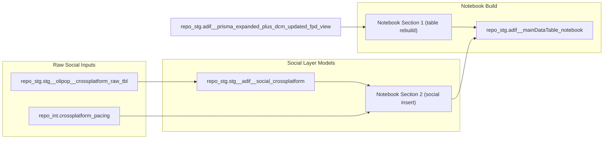

# Social Layering Pipeline

This sub-project owns the notebook-driven social append branch for ADIF.
Production orchestration runs from notebook (`build__adif__prisma_expanded_plus_dcm_with_social_tbl.ipynb`) and writes to `looker-studio-pro-452620.repo_stg.adif__mainDataTable_notebook`.

## Lineage Segment to Final Output

## Production Notebook

- Active production notebook: `projects/social_layering/build__adif__prisma_expanded_plus_dcm_with_social_tbl.ipynb`
- Legacy scheduled SQL and duplicate notebook copies: `projects/social_layering/archive/legacy_scheduled_sql/`

## Shadow Validation Notebook

- Shadow notebook: `projects/social_layering/build__adif__prisma_expanded_plus_dcm_with_social_tbl_v2.ipynb`
- Shadow output table: `looker-studio-pro-452620.repo_stg.adif__mainDataTable_notebook_v2_test`
- Current validation focus:
  - Keeps FPD, DCM, and social source metrics in separate source-prefixed columns
  - Recomputes canonical `final_spend`, `final_impressions`, and `final_clicks` with source-aware logic
  - Uses `d_daily_recalculated_cost` for DCM spend and `d_impressions` for DCM final impressions to mirror the current production definition
  - Prevents zero-filled FPD placeholders from masking valid DCM delivery in the shadow table

## Source Coverage

### Notebook Section 1 (`CREATE OR REPLACE TABLE`)
- Source: `looker-studio-pro-452620.repo_stg.adif__prisma_expanded_plus_dcm_updated_fpd_view`
- Output: `looker-studio-pro-452620.repo_stg.adif__mainDataTable_notebook`
- Behavior: rebuilds base table before social insert

### Notebook Section 2 (`INSERT INTO`)
- Social source: `looker-studio-pro-452620.repo_stg.stg__adif__social_crossplatform`
- Pacing source: `looker-studio-pro-452620.repo_int.crossplatform_pacing`
- Behavior:
  - Normalizes social platform to `meta` / `tiktok`
  - Maps `ad_set -> package`, `ad -> placement`
  - Computes package pacing rollups and over/under flags
  - Appends social rows with `channel_group='social'` into the target table

### `repo_int.crossplatform_pacing` upstream views used by notebook logic
- `looker-studio-pro-452620.repo_tables.int__tiktok__combined_history_dedupe_view`
- `looker-studio-pro-452620.repo_facebook.stg__fb_combined_history`
- `looker-studio-pro-452620.repo_google_ads.stg__ga_combined_history`

## Verification Queries in Notebook

- Table totals (`row_count`, `min_date`, `max_date`, `total_spend`, `total_impressions`) for 2026
- Breakdown by `data_source_primary` for 2026
- Breakdown by `supplier_code`, `p_package_friendly` for 2026
- Cross-check source totals from `repo_stg.stg__adif__social_crossplatform` by platform for 2026

## Editable Mapping Matrix

- `projects/social_layering/social_mapping_matrix_editable.csv`
- Purpose: editable mapping table for social ad set/ad level to main-table package/placement with sample mapped values.

## Validation Script

- `projects/social_layering/sql/test__adif__social_mapping_v2_vs_current.sql`
- Purpose: validates proposed v2 social mapping totals and pacing against raw social data and current social table output.
