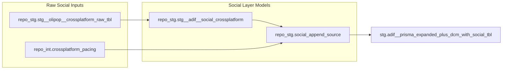

# Social Layering Pipeline

This sub-project owns the social branch that appends WP social delivery rows into the final ADIF output table.

## Lineage Segment to Final Output

## Source Coverage

### `repo_stg.stg__adif__social_crossplatform`
- Reads from `looker-studio-pro-452620.repo_stg.stg__olipop__crossplatform_raw_tbl`
- Filters to ADIF account names and `WP_` campaign patterns
- Preserves source grain and adds social tagging fields

### `repo_stg.social_append_source`
- Reads from `repo_stg.stg__adif__social_crossplatform`
- Reads pacing plans from `repo_int.crossplatform_pacing`
- Maps social rows to ADIF-compatible schema for append
- Uses ad-level delivery rows with `ad_group` mapped to package and `ad` mapped to placement
- Allocates ad_set daily pacing to ads by spend share within each ad_set/day

### `repo_int.crossplatform_pacing` upstream views
- `looker-studio-pro-452620.repo_tables.int__tiktok__combined_history_dedupe_view`
- `looker-studio-pro-452620.repo_facebook.stg__fb_combined_history`
- `looker-studio-pro-452620.repo_google_ads.stg__ga_combined_history`

## Editable Mapping Matrix

- `projects/social_layering/social_mapping_matrix_editable.csv`
- Purpose: editable mapping table for social ad set/ad level to main-table package/placement with sample mapped values.

## Validation Script

- `projects/social_layering/sql/test__adif__social_mapping_v2_vs_current.sql`
- Purpose: validates proposed v2 social mapping totals and pacing against raw social data and current social table output.
