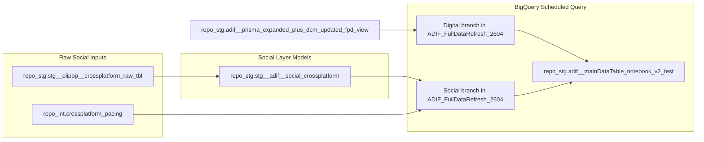

# Social Layering Pipeline

This sub-project owns the social append branch for ADIF.
The current live automated refresh is the BigQuery scheduled query `ADIF_FullDataRefresh_2604`, which writes to `looker-studio-pro-452620.repo_stg.adif__mainDataTable_notebook_v2_test`.
Older notebook copies are historical artifacts and are not the active build path for this table.

## Lineage Segment to Final Output

```mermaid
flowchart LR
  subgraph raw_social["Raw Social Inputs"]
    social_raw["repo_stg.stg__olipop__crossplatform_raw_tbl"]
    pacing["repo_int.crossplatform_pacing"]
  end

  subgraph social_models["Social Layer Models"]
    social_stg["repo_stg.stg__adif__social_crossplatform"]
  end

  subgraph scheduled_query["BigQuery Scheduled Query"]
    social_sched["Social branch in ADIF_FullDataRefresh_2604"]
    digital_sched["Digital branch in ADIF_FullDataRefresh_2604"]
    target_tbl["repo_stg.adif__mainDataTable_notebook_v2_test"]
  end

  social_raw --> social_stg
  social_stg --> social_sched
  pacing --> social_sched
  core_upd["repo_stg.adif__prisma_expanded_plus_dcm_updated_fpd_view"] --> digital_sched
  digital_sched --> target_tbl
  social_sched --> target_tbl
```

## Current Live Refresh

- Transfer config: `projects/671028410185/locations/us/transferConfigs/6a40bbfa-0000-2ee2-a61f-582429bc84e0`
- Display name: `ADIF_FullDataRefresh_2604`
- Schedule: `every 10 hours`
- Verified on: `2026-08-10`
- Live target table: [`looker-studio-pro-452620.repo_stg.adif__mainDataTable_notebook_v2_test`](https://console.cloud.google.com/bigquery?project=looker-studio-pro-452620&ws=!1m5!1m4!4m3!1slooker-studio-pro-452620!2srepo_stg!3sadif__mainDataTable_notebook_v2_test)

## Historical Notebook Copies and Archived SQL

- Historical notebook copy: `projects/social_layering/build__adif__prisma_expanded_plus_dcm_with_social_tbl.ipynb`
- Older notebook output table: `looker-studio-pro-452620.repo_stg.adif__mainDataTable_notebook`
- Legacy scheduled SQL and duplicate notebook copies: `projects/social_layering/archive/legacy_scheduled_sql/`

## Source Coverage

### Live V2 Digital Branch (`CREATE OR REPLACE TABLE`)
- Source: `looker-studio-pro-452620.repo_stg.adif__prisma_expanded_plus_dcm_updated_fpd_view`
- Output: `looker-studio-pro-452620.repo_stg.adif__mainDataTable_notebook_v2_test`
- Behavior: rebuilds the full target in one scheduled query

### Live V2 Social Logic
- Social source: `looker-studio-pro-452620.repo_stg.stg__adif__social_crossplatform`
- Pacing source: `looker-studio-pro-452620.repo_int.crossplatform_pacing`
- Behavior:
  - Normalizes social platform to `meta` / `tiktok`
  - Maps `ad_set -> package`, `ad -> placement`
  - Computes package pacing rollups and over/under flags
  - Keeps `campaign_public_id` as `NULL` so the social schema aligns with the Prisma-backed digital branch without inventing a Prisma identifier
  - Unions social rows into the rebuilt target table inside the V2 single-pass scheduled query

### `repo_int.crossplatform_pacing` upstream views used by live scheduled-query logic
- `looker-studio-pro-452620.repo_tables.int__tiktok__combined_history_dedupe_view`
- `looker-studio-pro-452620.repo_facebook.stg__fb_combined_history`
- `looker-studio-pro-452620.repo_google_ads.stg__ga_combined_history`

## Verification Notes

Live production verification completed on `2026-08-10`:

- Scheduled transfer run `6a96ea99-0000-24c4-9529-f4f5e806ee30` succeeded through the real `ADIF_FullDataRefresh_2604` entrypoint from `2026-08-10T12:03:01Z` to `2026-08-10T12:04:16Z`.
- The [main ADIF table](https://console.cloud.google.com/bigquery?project=looker-studio-pro-452620&ws=!1m5!1m4!4m3!1slooker-studio-pro-452620!2srepo_stg!3sadif__mainDataTable_notebook_v2_test) contains `27,365` rows, `148` final columns, and report data through `2026-08-10`.
- The digital and social branches both emit `142` columns before later calculated fields are added.
- `campaign_public_id` is column `39`, between `campaign_name` and `supplier_code`; `23,602` non-social rows carry a value and all `3,763` social rows remain `NULL`.
- The transfer configuration reports `SUCCEEDED`, retains its every-10-hours schedule, and keeps failure email enabled.

Historical notebook copies still contain useful validation queries for:
- Table totals (`row_count`, `min_date`, `max_date`, `total_spend`, `total_impressions`) for 2026
- Breakdown by `data_source_primary` for 2026
- Breakdown by `supplier_code`, `p_package_friendly` for 2026
- Cross-check source totals from `repo_stg.stg__adif__social_crossplatform` by platform for 2026

## Editable Mapping Matrix

- `projects/social_layering/social_mapping_matrix_editable.csv`
- Purpose: editable mapping table for social ad set/ad level to main-table package/placement with sample mapped values.

## Validation Script

- `projects/social_layering/sql/test__adif__social_mapping_v2_vs_current.sql`
- Purpose: validates proposed v2 social mapping totals and pacing against raw social data and current social table output.

## QA Dashboard Snapshot

- File: `projects/social_layering/dashboard/adif__mainDataTable_notebook_v2_test_qa_dashboard.html`
- Purpose:
  - Shows upstream freshness across direct and leaf sources used by `repo_stg.adif__mainDataTable_notebook_v2_test`
  - Summarizes row-source mix and package-source mix in the target table
  - Adds an interactive lineage map so each pipeline table can be clicked for snapshot details
  - Highlights carry-forward QA for digital, social, and updated FPD lanes
- Snapshot notes:
  - This HTML is a point-in-time export built from BigQuery results captured on `2026-04-07`
  - Status logic stays pinned to that same reference day so the snapshot stays stable when reopened later
  - Treat the HTML row counts and freshness badges as a snapshot, not as live production truth

## One-Page Guide

- File: `projects/social_layering/ADIF_MAIN_PIPELINE_LINEAGE_1PAGER.md`
- Purpose: beginner-friendly summary of the current production lineage from raw inputs to `repo_stg.adif__mainDataTable_notebook_v2_test`
