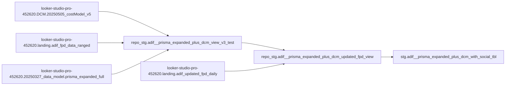

# Updated FPD Integration Guide

## Overview

This document describes the integration of **updated first-party data (FPD)** from a new Google Sheet source into the ADIF data pipeline. Unlike the existing FPD source that comes from multiple partner-specific sheets, this new source provides package-level aggregates that require date spreading.

## New Data Source

**Google Sheet**: [ADIF_Packages_w/o_delivery](https://docs.google.com/spreadsheets/d/1818fclbE_pxNLlCz4dW5zX6ulRRqnnedolbSYVUWnjk/edit?gid=1894007924#gid=1894007924)

**Characteristics**:
- **Granularity**: Package-level (not daily)
- **Records**: 83 packages total, 46 with FPD data
- **Metrics**:
  - `updated_FPD_IMPRESSIONS`: 244M total impressions
  - `updated_FPD_SPEND`: $3.3M total spend
- **Date Information**: None (requires join with Prisma)
- **Update Frequency**: Ad-hoc/Manual

## Architecture

### Pipeline Flow

```
┌──────────────────────────────────────────────────────────────────┐
│              NEW DATA SOURCE (Google Sheet)                      │
│         "ADIF_Packages_w/o_delivery 2601"                       │
│  • 46 packages with updated FPD metrics (package-level)         │
│  • NO date information                                           │
└────────────────────────┬─────────────────────────────────────────┘
                         │
                         ▼
┌──────────────────────────────────────────────────────────────────┐
│         STEP 1: Read Package-Level FPD                          │
│  util_process_updated_fpd.r                                      │
│  • Reads from Google Sheet via googlesheets4                    │
│  • Extracts updated_FPD_IMPRESSIONS, updated_FPD_SPEND          │
└────────────────────────┬─────────────────────────────────────────┘
                         │
                         ▼
┌──────────────────────────────────────────────────────────────────┐
│         STEP 2: Get Date Ranges from Prisma                     │
│  • Query prisma_expanded_full for package start/end dates      │
│  • Join on package_id                                            │
└────────────────────────┬─────────────────────────────────────────┘
                         │
                         ▼
┌──────────────────────────────────────────────────────────────────┐
│         STEP 3: Spread Metrics Across Date Range               │
│  • Divide package-level totals evenly across days              │
│  • Example: 280M imps / 10 days = 28M imps per day             │
│  • Creates daily_fpd_impressions, daily_fpd_spend              │
└────────────────────────┬─────────────────────────────────────────┘
                         │
                         ▼
┌──────────────────────────────────────────────────────────────────┐
│         STEP 4: Upload to BigQuery                              │
│  landing.adif_updated_fpd_daily (1,297 rows)                    │
│  • One row per package per day                                  │
│  • Date range: 2025-10-26 to 2026-01-12                        │
└────────────────────────┬─────────────────────────────────────────┘
                         │
                         ▼
┌──────────────────────────────────────────────────────────────────┐
│         STEP 5: Integrate into Staging View                     │
│  repo_stg.adif__prisma_expanded_plus_dcm_updated_fpd_view       │
│  • FULL OUTER JOIN with DCM, original FPD, and Prisma          │
│  • Data priority: Updated FPD → Original FPD → DCM             │
└──────────────────────────────────────────────────────────────────┘
```

### Lineage Segment to Final Output

This sub-project owns the updated-FPD branch that feeds the final social-augmented output table.



## Files

### R Scripts

#### 1. `util_explore_new_fpd_sheet.r`
**Purpose**: Exploration script to examine the structure of the new Google Sheet

**Key Functions**:
- Detects header row automatically
- Lists all columns and data types
- Identifies package identifiers and metric columns
- Checks for date columns (none found)
- Exports raw data to CSV for inspection

**Output**:
- Console report of sheet structure
- `data/new_fpd_exploration.csv`

#### 2. `util_process_updated_fpd.r`
**Purpose**: Main processing pipeline for updated FPD data

**Processing Steps**:
1. **Read Google Sheet** (via googlesheets4 SDK)
   - Filters to 46 packages with FPD data
   - Validates numeric metrics

2. **Query Prisma for Date Ranges**
   ```sql
   SELECT package_id,
          MIN(date) as prisma_start_date,
          MAX(date) as prisma_end_date
   FROM prisma_expanded_full
   WHERE advertiser_name = 'Forevermark US'
   GROUP BY package_id
   ```

3. **Join FPD with Prisma Dates**
   - Left join on `package_id`
   - Reports packages without date ranges

4. **Spread Metrics Across Days**
   - For each package, expand to daily rows
   - Divide metrics evenly: `daily_value = package_total / n_days`
   - Example:
     ```
     Package P37XV8H: 28.7M impressions, Oct 20 - Dec 21 (63 days)
     → 456K impressions per day
     ```

5. **Validation**
   - Compares sum of daily rows vs. package totals
   - Ensures no data loss during spreading

6. **Upload to BigQuery**
   - Table: `landing.adif_updated_fpd_daily`
   - Write disposition: `WRITE_TRUNCATE` (replaces existing)

**Outputs**:
- `data/updated_fpd_packages.csv` - Package-level raw data
- `data/prisma_package_dates.csv` - Date ranges from Prisma
- `data/updated_fpd_with_dates.csv` - Joined data before spreading
- `data/updated_fpd_daily.csv` - Daily expanded data
- `data/updated_fpd_package_summary.csv` - Summary by package
- BigQuery table: `landing.adif_updated_fpd_daily`

**Runtime**: ~7 seconds for 46 packages → 1,297 daily rows

### SQL Scripts

#### 3. `sql/stg__adif__updated_fpd_integrated.sql`
**Purpose**: Staging view that integrates updated FPD with existing data sources

**Data Sources**:
1. **DCM** (`DCM.20250505_costModel_v5`) - Third-party delivery data
2. **Original FPD** (`landing.adif_fpd_data_ranged`) - Partner-reported data from multiple sheets
3. **Updated FPD** (`landing.adif_updated_fpd_daily`) - **NEW** Package-level aggregates
4. **Prisma** (`20250327_data_model.prisma_expanded_full`) - Planning data

**Join Strategy**:
- Multiple FULL OUTER JOINs to preserve orphan days
- Join keys: `package_id` + `date`
- All sources normalized with same package_id mapping

**Data Priority Hierarchy**:
```sql
COALESCE(
  updated_fpd_impressions,  -- Highest priority (most recent partner data)
  fpd_orig_impressions,      -- Second priority (existing partner data)
  d_impressions              -- Third priority (DCM third-party data)
) AS final_impressions
```

**Key Output Columns**:
- `package_id_joined` - Normalized package ID
- `date` - Calendar date
- `final_impressions` - Coalesced impressions (priority order)
- `final_spend` - Coalesced spend (priority order)
- `final_clicks` - Coalesced clicks
- `data_source_primary` - Which source provided the final data
- `pkg_updated_fpd_*` - Package-level totals from updated FPD
- `pkg_orig_fpd_*` - Package-level totals from original FPD
- `pkg_dcm_*` - Package-level totals from DCM

**Validation Queries** (included at end of SQL):
1. Data source distribution by spend
2. Compare updated vs. original FPD for overlapping packages
3. Verify no data loss - totals should match source tables

## Data Characteristics

### Updated FPD Source Table
**BigQuery**: `looker-studio-pro-452620.landing.adif_updated_fpd_daily`

| Column | Type | Description |
|--------|------|-------------|
| `package_id` | STRING | Package identifier (join key) |
| `date` | DATE | Daily date within package flight |
| `supplier_name` | STRING | Media supplier/partner name |
| `initiative` | STRING | Initiative/campaign name |
| `package_name` | STRING | Full package name with metadata |
| `prisma_start_date` | DATE | Package start date (from Prisma) |
| `prisma_end_date` | DATE | Package end date (from Prisma) |
| `days_in_package` | INTEGER | Number of days in package flight |
| `daily_fpd_impressions` | FLOAT | Daily impressions (spread evenly) |
| `daily_fpd_spend` | FLOAT | Daily spend (spread evenly) |
| `total_package_impressions` | FLOAT | Original package-level total (reference) |
| `total_package_spend` | FLOAT | Original package-level total (reference) |
| `data_source` | STRING | Always "updated_fpd_sheet" |
| `data_update_datetime` | TIMESTAMP | When the data was processed |

**Current Data**:
- **Rows**: 1,297
- **Packages**: 46
- **Date Range**: 2025-10-26 to 2026-01-12
- **Total Impressions**: 244,251,156
- **Total Spend**: $3,265,977

### Top 5 Packages by Spend

| Package ID | Supplier | Initiative | Days | Impressions | Spend |
|------------|----------|------------|------|-------------|-------|
| P3BPTJM | MIQ DIGITAL | YouTubeWrapDecember | 14 | 2.8M | $420K |
| P37JYWD | MIQ DIGITAL | YouTubeWrap | 92 | 22.4M | $400K |
| P37SGTB | IHEART MEDIA | Radio Andy | 63 | 28.7M | $400K |
| P37S8VV | SIRIUS XM | Radio Andy | 57 | 86.0M | $299K |
| P37G11T | NATIONAL CINEMEDIA | Equitable Mix Pre-Trailer | 20 | 2.3M | $250K |

## Date Spreading Logic

### Calculation

For each package:
1. Get total package-level metrics from Google Sheet
2. Get date range from Prisma: `n_days = end_date - start_date + 1`
3. Calculate daily values:
   ```
   daily_impressions = package_impressions / n_days
   daily_spend = package_spend / n_days
   ```
4. Create one row per day in the range

### Example: Package P37XV8H

**Input (package-level)**:
- Impressions: 577,452,260
- Spend: $0
- Prisma dates: 2025-09-23 to 2026-05-31 (251 days)

**Output (daily rows)**:
- 251 rows, one per day
- Each row: 2,300,207 impressions, $0 spend

### Assumptions

1. **Even Distribution**: Metrics are distributed evenly across all days in the flight. This is a simplification - actual delivery may vary by day.

2. **Prisma Dates are Correct**: Package start/end dates from Prisma media planning are assumed to be accurate.

3. **No Partial Days**: Each day gets the same fractional value, regardless of weekends, holidays, or actual delivery patterns.

4. **Package ID Matching**: Package IDs between the Google Sheet and Prisma must match exactly (after normalization).

### Validation

The pipeline includes automatic validation:
```r
original_total <- sum(package_level_data$impressions)
expanded_total <- sum(daily_data$daily_impressions)
diff <- abs(expanded_total - original_total)

if (diff < 1) {
  "✓ Validation passed"
} else {
  "⚠ Warning: Mismatch detected"
}
```

## Integration Impact

### Data Priority Changes

**Before Integration**:
```
FPD (original) → DCM → Planned → NULL
```

**After Integration**:
```
Updated FPD → FPD (original) → DCM → Planned → NULL
```

### Expected Changes in Reporting

For the 46 packages with updated FPD:

1. **Impression Changes**:
   - Packages with updated FPD will use new impression values
   - Net change: +244M impressions across affected packages

2. **Spend Changes**:
   - Packages with updated FPD will use new spend values
   - Net change: +$3.3M spend across affected packages

3. **Affected Date Range**:
   - 2025-10-26 to 2026-01-12
   - Only affects daily rows within this range for the 46 packages

### Packages with Data Source Overlap

Some packages may have **both** original FPD and updated FPD. In these cases:
- Updated FPD takes priority (most recent data)
- Original FPD values are preserved in `fpd_orig_*` columns for reference
- You can compare sources using the validation queries

## Usage

### Running the Pipeline

1. **Process Updated FPD** (when new data is available):
   ```bash
   cd /Users/eugenetsenter/Looker_clonedRepo/looker_personal/adif
   Rscript util_process_updated_fpd.r
   ```

2. **Verify BigQuery Upload**:
   ```sql
   SELECT
     COUNT(*) as row_count,
     COUNT(DISTINCT package_id) as package_count,
     MIN(date) as min_date,
     MAX(date) as max_date,
     SUM(daily_fpd_impressions) as total_impressions,
     SUM(daily_fpd_spend) as total_spend
   FROM `looker-studio-pro-452620.landing.adif_updated_fpd_daily`
   ```

3. **Update Staging View** (one-time setup):
   - Option A: Execute `sql/stg__adif__updated_fpd_integrated.sql` to create new staging view
   - Option B: Modify existing `adif__prisma_expanded_plus_dcm_view_v3_test` to add updated FPD CTE

4. **Update Mart Layer** (if needed):
   - Change mart queries to reference new staging view
   - No changes needed if view name stays the same

### Validation Queries

**1. Check data source distribution**:
```sql
SELECT
  data_source_primary,
  COUNT(*) AS row_count,
  SUM(final_impressions) AS total_impressions,
  SUM(final_spend) AS total_spend
FROM `repo_stg.adif__prisma_expanded_plus_dcm_updated_fpd_view`
GROUP BY data_source_primary
ORDER BY total_spend DESC;
```

**2. Compare updated FPD vs original FPD**:
```sql
SELECT
  package_id_joined,
  SUM(updated_fpd_impressions) AS updated_imps,
  SUM(fpd_orig_impressions) AS orig_imps,
  SUM(updated_fpd_spend) AS updated_spend,
  SUM(fpd_orig_spend) AS orig_spend,
  CASE
    WHEN SUM(updated_fpd_impressions) > 0 AND SUM(fpd_orig_impressions) > 0 THEN 'Both'
    WHEN SUM(updated_fpd_impressions) > 0 THEN 'Updated only'
    WHEN SUM(fpd_orig_impressions) > 0 THEN 'Original only'
    ELSE 'Neither'
  END AS data_availability
FROM `repo_stg.adif__prisma_expanded_plus_dcm_updated_fpd_view`
GROUP BY package_id_joined
HAVING SUM(updated_fpd_impressions) > 0 OR SUM(fpd_orig_impressions) > 0
ORDER BY updated_spend DESC;
```

**3. Verify daily spread accuracy for one package**:
```sql
-- Check P37JYWD (YouTubeWrap - $400K package)
SELECT
  date,
  daily_fpd_impressions,
  daily_fpd_spend,
  total_package_impressions,
  total_package_spend,
  days_in_package
FROM `landing.adif_updated_fpd_daily`
WHERE package_id = 'P37JYWD'
ORDER BY date;

-- Verify totals match
SELECT
  package_id,
  COUNT(*) AS daily_rows,
  SUM(daily_fpd_impressions) AS sum_daily_imps,
  MAX(total_package_impressions) AS expected_imps,
  SUM(daily_fpd_spend) AS sum_daily_spend,
  MAX(total_package_spend) AS expected_spend
FROM `landing.adif_updated_fpd_daily`
WHERE package_id = 'P37JYWD'
GROUP BY package_id;
```

## Maintenance

### Regular Tasks

1. **Weekly** (if data updates regularly):
   - Run `util_process_updated_fpd.r` to refresh data
   - Verify row counts and totals in BigQuery

2. **Monthly**:
   - Review packages without Prisma date ranges
   - Check for new packages in Google Sheet
   - Archive old checkpoint CSVs

### Troubleshooting

**Issue**: Package has FPD data but no Prisma dates
- **Cause**: Package ID doesn't exist in Prisma, or is a "Child" package type
- **Fix**: Check package ID spelling, or manually provide date range

**Issue**: Total impressions/spend don't match after spreading
- **Cause**: Floating point rounding errors (usually < 1 unit)
- **Fix**: Review validation report - differences < 1 are acceptable

**Issue**: Google Sheet structure changed
- **Cause**: Someone modified column names or layout
- **Fix**: Update `util_process_updated_fpd.r` column references (lines 27-35)

## Future Enhancements

1. **Weighted Date Spreading**: Instead of even distribution, weight by day-of-week or actual delivery patterns from DCM

2. **Automated Scheduling**: Set up Cloud Scheduler to run R script automatically when sheet updates

3. **Data Quality Checks**: Add alerts for packages missing Prisma dates or with unusual metric values

4. **Historical Tracking**: Archive previous versions of updated FPD to track changes over time

5. **Date Range Validation**: Check if Prisma dates align with DCM delivery dates before spreading

## Related Documentation

- [Main Pipeline Documentation](../tv_digital_pipeline/README%20-%20ADIF%20TV%20%26%20Digital%20Data%20Pipeline.md)
- [Original FPD Collection](../tv_digital_pipeline/util_collect_fpd_v2.r) - Existing partner sheet ingestion
- [Prisma Data Model](../20250327_data_model/prisma_expanded_full) - Source for date ranges

## Contact

For questions about this integration:
- Data Engineering Team
- Last Updated: 2026-01-23
