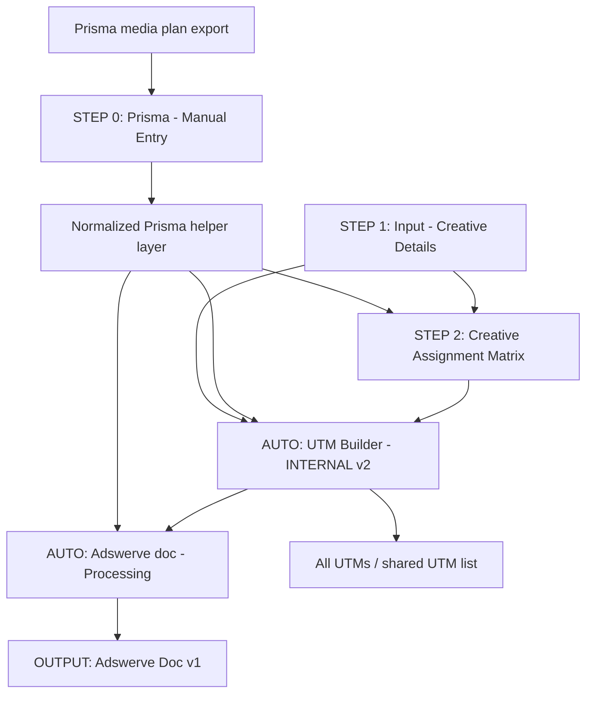

# Creative Assignment Sheet System Map

Last updated: May 13, 2026

Primary source workbook: [Creative Assignment Sheet | 2026 | Apollo](https://docs.google.com/spreadsheets/d/1U46ZJ4U6XCLTXqtNXlun7uY0L1iyG88RZ6HMiOeACyU/edit)

Compared variant workbooks:

- [Creative Assignment Sheet | 2025 | Olipop - Nov25](https://docs.google.com/spreadsheets/d/129tqkDAhmeUXQ0WVb4w0YHJ5DGIPMuL8fGRHOfH8mD8/edit)
- [Creative Assignment Sheet | 2025 | ADIF](https://docs.google.com/spreadsheets/d/1WI9RlZ8qkgDs2TQDTLHkN55jWTZ3VOOba1fCTcFwZsQ/edit)
- [Creative Assignment Sheet | 2026 | Ritual](https://docs.google.com/spreadsheets/d/1boQDy5nSQDaheIBcXJZTuhbdNSBOVtVFb8xtIuAGyjA/edit)

## Purpose

This document maps how the Creative Assignment Sheet works as a system: its tabs, inputs, transformations, outputs, formula dependencies, risks, and practical simplification opportunities.

The workbook is a manual trafficking-prep workflow. It lets a trafficker paste Prisma placement data, enter creative assets, assign one or more creatives to each placement, generate UTM values, and produce an Adswerve-ready trafficking output.

## Critical Constraint

Treat the Prisma import as immutable.

That means:

- Do not change the raw Prisma export shape.
- Do not require users to alter the Step 0 paste format.
- Do not insert columns into the raw pasted Prisma area.
- Do not depend on changing Prisma field names or export order as the first fix.
- Put improvements downstream of the import: helper tabs, normalized views, named ranges, validation tabs, QA tabs, and output tabs.

The safest architecture is:

1. Keep `STEP 0 | Prisma - Manual Entry` as the raw immutable input.
2. Add or improve a normalized layer that reads Step 0.
3. Point all assignment, UTM, and output logic at the normalized layer.
4. Keep client-specific rules in configuration tables, not hardcoded formulas.

## Current Operating Reality

The current workflow is manual.

The old automatic Prisma import flow is deprecated. The workbook still contains hidden or archived auto-import remnants, but those should be treated as legacy unless a downstream formula still actively depends on them.

Important current reality:

- Users paste the Prisma export manually.
- Creative details are entered manually.
- Creative assignment is done through dropdowns in the assignment matrix.
- UTM and Adswerve outputs are formula-generated.
- The workbook was originally built for MassMutual, then copied and customized for other clients.
- Template residue is expected and should be managed intentionally.

## Real-Life Template Variants Observed

The Apollo workbook is not the only version in use. Three other copied and customized versions were reviewed on May 13, 2026: Olipop, ADIF, and Ritual. These variants are important because they show the real customization surface, not just the theoretical Apollo design.

### Workbook Comparison Summary

| Workbook | Tabs | Main input tab naming | Output data rows observed | Notable behavior |
| --- | ---: | --- | ---: | --- |
| Apollo 2026 | 18 | `STEP 0`, `STEP 1`, `STEP 2` | 1,041 | Adds updated directions, Apollo-specific UTM fields, `All_UTMs`, and `Unique values`. |
| Olipop Nov25 | 15 | `1 | INPUT - Prisma`, `2 | INPUT - Creative Details`, `3 | Creative Assignment Matrix` | 87 | Leaner UTM schema, visible `AUTO | Prisma | Combined`, client landing page and creative set customized. |
| ADIF 2025 | 15 | `1 | INPUT - Prisma`, `2 | INPUT - Creative Details`, `3 | Creative Assignment Matrix` | 162 | Leaner UTM schema, ADIF landing pages, audio/podcast examples, and same copied hidden logic. |
| Ritual 2026 | 15 | `1 | INPUT - Prisma`, `2 | INPUT - Creative Details`, `3 | Creative Assignment Matrix` | 5 | Smallest active output, Ritual URL pattern, and evidence of stale ADIF residue in sampled output rows. |

All reviewed workbooks share the same Adswerve output schema:

1. Campaign
2. Site Name
3. Package Name
4. Size
5. Placement Name
6. Start
7. End
8. Est. Impressions
9. CPM
10. Media Cost
11. Ad Name
12. Creative Assignment
13. Creative Rotation
14. Landing Page Name
15. URL
16. Contact Info
17. Notes

### Real Customization Patterns

The copied sheets show that client customization happens in several places at once:

- Workbook naming and year: Apollo 2026, Olipop 2025/2026 media, ADIF 2025/2026, Ritual 2026.
- Client and campaign codes embedded in Prisma placement names: `APO`, `OLI`, `FMUS_ADIF`, `RTL`.
- Landing page domains: `apollo.com`, `drinkolipop.com`, `adiamondisforever.com`, and `ritual.com`.
- Creative inventory: each client has its own creative names, creative types, and destination URLs in the creative details tab.
- Assignment volume: Apollo has more than 1,000 Adswerve output rows, while Ritual currently has only 5 nonblank output rows.
- UTM shape: Apollo uses `utm_source_platform`; the other reviewed variants use a leaner five-parameter UTM structure.
- Supporting tabs: Apollo has `manual utm builder validations`, `All_UTMs`, and `Unique values`; the other variants use `UTM_taxonomy` and `URLs`.

### UTM Pattern Examples

Apollo example:

```text
https://www.apollo.com/insights-news/think-it-new?utm_source=amco&utm_medium=video&utm_campaign=apollopatrickcantlay2025&utm_source_platform=amco&utm_content=amco_video_p35r3wf-videoflexframe_p35r3wm-pc30_pc30&utm_term=wealthinstitutional_usa
```

Olipop example:

```text
https://drinkolipop.com/?utm_source=disned&utm_medium=OTT&utm_campaign=USA_OLIPOPBachelorette2026&utm_content=P38GSTP-VideoCommercialBachelorFranchise_P38GSTY-TBD&utm_term=cxt_BachFranchise_USA
```

ADIF example:

```text
https://adiamondisforever.com/desert-diamonds/?utm_source=relx&utm_medium=audio&utm_campaign=USA_ADIF2026&utm_content=P3C4KPJ_P3C4KV2_Gifting&utm_term=na_na_USA
```

Ritual example:

```text
https://ritual.com/?utm_source=discov&utm_medium=tv&utm_campaign=USA_Ritual2026Media&utm_content=P3FLS2Z_P3FLS3G_CustomBumper&utm_term=na_WellnessSeeker_USA
```

The key design lesson is that "client customization" is not just a logo, title, or output name. It is a bundle of UTM rules, placement parsing assumptions, creative naming conventions, destination URL rules, source/platform fields, and export QA expectations.

### Variant Residue And Drift Found

The variant comparison surfaced several concrete signs of template drift:

- Olipop, ADIF, and Ritual keep old numbered tab names while Apollo uses newer `STEP` names.
- The reviewed variants still include formulas checking for `mass` in UTM builder logic.
- The reviewed variants keep external `IMPORTRANGE` formulas pointing to the old shared UTM-builder workbook.
- The reviewed variants include a `URLs` tab that imports from the ADIF workbook ID, even in non-ADIF copies.
- Ritual has sampled output rows containing stale ADIF URL values lower in the output range.
- Formula errors such as `=#REF!` and `COUNTA(SPLIT(#REF!,"_"))` appear in helper cells in the reviewed copies.

These are exactly the kinds of issues a web app or hardened template should prevent by design.

## High-Level Data Flow



In the current workbook, the normalized helper layer is partly represented by `AUTO | Prisma | Combined` and named range `prisma_data`, but that layer still contains deprecated auto-import assumptions.

## Workbook Inventory

### User-Facing Direction Tabs

`Directions`

- Original instruction tab.
- Contains useful conceptual context.
- Now partly stale because it still describes the old auto-update behavior.

`Directions - Updated`

- New polished instruction tab added on May 13, 2026.
- States the manual-only workflow clearly.
- Warns that auto import is deprecated.
- Should be treated as the current user-facing instruction tab.

### User Input Tabs

`STEP 0 | Prisma - Manual Entry`

- Raw manual Prisma export input.
- This is the immutable raw source.
- Users paste Prisma export rows into the designated paste area.
- Current workbook size observed: 988 rows by 539 columns.
- Used range observed: `A1:FC988`.
- Formula/helper columns exist on the far right.
- Key formulas parse placement names and package IDs from raw Prisma text.
- Variant equivalent: `1 | INPUT - Prisma`.
- Variant row counts observed: Olipop 2,827 rows, ADIF 2,854 rows, Ritual 2,854 rows.

Observed helper behavior:

- Columns around `EP:FC` parse package, placement, supplier, campaign, and helper identifiers.
- Column `FC` contains many repeated `COUNTA(SPLIT(...))` formulas.
- Some helper formulas contain `#REF!`, which should be reviewed.

`STEP 1 | INPUT - Creative Details`

- Manual creative asset input.
- Used range observed: `A1:I57`.
- Required business fields include asset name, creative type, and destination URL where needed.
- Creative names in column `C` feed dropdowns in the assignment matrix.
- Current validation is light; this tab is a strong candidate for more guardrails.
- Variant equivalent: `2 | INPUT - Creative Details`.
- Real-life customization is concentrated here: client landing pages, creative names, creative types, and naming conventions differ heavily by client.

`STEP 2 |  Creative Assignment Matrix v2`

- Main assignment surface.
- Placement rows are shown to users.
- Creative assignment cells use dropdowns populated by `STEP 1 | INPUT - Creative Details`.
- Current workbook size observed: 2910 rows by 23 columns.
- Used range observed: `A1:V2910`.
- Core assignment columns observed around `J:T`.
- Column `U` concatenates placement and creative pairings into a flattened string that downstream tabs split.
- Variant equivalent: `3 |  Creative Assignment Matrix v2`.
- The same horizontal assignment pattern is used across Apollo, Olipop, ADIF, and Ritual.

### Manual UTM Tabs

`MANUAL UTM BUILDER`

- Separate manual UTM builder.
- Current workbook size observed: 2529 rows by 23 columns.
- Used range observed: `A1:W2529`.
- Formula-heavy: observed more than 10,000 formulas.
- Major formula columns include `S`, `T`, `U`, and `V`.
- Uses many repeated row formulas to build UTM components and final URLs.
- Apollo version has 23 columns; reviewed variant versions have 19 columns.
- Apollo includes `utm_source_platform` and inherited Apollo/MassMutual fields; reviewed variants use a leaner UTM builder.

`manual utm builder validations`

- Validation helper tab for the manual builder.
- Holds dropdown lists and client-specific values.
- Observed formulas derive some validation values from Step 0 and the manual builder.
- Contains references to client campaign naming and source/medium mappings.
- Variant equivalent: `UTM_taxonomy`.
- The reviewed variants use this tab as a simpler explanation/lookup table for UTM source, medium, campaign, content, and term.

`All_UTMs`

- Shared/external UTM list.
- Contains `IMPORTRANGE` formulas pointing to other spreadsheets.
- This is a high-risk template inheritance area.
- For a durable template or app, this should be replaced by a local output table or an explicit external integration.
- Variant equivalent: `URLs`.
- In the reviewed variants, `URLs` contains `IMPORTRANGE` formulas that still point to the ADIF workbook ID. This is a major copy-template risk.

### Internal Processing Tabs

`AUTO | UTM Builder | INTERNAL v2`

- Internal row-expansion and UTM construction tab.
- Splits creative assignments from the matrix into one row per placement/creative pairing.
- Looks up Prisma fields using `prisma_data`.
- Builds UTM fields and final destination URLs.
- Contains client-specific hardcoding such as Apollo and Mass matching.
- Uses `VLOOKUP` by numeric column index heavily.
- Contains at least one formula with `#REF!` embedded in an `IFERROR`.

`AUTO | Adswerve doc - Processing | INTERNAL`

- Processing layer between UTM builder and output.
- Splits and reshapes rows for trafficking output.
- Currently contains formulas that reference the archived UTM builder v1 in at least one sampled formula.
- This should be reviewed because active processing should not depend on archived v1 logic unless intentional.

`OUTPUT | Adswerve Doc | v1`

- Primary trafficking output for Adswerve.
- Uses `AUTO | Adswerve doc - Processing | INTERNAL`, `AUTO | Prisma | Combined`, `AUTO | UTM Builder | INTERNAL v2`, and `prisma_data`.
- Formula-heavy but mostly output-shaping.
- Should become the final reviewed export surface.

### Deprecated / Legacy / Hidden Tabs

`AUTO | PRISMA | Auto-Updates`

- Hidden auto Prisma import layer.
- Deprecated according to current operating reality.
- Still referenced in visible downstream formulas.

`AUTO | Prisma | Combined`

- Hidden combined Prisma layer.
- Current formula design merges deprecated auto data and manual Step 0 data.
- Named range `prisma_data` points here.
- This is structurally important, but its current semantics should be cleaned up for a manual-only future.

`AUTO | UTM Builder | INTERNAL v1 - archived`

- Hidden archived UTM builder.
- Contains many `IMPORTRANGE` references to external spreadsheets.
- Should not drive current output.

`MANUAL UTM BUILDER v1 - archived`

- Hidden archived manual builder.
- Should be treated as historical.

`Lookup talbe - archived`

- Hidden archived lookup tab.
- Typo in tab name is another sign that this is inherited template residue.

`data5`

- Hidden data source sheet connected to BigQuery.
- Points to `giant-spoon-299605.Prisma_Master.data5`.
- Data source filter was observed using a Mass-related placement-name condition.
- Because auto import is deprecated, this should be treated as legacy/template residue, not active truth.

`Unique values`

- Helper tab that derives unique values from current or external UTM fields.
- Contains `IMPORTRANGE` references to another spreadsheet ID.
- Should be treated carefully because it may blend current workbook logic with old template sources.

## Named Ranges

Observed named ranges:

- `Prisma_Manual`: points to the manual Prisma input area.
- `prisma_data`: points to `AUTO | Prisma | Combined`.
- `Prisma_Auto`: points to the deprecated auto Prisma import area.

Recommended future named ranges:

- `raw_prisma_import`: raw immutable Step 0 pasted data.
- `normalized_prisma`: clean helper view derived from Step 0 only.
- `creative_assets`: Step 1 creative records.
- `creative_assignments`: normalized one-row-per-placement-creative assignments.
- `utm_output`: one-row-per-assignment UTM output.
- `adswerve_export`: final trafficking export surface.

## Core Data Objects

### Prisma Placement

Grain: one Prisma placement row.

Source:

- `STEP 0 | Prisma - Manual Entry`

Important fields:

- Placement ID
- Provider name
- Supplier code
- Package type
- Buy type
- Placement name
- Dimension
- Cost method
- Unit type
- Planned amount
- Flight dates
- Click-through URL
- Parsed package ID
- Parsed campaign/supplier/audience/geography fields

Constraint:

- Raw import is immutable.
- Any cleanup should happen in a downstream normalized view.

### Creative Asset

Grain: one creative asset.

Source:

- `STEP 1 | INPUT - Creative Details`

Important fields:

- Asset Name
- Creative Type
- Destination URL override
- Rotation
- Campaign
- Supplier
- Package and placement hints

Current risk:

- Step 1 has limited validation.
- Duplicate or inconsistent creative names can break dropdown selection and output naming.

### Creative Assignment

Grain: one placement and one selected creative.

Source:

- `STEP 2 | Creative Assignment Matrix v2`

Current representation:

- Assignment cells are horizontal, roughly `J:T`.
- Column `U` flattens assignments into comma-separated strings.
- Downstream formulas split that string back into rows.

Current risk:

- Horizontal assignment cells are convenient for users, but the string-flattening bridge is fragile.
- A normalized helper table should materialize one row per placement/creative pairing.

### UTM Row

Grain: one placement/creative UTM.

Source:

- `AUTO | UTM Builder | INTERNAL v2`

Important fields:

- UTM source
- UTM medium
- UTM campaign
- UTM source platform, when required by the client
- UTM content
- UTM term
- Final destination URL

Current risk:

- Client-specific logic is hardcoded in formulas.
- Lookup logic uses numeric `VLOOKUP` indexes against large ranges.
- Some formulas include legacy `mass` or `apollo` branches.
- Real variants do not all use the same UTM schema: Apollo includes `utm_source_platform`, while Olipop, ADIF, and Ritual use a five-parameter pattern without it.

### Adswerve Export Row

Grain: one trafficking row for Adswerve.

Source:

- `OUTPUT | Adswerve Doc | v1`

Important fields:

- Placement information
- Creative filename/name
- Size or dimension
- URL fields
- UTM fields
- Final output columns required by Adswerve

Current risk:

- Output formulas depend on multiple internal layers and named ranges.
- Some processing formulas still reference archived v1 UTM builder logic.

## Formula Dependency Map

### Step 0 Parsing Formulas

Representative formula family:

```gs
=ARRAYFORMULA(IFERROR(
  IF($A2:$A<>"",
    IF($FC2:$FC<12,
      REGEXEXTRACT($J2:$J,"^(?:[^_]*\_){4}([^\||_]*)"),
      REGEXEXTRACT($J2:$J,"^(?:[^_]*\_){6}([^\||_]*)")
    ),
    ""
  ),
  "NA"
))
```

What it does:

- Reads raw placement-name text.
- Counts underscore-delimited segments.
- Applies one regex pattern for older/shorter placement names and another for longer placement names.
- Extracts derived metadata needed downstream.

Risk:

- The formula is hard to read.
- Regex assumptions are hidden.
- If Prisma naming conventions change, derived fields can silently become `NA`.

Immutable-import improvement:

- Keep the raw Step 0 input unchanged.
- Move these parsing formulas into a dedicated normalized helper tab.
- Name each derived field clearly.
- Add a QA flag when parsing returns `NA` for required fields.

### Step 2 Placement Display Formula

Representative formula family:

```gs
=IF(
  AND(
    IFERROR(MATCH(G5,'STEP 0 | Prisma - Manual Entry'!J:J,0),0)>0,
    IFERROR(VLOOKUP(G5,'AUTO | PRISMA | Auto-Updates'!I:I,1,false),0)=0
  ),
  CONCAT(IFNA(CONCATENATE(B5," | ",C5," | ",D5," | ",E5),F5)," ## MANUAlly ADDED ##"),
  IFNA(CONCATENATE(B5," | ",C5," | ",D5," | ",E5),F5)
)
```

What it does:

- Builds a friendly placement label.
- Attempts to detect whether a placement exists in manual input but not in the deprecated auto-update tab.
- Appends a manually-added label.

Risk:

- It still depends on `AUTO | PRISMA | Auto-Updates`, even though auto import is deprecated.
- It uses a deprecated data source to classify current manual rows.
- The output label typo/casing (`MANUAlly`) is another sign of legacy formula drift.

Immutable-import improvement:

- Remove deprecated auto-update dependency from current manual workflow.
- If manual-source labeling is still needed, derive it from an explicit helper field, not from the deprecated auto tab.
- Keep placement label construction separate from source-status labeling.

### Step 2 Assignment Flattening Formula

Representative row formula:

```gs
=CONCATENATE(
  IF(J5<>"",CONCATENATE(F5," || ",J5),""),
  ",",
  IF(K5<>"",CONCATENATE(F5," || ",K5),""),
  ",",
  IF(L5<>"",CONCATENATE(F5," || ",L5),""),
  ",",
  IF(M5<>"",CONCATENATE(F5," || ",M5),""),
  ",",
  IF(N5<>"",CONCATENATE(F5," || ",N5),""),
  ",",
  IF(O5<>"",CONCATENATE(F5," || ",O5),""),
  ",",
  IF(P5<>"",CONCATENATE(F5," || ",P5),""),
  ",",
  IF(Q5<>"",CONCATENATE(F5," || ",Q5),""),
  ",",
  IF(R5<>"",CONCATENATE(F5," || ",R5),""),
  ",",
  IF(S5<>"",CONCATENATE(F5," || ",S5),""),
  ",",
  IF(T5<>"",CONCATENATE(F5," || ",T5),"")
)
```

What it does:

- Converts up to 11 creative assignment cells into a single comma-separated string.
- Each nonblank creative becomes `placement || creative`.

Risk:

- Very repetitive.
- Easy to break if assignment columns expand or contract.
- Emits placeholder commas for blank assignments.
- Downstream logic must split the string back into rows.

Simpler row-level replacement:

```gs
=IF(
  COUNTA(J5:T5)=0,
  "",
  TEXTJOIN(
    ",",
    TRUE,
    MAP(
      FILTER(J5:T5,J5:T5<>""),
      LAMBDA(creative,F5&" || "&creative)
    )
  )
)
```

Why this is better:

- Reads as "for each selected creative, attach the placement".
- Automatically ignores blanks.
- Avoids long chains of repeated `IF` and `CONCATENATE`.
- Adapts more easily if the assignment range changes.

Best structural improvement:

- Create a normalized `creative_assignments` helper table with one row per selected creative.
- Avoid flattening to comma-separated strings at all.

### Step 2 All-Assignments Aggregator

Current pattern:

```gs
=(JOIN(",",filter(U5:U,U5:U<>",,,,,,,,,,")))
```

What it does:

- Aggregates row-level assignment strings into one large comma-separated list.
- Excludes a specific placeholder string produced by blank assignment rows.

Risk:

- The placeholder value is brittle.
- If the number of assignment columns changes, the placeholder changes.
- It hides the difference between "no assignment" and "formula emitted blank separators".

Simpler replacement:

```gs
=TEXTJOIN(",",TRUE,FILTER(U5:U,U5:U<>""))
```

Prerequisite:

- First simplify the row-level assignment formula so truly blank rows return blank, not comma placeholders.

### UTM Builder Assignment Expansion

Representative formula:

```gs
=TRANSPOSE(SPLIT('STEP 2 |  Creative Assignment Matrix v2'!U3,",",true,true))
```

What it does:

- Splits the assignment aggregator into one row per placement/creative string.

Risk:

- Depends on comma-separated text as an intermediate data format.
- Creative names or placement labels containing commas could break parsing.
- The formula depends on all assignments being stuffed into a single cell first.

Improvement:

- Replace the string bridge with a normalized helper table.
- Use one row per assignment as early as possible.
- If staying in Sheets, build a helper tab whose only purpose is to unpivot assignment columns.

### UTM Builder Lookup Formulas

Representative formulas:

```gs
=ARRAYFORMULA(IFNA(VLOOKUP($D3:$D,prisma_data,156,false),""))
```

```gs
=(arrayformula(SUBSTITUTE(IFNA(VLOOKUP($D3:D,prisma_data,145,false),""),"PITCHB","PITCH")))
```

What they do:

- Look up many Prisma fields by placement/package ID.
- Return specific fields by numeric column index.

Risk:

- Numeric column indexes are hard to audit.
- `156` and `145` do not communicate business meaning.
- If the normalized source changes, every dependent formula must be manually audited.

Immutable-import improvement:

- Keep Step 0 raw import unchanged.
- Create a normalized helper tab with business-readable column names.
- Use named ranges or `XLOOKUP` against named helper columns.
- Example target shape:
  - `placement_id`
  - `supplier_code`
  - `supplier_name`
  - `campaign_name`
  - `package_name`
  - `placement_name`
  - `audience`
  - `geo`
  - `dimension`
  - `click_url`

Example lookup direction:

```gs
=XLOOKUP($D3:$D, normalized_prisma[placement_id], normalized_prisma[campaign_name], "")
```

If Google Sheets structured table references are not available in this workbook, use named ranges for each normalized column.

### UTM Builder Media-Type Classification

Representative formula:

```gs
=ARRAYFORMULA(IF(
  A3:A<>"",
  IFS(
    REGEXMATCH(A3:A,"(?i)OOH"),"ooh",
    REGEXMATCH(A3:A,"(?i)social"),"paid_social",
    REGEXMATCH(A3:A,"(?i)email|newsletter"),"newsletter",
    REGEXMATCH(A3:A,"(?i)Video"),"video",
    REGEXMATCH(A3:A,"(?i)audio"),"audio",
    REGEXMATCH(A3:A,"(?i)programmatic"),"programmatic",
    TRUE,"display"
  ),
  ""
))
```

What it does:

- Infers UTM medium from placement text.

Risk:

- Business rules are hardcoded.
- New media types require formula edits.
- Matching order matters and is not documented.

Improvement:

- Create a `CONFIG | Media Type Rules` table.
- Columns:
  - `priority`
  - `match_pattern`
  - `utm_medium`
  - `notes`
- Use a helper formula or future app logic to apply the first matching rule.

### Client-Specific Branching

Observed formula patterns include client-specific checks:

```gs
=IF(REGEXMATCH(LOWER(A3),"apollo"), ...)
```

```gs
=IF(REGEXMATCH(LOWER(E3),"mass"), ...)
```

Risk:

- A copied workbook can retain another client's rules.
- Client behavior is hidden inside formulas instead of visible config.
- It makes template reuse dangerous.
- This is not hypothetical: Olipop, ADIF, and Ritual still contain repeated `REGEXMATCH(...,"mass")` formulas in sampled UTM-builder cells.
- Ritual also shows stale ADIF URL residue in sampled output rows, which indicates copied template content can survive even when visible client setup appears changed.

Improvement:

- Create a `CONFIG | Client` tab.
- Store client-specific settings once.
- Reference those settings from formulas.
- Avoid hardcoded client names inside formula logic.

Example config fields:

- `client_code`
- `default_geo`
- `default_audience`
- `utm_campaign_prefix`
- `include_utm_source_platform`
- `utm_content_pattern`
- `utm_term_pattern`
- `creative_filename_pattern`
- `adswerve_output_version`

Observed client config examples:

| Client | Client code examples | Landing domain | UTM campaign style | Source platform? |
| --- | --- | --- | --- | --- |
| Apollo | `APO` | `apollo.com` | `apollopatrickcantlay2025` or source campaign casing from Prisma | Yes |
| Olipop | `OLI` | `drinkolipop.com` | `USA_OLIPOPBachelorette2026` | No |
| ADIF | `FMUS_ADIF` | `adiamondisforever.com` | `USA_ADIF2026` | No |
| Ritual | `RTL` | `ritual.com` | `USA_Ritual2026Media` | No |

### Final URL Builder

Representative manual-builder formula:

```gs
=IF(
  COUNTA(B7:O7)<COLUMNS(B7:O7),
  "missing input",
  IF(
    B7<>"",
    IF(
      REGEXMATCH(C7,"\?"),
      CONCATENATE(C7,"&",T7),
      CONCATENATE(C7,"?",T7)
    ),
    ""
  )
)
```

What it does:

- Checks required inputs.
- Appends UTM parameters to the landing page.
- Uses `?` or `&` depending on whether the URL already has query parameters.

Risk:

- Required input check uses a broad fixed range.
- It may block rows where optional fields are intentionally blank.
- Same URL-building pattern appears in more than one place.

Improvement:

- Turn URL assembly into a named function.
- Separate required-field QA from final URL construction.

Example named function shape:

```gs
=APPEND_UTM(base_url, utm_query)
```

Function logic:

```gs
=IF(
  OR(base_url="",utm_query=""),
  "",
  base_url & IF(REGEXMATCH(base_url,"\?"),"&","?") & utm_query
)
```

### Adswerve Output Lookups

Representative formula:

```gs
=ARRAYFORMULA(IFNA(
  VLOOKUP('AUTO | Adswerve doc - Processing | INTERNAL '!$D3:$D1544,prisma_data,156,false),
  VLOOKUP(REGEXEXTRACT(C2:C,"P2....."),prisma_data,156,false)
))
```

What it does:

- Uses processing output to look up Prisma fields.
- Falls back to extracting a package ID from another output field.

Risk:

- Multiple fallback paths make debugging hard.
- `P2.....` is a narrow pattern and may not generalize.
- Numeric column index `156` hides business meaning.

Improvement:

- Normalize placement/package IDs before output generation.
- Use readable helper fields in the processing layer.
- Keep fallback logic in one helper column, then output columns use direct references.

## Current System Risks

### Risk 1: Deprecated Auto Logic Still Exists

The workbook is now manual, but active formulas still reference deprecated auto tabs.

Examples:

- Step 2 placement labels reference `AUTO | PRISMA | Auto-Updates`.
- `AUTO | Prisma | Combined` still merges auto and manual sources.
- `AUTO | Adswerve doc - Processing | INTERNAL` has sampled formulas referencing `AUTO | UTM Builder | INTERNAL v1 - archived`.

Impact:

- A stale hidden tab can influence visible output.
- Users may trust output that is partly generated from old template logic.

Recommendation:

- Create a manual-only normalized Prisma layer.
- Point active formulas to that layer.
- Move old auto tabs to an archival copy or rename them with a strong `LEGACY_DO_NOT_USE` prefix.

### Risk 2: Formula Logic Is Distributed Across Too Many Tabs

Key transformations are split across:

- Step 0 helper columns.
- Step 2 assignment flattening.
- Auto UTM builder.
- Adswerve processing.
- Output tab.
- Validation tabs.
- Archived tabs.

Impact:

- Hard to debug.
- Hard to onboard new users.
- Easy to break during client customization.

Recommendation:

- Formalize layers:
  - Raw input
  - Normalized Prisma
  - Creative assets
  - Assignment table
  - UTM generation
  - QA
  - Export

### Risk 3: Client-Specific Logic Is Hardcoded

Observed formulas include client-name checks and old client references.

Impact:

- Copied workbooks can leak old client assumptions.
- Client customization requires formula edits.
- Copied sheets can look client-specific while still retaining stale `mass`, Apollo, ADIF, or external workbook assumptions.

Recommendation:

- Move client rules into config tabs.
- Use formulas to reference config values.
- For a web app, store client config in a database table.
- Add a QA check that scans formulas and output values for stale client names, stale workbook IDs, and unexpected domains.

### Risk 4: Large Formula Counts Increase Fragility

Observed examples:

- `MANUAL UTM BUILDER` has more than 10,000 formulas.
- `STEP 2 | Creative Assignment Matrix v2` has more than 5,800 formulas.
- `STEP 0 | Prisma - Manual Entry` has hundreds of helper formulas.

Impact:

- Formula drift is likely.
- Copy/paste can overwrite logic.
- Performance may degrade.

Recommendation:

- Prefer one spill formula per output column where possible.
- Replace repeated row formulas with named functions or helper views.
- Protect formula columns.
- Add QA flags that detect formula errors.

### Risk 5: External Spreadsheet Dependencies Are Hidden

`All_UTMs`, `Unique values`, and archived UTM tabs include `IMPORTRANGE` references to other spreadsheet IDs.

Impact:

- Permissions can break.
- External source shape can change.
- Copied templates can inherit irrelevant history.

Recommendation:

- Replace external imports with local workbook outputs for client-specific files.
- If cross-workbook aggregation is needed, make it explicit and documented.
- In a web app, centralize UTM records in a database or warehouse table.

### Risk 6: Copied Client Sheets Drift In Different Directions

The reviewed client variants are not just Apollo with different data. They changed tab names, UTM field sets, supporting lookup tabs, visible/hidden status, and external URL list behavior.

Observed examples:

- Apollo uses `STEP 0`, `STEP 1`, and `STEP 2`; the variants use `1 | INPUT - Prisma`, `2 | INPUT - Creative Details`, and `3 | Creative Assignment Matrix`.
- Apollo has `manual utm builder validations`, `All_UTMs`, and `Unique values`; the variants have `UTM_taxonomy` and `URLs`.
- Apollo hides `AUTO | Prisma | Combined`; the reviewed variants leave it visible.
- Apollo uses a wider UTM builder with source-platform fields; the variants use a narrower UTM builder.
- The reviewed variants share copied `IMPORTRANGE` dependencies and MassMutual formula residue.

Impact:

- A single "copy Apollo and customize" process will keep producing drift.
- Client-specific differences are spread across tab names, formulas, and pasted values.
- Future fixes must either support multiple historical sheet shapes or normalize them first.

Recommendation:

- Define a canonical internal model that does not care what the visible tab was named.
- Treat tab names as aliases only at import/read time.
- Move all client-specific behavior into `CONFIG | Client`, `CONFIG | UTM Rules`, and `CONFIG | Output Rules`.
- Add a `CONFIG | Template Version` tab to every sheet copy so future logic knows what shape it is reading.
- In a web app, migrate each historical workbook through a client-profile importer that maps old tab names and formulas into canonical fields.

## Formula Simplification Plan

### Phase 1: No-Behavior-Change Cleanup

Goal: make formulas easier to read without changing output.

Recommended changes:

- Replace repeated `CONCATENATE` patterns with `TEXTJOIN`.
- Replace intentional `#REF!` fallbacks with explicit blank or documented fallback fields.
- Rename helper tabs and ranges to describe business purpose.
- Add comments or a documentation row above helper formulas.
- Protect formula-only columns with warning-only protection.

Example:

```gs
=CONCATENATE(A1,"_",B1,"_",C1)
```

Can become:

```gs
=TEXTJOIN("_",TRUE,A1:C1)
```

### Phase 2: Manual-Only Prisma Normalization

Goal: keep Step 0 immutable while removing dependency on deprecated auto import.

Add a helper tab:

`CANONICAL | Prisma Manual Normalized`

Responsibilities:

- Read from `STEP 0 | Prisma - Manual Entry`.
- Support historical input-tab aliases such as `1 | INPUT - Prisma`.
- Preserve raw placement IDs and placement names.
- Create clearly named derived fields.
- Add parse-status fields.
- Add source-status fields.
- Expose business-readable columns for downstream lookups.

Recommended fields:

- `placement_id`
- `raw_placement_name`
- `package_id`
- `supplier_code`
- `supplier_name`
- `campaign_name`
- `package_name`
- `placement_name`
- `dimension`
- `creative_size`
- `audience`
- `geo`
- `default_click_url`
- `parse_status`
- `parse_warning`

Then point `prisma_data` or a new named range at this manual-only normalized table.

### Phase 3: Assignment Normalization

Goal: remove comma-separated assignment strings.

Add a helper tab:

`CANONICAL | Creative Assignments`

Responsibilities:

- Read the assignment matrix.
- Convert horizontal creative assignment cells into one row per placement/creative pairing.
- Preserve row source information for debugging.

Target fields:

- `assignment_id`
- `placement_id`
- `placement_label`
- `assignment_row`
- `creative_slot`
- `creative_name`
- `creative_type`
- `destination_url_override`
- `assignment_status`

Benefits:

- UTM builder reads a clean table.
- Adswerve processing reads a clean table.
- QA becomes much easier.
- A future web app can copy this data model directly.

### Phase 4: Config-Driven UTM Rules

Goal: replace hardcoded client rules.

Add config tabs:

- `CONFIG | Client`
- `CONFIG | UTM Rules`
- `CONFIG | Media Type Rules`
- `CONFIG | Output Rules`
- `CONFIG | Template Version`

Example UTM rule fields:

- `rule_name`
- `field`
- `source_field`
- `default_value`
- `normalization`
- `include_when`
- `required`
- `notes`

Example media-type rule fields:

- `priority`
- `match_field`
- `match_pattern`
- `utm_medium`
- `active`

Example output-rule fields:

- `adswerve_output_version`
- `include_utm_source_platform`
- `creative_assignment_name_pattern`
- `creative_rotation_default`
- `landing_page_name_pattern`
- `output_blank_policy`

Example template-version fields:

- `template_version`
- `created_from_workbook`
- `client`
- `step0_tab_alias`
- `step1_tab_alias`
- `step2_tab_alias`
- `utm_builder_tab_alias`
- `urls_tab_alias`
- `notes`

This is how the real variants should be supported. Apollo, Olipop, ADIF, and Ritual can keep different UTM rules without requiring different formula architecture.

### Phase 5: Replace Cross-Workbook URL Imports

Goal: stop copied client sheets from silently importing another client's URLs.

The reviewed variants show this pattern in `URLs`:

```gs
=IMPORTRANGE("https://docs.google.com/spreadsheets/d/1WI9RlZ8qkgDs2TQDTLHkN55jWTZ3VOOba1fCTcFwZsQ/edit"," AUTO | UTM Builder | INTERNAL | v2!ab4:ac")
```

Replace that with a local workbook output table.

Current-sheet pattern:

```gs
=FILTER(
  'AUTO | UTM Builder | INTERNAL v2'!A:Z,
  'AUTO | UTM Builder | INTERNAL v2'!Z:Z<>""
)
```

Canonical-refactor pattern:

```gs
=FILTER(
  'CANONICAL | Generated UTMs'!A:Z,
  'CANONICAL | Generated UTMs'!Z:Z<>""
)
```

The exact final columns should be adjusted once the canonical UTM table is built. The important rule is that a client workbook should not silently import final URLs from a different client workbook.

### Phase 6: QA Layer

Goal: make output readiness visible.

Add tab:

`QA | Readiness Checks`

Recommended checks:

- Missing placement ID.
- Missing creative name.
- Creative selected in assignment matrix but missing from Step 1.
- Duplicate creative asset names.
- Missing destination URL.
- Final URL does not start with `http`.
- Final URL has two question marks.
- UTM value contains spaces.
- UTM value has unexpected capitalization.
- Formula error detected.
- Deprecated auto tab referenced in active output formula.
- External `IMPORTRANGE` dependency detected.

## Suggested Named Functions

Named functions can make formulas readable without changing the workbook into an app immediately.

### `NORMALIZE_TOKEN(value)`

Purpose:

- Lowercase a value.
- Replace spaces with hyphens or underscores.
- Remove unwanted punctuation.
- Return blank for blank input.

Example body:

```gs
=IF(value="","",LOWER(REGEXREPLACE(TRIM(value),"\s+","-")))
```

### `APPEND_UTM(base_url, utm_query)`

Purpose:

- Append a UTM query string to a URL.
- Use `?` when the base URL has no query string.
- Use `&` when the base URL already has query parameters.

Example body:

```gs
=IF(OR(base_url="",utm_query=""),"",base_url&IF(REGEXMATCH(base_url,"\?"),"&","?")&utm_query)
```

### `BUILD_ASSIGNMENT(placement_label, creative_name)`

Purpose:

- Standardize one placement/creative pairing string.

Example body:

```gs
=IF(OR(placement_label="",creative_name=""),"",placement_label&" || "&creative_name)
```

### `BUILD_UTM_QUERY(source, medium, campaign, source_platform, content, term)`

Purpose:

- Build the UTM query string once.
- Use URL encoding consistently.
- Skip `utm_term` when blank.

Example body:

```gs
="utm_source="&ENCODEURL(source)&
"&utm_medium="&ENCODEURL(medium)&
"&utm_campaign="&ENCODEURL(campaign)&
"&utm_source_platform="&ENCODEURL(source_platform)&
"&utm_content="&ENCODEURL(content)&
IF(term<>"","&utm_term="&ENCODEURL(term),"")
```

## Recommended Target Architecture For A Web App

### Core Entities

`Client`

- Stores client-specific naming rules and output settings.

`Campaign`

- Stores campaign-level metadata and allowed values.

`PrismaImport`

- Stores an uploaded Prisma export file.
- Preserves the raw immutable import.

`PrismaPlacement`

- Parsed placement records from the import.
- Stores raw fields and normalized helper fields.

`CreativeAsset`

- Creative inventory entered by the trafficker.

`CreativeAssignment`

- One row per placement and creative pairing.

`UtmRuleSet`

- Client-specific UTM construction rules.

`ClientTemplate`

- Stores client-level defaults and feature flags.
- Examples: UTM campaign prefix, whether `utm_source_platform` is included, allowed landing domains, creative naming pattern, output schema version, and historical sheet aliases.

`GeneratedUtm`

- One generated UTM row per creative assignment.

`TraffickingExport`

- Final Adswerve-ready export.

`QaIssue`

- Structured issue table for missing data, bad URLs, formula-equivalent errors, stale client references, or invalid mappings.

### Web App Workflow

1. Create client/campaign workspace.
2. Upload Prisma export.
3. App parses and validates immutable import.
4. User enters or uploads creative assets.
5. User assigns creatives to placements in a matrix or table view.
6. App generates UTMs from configurable rules.
7. App runs QA checks.
8. User exports Adswerve doc.

### Why This Is Better Than A Copied Sheet

- Client rules live in config, not formulas.
- Raw imports are preserved.
- Assignment rows are normalized.
- QA is explicit.
- Formula drift disappears.
- Archived template residue cannot leak into live output.
- The same app can support multiple clients without copying hidden tabs.

## Implementation Roadmap

### Short-Term Spreadsheet Hardening

1. Keep the updated directions tab as the visible user guide.
2. Add warning-only protection to formula/helper ranges.
3. Add a QA tab for output readiness.
4. Rename deprecated tabs with `LEGACY` or move them out of the working copy.
5. Replace Step 2 assignment concatenation formulas with simpler `TEXTJOIN`/`MAP` formulas.
6. Remove active references to deprecated auto import from manual-only workflow formulas.
7. Remove or replace `IMPORTRANGE` formulas in copied `URLs`/`All_UTMs` tabs unless they are explicitly intended for a central shared UTM library.
8. Add a visible `CONFIG | Template Version` tab so each copied workbook declares which tab aliases and UTM schema it uses.

### Medium-Term Spreadsheet Refactor

1. Add `CANONICAL | Prisma Manual Normalized`.
2. Add `CANONICAL | Creative Assignments`.
3. Add `CONFIG | Client`.
4. Add `CONFIG | UTM Rules`.
5. Add `CONFIG | Output Rules`.
6. Add `CONFIG | Template Version`.
7. Point UTM and Adswerve outputs at canonical helper tables.
8. Replace numeric `VLOOKUP` indexes with named fields or `XLOOKUP` against helper columns.
9. Keep Apollo's `utm_source_platform` as a configurable output option, not as a hardcoded default for every client.

### Long-Term Web App Build

1. Use the spreadsheet as the requirements prototype.
2. Build the immutable Prisma import parser.
3. Build creative asset entry/upload.
4. Build assignment matrix UI.
5. Build configurable UTM rule engine.
6. Build QA dashboard.
7. Build Adswerve export generator.
8. Add client-level templates and version history.
9. Add an importer that can read historical Apollo, Olipop, ADIF, and Ritual sheet shapes by alias and normalize them into one internal model.

## Open Questions

- Should deprecated auto tabs remain in future template copies, or should they be removed entirely?
- Should `All_UTMs` be a local workbook output or a cross-client central source?
- Which client-specific UTM rules must remain Apollo-specific?
- Which MassMutual inherited formulas are still intentionally useful?
- What exact Adswerve output schema is considered canonical?
- Should creative assets be entered manually, uploaded from a file, or pulled from a creative repository in the future app?

## Glossary

`Immutable import`

- A raw input that should not be changed after it enters the system. In this workbook, the Prisma export format should be treated as fixed.

`Normalized layer`

- A helper table that turns messy raw input into clean, named fields for downstream formulas.

`Grain`

- The level of detail represented by one row. For example, one row per placement, one row per creative, or one row per placement/creative assignment.

`Named function`

- A reusable Google Sheets formula saved with a meaningful name, similar to a small custom function.

`Configuration table`

- A sheet that stores business rules as editable rows instead of burying those rules inside formulas.

`Template residue`

- Leftover labels, formulas, examples, or references from a previous client copy of the workbook.
