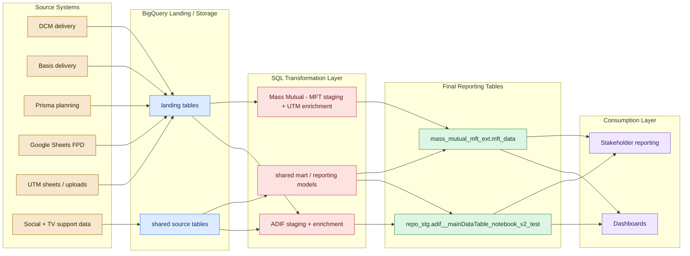

```mermaid
flowchart LR
  classDef source fill:#F7E7CE,stroke:#A36A00,color:#2F2100
  classDef landing fill:#DCEBFF,stroke:#2F6FEB,color:#0F2D66
  classDef model fill:#FDE2E2,stroke:#C53D3D,color:#5A1616
  classDef final fill:#DDF5E3,stroke:#2D8A4B,color:#123D22
  classDef dash fill:#EFE7FF,stroke:#7A4DCC,color:#311A63

  subgraph sources["Source Systems"]
    s1["DCM delivery"]
    s2["Basis delivery"]
    s3["Prisma planning"]
    s4["Google Sheets FPD"]
    s5["UTM sheets / uploads"]
    s6["Social + TV support data"]
  end

  subgraph bigquery["BigQuery Landing / Storage"]
    b1["landing tables"]
    b2["shared source tables"]
  end

  subgraph transform["SQL Transformation Layer"]
    t1["ADIF staging + enrichment"]
    t2["Mass Mutual - MFT staging + UTM enrichment"]
    t3["shared mart / reporting models"]
  end

  subgraph outputs["Final Reporting Tables"]
    o1["repo_stg.adif__mainDataTable_notebook_v2_test"]
    o2["mass_mutual_mft_ext.mft_data"]
  end

  subgraph dashboards["Consumption Layer"]
    d1["Dashboards"]
    d2["Stakeholder reporting"]
  end

  s1 --> b1
  s2 --> b1
  s3 --> b1
  s4 --> b1
  s5 --> b1
  s6 --> b2

  b1 --> t1
  b1 --> t2
  b2 --> t1
  b2 --> t3

  t1 --> o1
  t2 --> o2
  t3 --> o1
  t3 --> o2

  o1 --> d1
  o2 --> d1
  o1 --> d2
  o2 --> d2

  class s1,s2,s3,s4,s5,s6 source
  class b1,b2 landing
  class t1,t2,t3 model
  class o1,o2 final
  class d1,d2 dash

```
