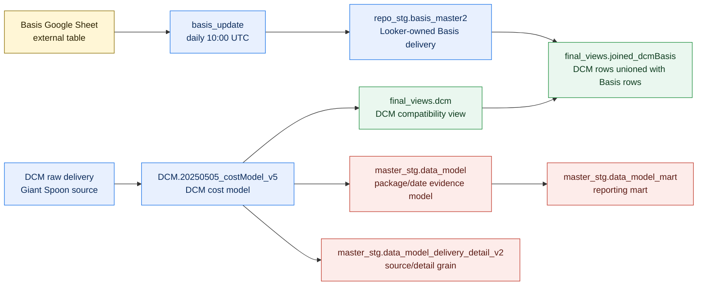

# Basis, DCM, And Master Data Model Pipeline

This page documents the live end-to-end path from Basis delivery, through DCM-facing combined views, into the master data model surfaces.

It exists because the Basis cutover away from `giant-spoon-299605` changed the safest way to reason about the pipeline. Basis delivery now has a Looker-owned source and target, while the master data model still gets DCM delivery from the DCM cost model.

## Current Flow

## Object Map

| Stage | Live object | Grain or role | Refresh owner | Notes |
|---|---|---|---|---|
| Basis Sheet bridge | [Basis Google Sheet external table](https://console.cloud.google.com/bigquery?project=looker-studio-pro-452620&p=looker-studio-pro-452620&d=repo_stg&t=basis_gsheet2&page=table) | Source rows from the Basis delivery workbook | External table | Looker-owned replacement for the old Giant Spoon Basis external table. |
| Basis delivery target | [Basis delivery master](https://console.cloud.google.com/bigquery?project=looker-studio-pro-452620&p=looker-studio-pro-452620&d=repo_stg&t=basis_master2&page=table) | Daily delivery by campaign, line item, tactic, placement, creative, creative grouping, and DSP tactic group | `basis_update`, daily `10:00` UTC | The scheduled query merges only `latest_record = 1` rows from the last 30 days. |
| DCM cost model | [DCM cost model v5](https://console.cloud.google.com/bigquery?project=looker-studio-pro-452620&p=looker-studio-pro-452620&d=DCM&t=20250505_costModel_v5&page=table) | DCM delivery plus Prisma package metadata and cost-model fields | `mm_dcm_costmodel`, every 4 hours | Main DCM input for both MFT-style DCM views and the master data model. |
| DCM compatibility view | [Final DCM view](https://console.cloud.google.com/bigquery?project=looker-studio-pro-452620&p=looker-studio-pro-452620&d=final_views&t=dcm&page=table) | Same columns as the DCM cost model | View | The live definition is `SELECT *` from the DCM cost model. |
| Combined DCM/Basis view | [Joined DCM and Basis view](https://console.cloud.google.com/bigquery?project=looker-studio-pro-452620&p=looker-studio-pro-452620&d=final_views&t=joined_dcmBasis&page=table) | Unioned DCM rows and Basis rows | View | This is the combined Basis + DCM reporting surface. It reads `final_views.dcm` and `repo_stg.basis_master2`. |
| Master evidence model | [Master evidence model](https://console.cloud.google.com/bigquery?project=looker-studio-pro-452620&p=looker-studio-pro-452620&d=master_stg&t=data_model&page=table) | Package/date evidence model | Live view | Reads the DCM cost model directly. Basis delivery does not directly feed this package/date model today. |
| Master detail model | [Master delivery detail model](https://console.cloud.google.com/bigquery?project=looker-studio-pro-452620&p=looker-studio-pro-452620&d=master_stg&t=data_model_delivery_detail_v2&page=table) | Source/detail grain for DCM and FPD delivery | Live view | Preserves DCM at package/date/placement/ad/creative grain so creative detail is not collapsed. |
| Reporting mart | [Master reporting mart](https://console.cloud.google.com/bigquery?project=looker-studio-pro-452620&p=looker-studio-pro-452620&d=master_stg&t=data_model_mart&page=table) | Reporting-ready rows after mart-only filters | Live view | Recalculates package source labels and rollups after reporting exclusions. |

## Basis Cutover Boundary

The active Basis delivery refresh is now inside `looker-studio-pro-452620`:

1. [Basis Google Sheet external table](https://console.cloud.google.com/bigquery?project=looker-studio-pro-452620&p=looker-studio-pro-452620&d=repo_stg&t=basis_gsheet2&page=table) exposes the current Google Sheet data to BigQuery.
2. The `basis_update` scheduled query runs daily at `10:00` UTC.
3. It merges rows into [Basis delivery master](https://console.cloud.google.com/bigquery?project=looker-studio-pro-452620&p=looker-studio-pro-452620&d=repo_stg&t=basis_master2&page=table).
4. [Joined DCM and Basis view](https://console.cloud.google.com/bigquery?project=looker-studio-pro-452620&p=looker-studio-pro-452620&d=final_views&t=joined_dcmBasis&page=table) unions Basis rows from the Looker-owned table with DCM rows from [Final DCM view](https://console.cloud.google.com/bigquery?project=looker-studio-pro-452620&p=looker-studio-pro-452620&d=final_views&t=dcm&page=table).

The `basis_update` SQL verified on July 1, 2026 does not read the old Giant Spoon Basis master table.

## DCM And Master Model Boundary

The master data model does not use [Joined DCM and Basis view](https://console.cloud.google.com/bigquery?project=looker-studio-pro-452620&p=looker-studio-pro-452620&d=final_views&t=joined_dcmBasis&page=table) as its source. It reads [DCM cost model v5](https://console.cloud.google.com/bigquery?project=looker-studio-pro-452620&p=looker-studio-pro-452620&d=DCM&t=20250505_costModel_v5&page=table) directly.

That matters for debugging:

| Question | Start here | Why |
|---|---|---|
| Did Basis delivery refresh from the Sheet? | [Basis delivery master](https://console.cloud.google.com/bigquery?project=looker-studio-pro-452620&p=looker-studio-pro-452620&d=repo_stg&t=basis_master2&page=table) | This is the scheduled-query target. |
| Did the combined DCM/Basis reporting view pick up Basis rows? | [Joined DCM and Basis view](https://console.cloud.google.com/bigquery?project=looker-studio-pro-452620&p=looker-studio-pro-452620&d=final_views&t=joined_dcmBasis&page=table) | This is the union surface for DCM and Basis delivery. |
| Did DCM delivery reach the master model? | [Master evidence model](https://console.cloud.google.com/bigquery?project=looker-studio-pro-452620&p=looker-studio-pro-452620&d=master_stg&t=data_model&page=table) | The master model reads DCM cost-model fields and maps DCM rows into final package/date metrics. |
| Do I need creative-level DCM detail? | [Master delivery detail model](https://console.cloud.google.com/bigquery?project=looker-studio-pro-452620&p=looker-studio-pro-452620&d=master_stg&t=data_model_delivery_detail_v2&page=table) | DCM creative can be one-to-many inside one package/date, so detail stays out of the package/date creative field. |

## Verified Snapshot

Live checks on July 1, 2026 showed:

| Object | Type | Rows | Date range | Notes |
|---|---|---:|---|---|
| [Basis Google Sheet external table](https://console.cloud.google.com/bigquery?project=looker-studio-pro-452620&p=looker-studio-pro-452620&d=repo_stg&t=basis_gsheet2&page=table) | External table | 149,612 latest rows | 2024-02-13 to 2025-09-25 | Latest-record rows summed to 312,721,314 impressions, 626,703 clicks, and 7,870,144.58 spend. |
| [Basis delivery master](https://console.cloud.google.com/bigquery?project=looker-studio-pro-452620&p=looker-studio-pro-452620&d=repo_stg&t=basis_master2&page=table) | Table | 132,915 rows | 2024-02-13 to 2025-09-28 | Table modification time was July 1, 2026 after the Looker-owned cutover. |
| [Final DCM view](https://console.cloud.google.com/bigquery?project=looker-studio-pro-452620&p=looker-studio-pro-452620&d=final_views&t=dcm&page=table) | View | Not materialized | DCM cost-model dependent | Live definition selects from the DCM cost model. |
| [Joined DCM and Basis view](https://console.cloud.google.com/bigquery?project=looker-studio-pro-452620&p=looker-studio-pro-452620&d=final_views&t=joined_dcmBasis&page=table) | View | Not materialized | DCM and Basis dependent | Live definition reads `repo_stg.basis_master2`, not a Giant Spoon Basis table. |

Counts change as sources refresh. Treat this section as a recent verification snapshot, not a permanent contract.

## Local Documentation And SQL

| Area | File | Use it for |
|---|---|---|
| Scheduled-query runbook | [Scheduled queries](/Users/eugenetsenter/Looker_clonedRepo/looker_personal/docs/SCHEDULED_QUERIES.md) | Cadence, transfer names, and refresh ownership. |
| Basis utilities | [Basis UTM utilities README](/Users/eugenetsenter/Looker_clonedRepo/looker_personal/util/basis_utms/README.md) | Basis UTM staging scripts and compatibility views. |
| DCM branch | [DCM branch README](/Users/eugenetsenter/Looker_clonedRepo/looker_personal/master_data_model/model/branches/dcm/README.md) | Master-model DCM branch rules, grain, and handoff. |
| DCM detail SQL | [Delivery detail SQL](/Users/eugenetsenter/Looker_clonedRepo/looker_personal/master_data_model/model/branches/dcm/create_data_model_delivery_detail_v2.sql) | Source/detail DCM preservation logic. |
| Master model overview | [Master data model README](/Users/eugenetsenter/Looker_clonedRepo/looker_personal/master_data_model/README.md) | Package/date model behavior and reporting outputs. |
