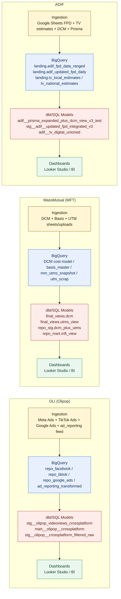

# Data Flow Diagram: OLI, MassMutual, ADIF

This diagram shows the end-to-end reporting flow for the three focus pipelines:
ingestion -> BigQuery -> dbt/SQL models -> dashboards.

## Notes

- OLI model names are based on SQL files in `/Users/eugenetsenter/Looker_clonedRepo/looker_personal/sql/stg` and `/Users/eugenetsenter/Looker_clonedRepo/looker_personal/sql/marts/olipop`.
- MFT model and source names are based on `/Users/eugenetsenter/Looker_clonedRepo/looker_personal/mft/README.md`.
- ADIF source/model names are based on `/Users/eugenetsenter/Looker_clonedRepo/looker_personal/adif/README - ADIF TV & Digital Data Pipeline.md` and `/Users/eugenetsenter/Looker_clonedRepo/looker_personal/adif/README_Updated_FPD_Integration.md`.
