# Master Data Model Pipeline

Complete documentation of the master data model pipeline that unifies planning, digital delivery, partner-reported delivery, digital conversion outcomes, social, TV, Amazon Ads, and manual package edits into one cross-client evidence layer.

The current production endpoint is [Master evidence model v3](https://console.cloud.google.com/bigquery?project=looker-studio-pro-452620&p=looker-studio-pro-452620&d=master_stg&t=data_model_v3&page=table). The older package/date evidence and mart outputs remain live compatibility surfaces until their later migration and cleanup.

This v2 README follows the MFT pipeline README format: start with the shape of the pipeline, then explain each source, model layer, operational workflow, current state, usage path, maintenance habit, and troubleshooting route.

## Pipeline Overview

```text
┌────────────────────────────────────────────────────────────────────────────────────┐
│                                 BASE DATA SOURCES                                  │
├────────────────────────────────────────────────────────────────────────────────────┤
│ PLANNING: Prisma expanded package/date planning                                    │
│ DIGITAL: DCM cost model, original FPD, revised FPD                                 │
│ SOCIAL: shared cross-platform raw staging, Reddit email landing, WP Apollo Sheet    │
│ TV: combined local/national TV estimate source                                     │
│ AMAZON: Ritual Amazon Ads daily report                                             │
│ CONVERSIONS: Ritual conversion report outcome rows                                 │
│ MANUAL: Manual Package Editor raw and daily correction tables                       │
└──────────────────────────────────────┬─────────────────────────────────────────────┘
                                       │
                                       ▼
┌────────────────────────────────────────────────────────────────────────────────────┐
│                              CONTROLLED SOURCE LAYER                               │
├──────────────────────────────┬──────────────────────────────┬──────────────────────┤
│ Digital package/date base    │ Source-specific branches      │ Manual correction    │
│ stable package/date model    │ social, TV, Amazon, mappings  │ raw + daily tables   │
└──────────────────────────────┴───────────────┬──────────────┴──────────────────────┘
                                               │
                                               ▼
┌────────────────────────────────────────────────────────────────────────────────────┐
│                              FINAL MODEL BUILDER                                   │
│ model/final_model/create_master_stg_data_model_v3.sql                              │
│ Adds source precedence, manual overrides, conversion outcomes, QA fields, rollups   │
└──────────────────────────────────────┬─────────────────────────────────────────────┘
                                       │
                                       ▼
┌────────────────────────────────────────────────────────────────────────────────────┐
│                               REPORTING OUTPUTS                                    │
├────────────────────────────────────────────────────────────────────────────────────┤
│ master_stg.data_model_v3: current production lowest-grain master table             │
│ master_stg.data_model: package/date compatibility base                             │
│ master_stg.data_model_mart: package/date compatibility reporting mart              │
│ master_stg.data_model_v2: compatibility wrapper                                    │
│ master_stg.data_model_delivery_detail_v2: lower-grain creative/detail sibling      │
└──────────────────────────────────────┬─────────────────────────────────────────────┘
                                       │
                                       ▼
┌────────────────────────────────────────────────────────────────────────────────────┐
│                              CONSUMPTION AND QA                                    │
│ dashboards, ad hoc analysis, Manual Data Editor checks, source maps, QA candidates  │
└────────────────────────────────────────────────────────────────────────────────────┘
```

### Mermaid Diagram (Full Pipeline)

```mermaid
flowchart TD
    subgraph S["0) Base Data Sources"]
        PRISMA["Prisma package/date planning<br/>planned spend, impressions, campaign metadata"]
        DCM["DCM cost model v5<br/>delivery and media-cost evidence"]
        FPD["Original and revised FPD<br/>partner-reported delivery"]
        SOCIAL["Shared social sources<br/>cross-platform staging, Reddit, WP Apollo"]
        TV["TV combined source<br/>local and national estimate rows"]
        AMAZON["Ritual Amazon Ads landing table<br/>daily Amazon delivery report"]
        CONV["Ritual conversion report<br/>package/date/site/creative/activity outcomes"]
        MANUAL["Manual Package Editor<br/>raw edit rows and allocated daily rows"]
        MAPS["Advertiser mapping<br/>canonical names and short codes"]
    end

    subgraph C["1) Controlled Source Layer"]
        STABLE["Stable package/date base<br/>model/stable_base/create_master_stg_data_model.sql"]
        UPSTREAM["Upstream scheduled helpers<br/>create_master_data_model_upstream_tables_sched.sql"]
        MANUAL_TABLES["Manual edit tables<br/>create_manual_package_edit_tables.sql"]
        BRANCHES["Source branches<br/>social, TV, Amazon, mappings, reference maps"]
    end

    subgraph F["2) Final Model Builder"]
        FINAL["Master evidence builder<br/>model/final_model/create_master_stg_data_model_v3.sql"]
        PRECEDENCE["Precedence and rollups<br/>manual overrides, FPD/DCM priority, package totals"]
        QA["QA and lineage fields<br/>source labels, freshness, issue flags"]
    end

    subgraph O["3) Reporting Outputs"]
        V3["master_stg.data_model_v3<br/>current production master table"]
        DATA_MODEL["master_stg.data_model<br/>package/date compatibility base"]
        MART["master_stg.data_model_mart<br/>compatibility reporting mart"]
        V2["master_stg.data_model_v2<br/>compatibility wrapper"]
        DETAIL["master_stg.data_model_delivery_detail_v2<br/>creative/detail sibling"]
        CLUSTER["master_stg.data_model_clustered_by_advertiser_qa<br/>stored advertiser-filter QA table"]
    end

    subgraph Q["4) QA, Maps, and Operations"]
        MAP_HTML["Interactive model maps<br/>docs/master-data-model-map.html"]
        MANUAL_QA["Manual Data Editor QA<br/>visible Sheet to warehouse to mart"]
        RUNNER["Universal runner refresh<br/>clustered advertiser + v3 support tables"]
        DASH["Dashboards and analysis"]
    end

    PRISMA --> STABLE
    DCM --> STABLE
    FPD --> STABLE
    SOCIAL --> BRANCHES
    TV --> BRANCHES
    AMAZON --> BRANCHES
    CONV --> BRANCHES
    MANUAL --> MANUAL_TABLES
    MAPS --> FINAL
    STABLE --> FINAL
    UPSTREAM --> FINAL
    MANUAL_TABLES --> FINAL
    BRANCHES --> FINAL
    FINAL --> PRECEDENCE
    PRECEDENCE --> QA
    QA --> V3
    DATA_MODEL --> MART
    DATA_MODEL --> V2
    DATA_MODEL --> DETAIL
    DATA_MODEL --> V3
    DATA_MODEL --> CLUSTER
    DATA_MODEL --> MAP_HTML
    MART --> DASH
    DETAIL --> DASH
    MANUAL_TABLES --> MANUAL_QA
    RUNNER --> CLUSTER
    RUNNER --> V3
```



## Table of Contents

- [Data Sources](#data-sources)
- [Controlled Source Layer](#controlled-source-layer)
- [Final Model And Output Layer](#final-model-and-output-layer)
- [Manual Package Editor](#manual-package-editor)
- [Operational Scripts](#operational-scripts)
- [Key Concepts](#key-concepts)
- [Current State](#current-state)
- [Usage Examples](#usage-examples)
- [Verification Guidance](#verification-guidance)
- [Maintenance](#maintenance)
- [Troubleshooting](#troubleshooting)
- [Documentation Pattern](#documentation-pattern)

---

## Data Sources

### Source Inventory

| Source area | Active source | Purpose | Grain | Notes |
|---|---|---|---|---|
| Planning | [Prisma expanded planning](https://console.cloud.google.com/bigquery?project=looker-studio-pro-452620&p=looker-studio-pro-452620&d=20250327_data_model&t=prisma_expanded_full&page=table) | Planned package spend, impressions, campaign metadata, advertiser metadata | Package/date | Rows begin from the model's active date gate, currently documented as 2025-01-01. |
| DCM delivery | [DCM cost model v5](https://console.cloud.google.com/bigquery?project=looker-studio-pro-452620&p=looker-studio-pro-452620&d=DCM&t=20250505_costModel_v5&page=table) | Delivered impressions, clicks, media cost, DCM package evidence | Package/date and delivery detail | The master model reads this directly for the DCM branch. |
| Original FPD | [Original FPD landing table](https://console.cloud.google.com/bigquery?project=looker-studio-pro-452620&p=looker-studio-pro-452620&d=landing&t=fpd_data_ranged_shortcutsFolder&page=table) | Partner-reported delivery and creative evidence | Partner/package/date | Consolidated into the public `fpd_*` field family before output. |
| Revised FPD | [Revised FPD daily table](https://console.cloud.google.com/bigquery?project=looker-studio-pro-452620&p=looker-studio-pro-452620&d=landing&t=adif_updated_fpd_daily&page=table) | Updated partner delivery data | Package/date | Layered before final spend, impressions, clicks, and rollups are calculated. |
| Social | [Shared cross-platform raw staging](https://console.cloud.google.com/bigquery?project=looker-studio-pro-452620&p=looker-studio-pro-452620&d=repo_stg&t=stg__olipop__crossplatform_raw_tbl&page=table) | Social and cross-platform delivery evidence | Platform/campaign/ad-group/ad/date | Uses synthetic package keys when no Prisma package exists. |
| Reddit | [Reddit Ads email landing table](https://console.cloud.google.com/bigquery?project=looker-studio-pro-452620&p=looker-studio-pro-452620&d=landing&t=reddit-ads-email&page=table) | Reddit delivery from email ingestion | Campaign/ad/date | Pacing is derived from Reddit campaign budget and flight dates. |
| WP Apollo | [WP normalized staging](https://console.cloud.google.com/bigquery?project=looker-studio-pro-452620&p=looker-studio-pro-452620&d=repo_stg&t=stg__wp__search_data_template_daily&page=table) | Controlled Apollo delivery and creative metadata | Candidate campaign/ad-group/ad/date | WP-first values are used where the controlled Sheet supplies production data. |
| TV | [TV combined table](https://console.cloud.google.com/bigquery?project=looker-studio-pro-452620&p=looker-studio-pro-452620&d=landing&t=tv_combined_tbl&page=table) | Local and national TV estimates | TV outlet/program/market/date | TV rows use synthetic package and placement keys. |
| Amazon Ads | [Ritual Amazon Ads landing table](https://console.cloud.google.com/bigquery?project=looker-studio-pro-452620&p=looker-studio-pro-452620&d=landing&t=rit_amzn_report_daily&page=table) | Ritual Amazon Ads media delivery | Amazon campaign/ad/date | Maps Amazon supply cost into spend; sales remain Amazon-specific outcome fields. |
| Digital conversions | [Direct CM360 RTL conversion history](https://console.cloud.google.com/bigquery?project=looker-studio-pro-452620&p=looker-studio-pro-452620&d=master_stg&t=rtl_cm360_direct_conversions&page=table) | Ritual post-media conversion outcomes | Package/date/parsed-placement/creative, with source activity retained | Current production source. Direct conversion and revenue fields populate `conv_*` only after a unique delivery match; conversion-only rows retain null delivery metrics. The legacy Sheet landing table is comparison evidence only. |
| Advertiser mapping | [Advertiser mapping](https://console.cloud.google.com/bigquery?project=looker-studio-pro-452620&p=looker-studio-pro-452620&d=master_stg&t=advertiser_mapping&page=table) | Canonical advertiser names and short codes | Source name or short-code variant | Keeps mapped clients consistent across digital, social, TV, Amazon, and manual rows. |
| Manual edits | [Manual package raw edits](https://console.cloud.google.com/bigquery?project=looker-studio-pro-452620&p=looker-studio-pro-452620&d=landing&t=master_data_model_manual_package_edits_raw&page=table) and [Manual package daily edits](https://console.cloud.google.com/bigquery?project=looker-studio-pro-452620&p=looker-studio-pro-452620&d=landing&t=master_data_model_manual_package_daily&page=table) | User-approved package metadata and metric corrections | Package-level and package/date | Valid manual values override source-derived values before final package rollups. |

### Source Boundaries

| Boundary | Rule | Why it matters |
|---|---|---|
| Basis delivery | Basis is not a direct package/date master model source. It feeds Looker-owned Basis/DCM reporting views outside the master package/date DCM branch. | Prevents accidental debugging through the wrong reporting path. |
| DCM creative | DCM creative is preserved in [Delivery detail v2](https://console.cloud.google.com/bigquery?project=looker-studio-pro-452620&p=looker-studio-pro-452620&d=master_stg&t=data_model_delivery_detail_v2&page=table), not collapsed into one package/date creative. | One package/date can have multiple DCM creatives. |
| Package/date evidence | The main model is an evidence layer, not the only reporting surface. | Use the mart for reporting-ready filters and recalculated package labels. |
| Manual corrections | The Sheet request checkbox notifies Gene; it does not run the loader by itself. | Prevents confusing a refresh request with a warehouse write. |

---

## Controlled Source Layer

### Current Workspace

Start in [model workspace](/Users/eugenetsenter/Looker_clonedRepo/looker_personal/master_data_model/model/) for active work. It organizes the project by function:

| Folder | Purpose |
|---|---|
| [Final model](/Users/eugenetsenter/Looker_clonedRepo/looker_personal/master_data_model/model/final_model/) | Current master evidence builder. |
| [Stable base](/Users/eugenetsenter/Looker_clonedRepo/looker_personal/master_data_model/model/stable_base/) | Stable package/date base used by the final builder. |
| [Manual editor](/Users/eugenetsenter/Looker_clonedRepo/looker_personal/master_data_model/model/manual_editor/) | Manual Package Editor table setup, loader, and QA runbook. |
| [Mappings](/Users/eugenetsenter/Looker_clonedRepo/looker_personal/master_data_model/model/mappings/) | Advertiser and mapping support assets. |
| [Branches](/Users/eugenetsenter/Looker_clonedRepo/looker_personal/master_data_model/model/branches/) | Source-specific branch work. |
| [Reporting outputs](/Users/eugenetsenter/Looker_clonedRepo/looker_personal/master_data_model/model/reporting_outputs/) | Mart and output-facing SQL. |
| [Reference maps](/Users/eugenetsenter/Looker_clonedRepo/looker_personal/master_data_model/model/reference_maps/) | Clickable orientation maps and companion docs. |
| [Archive candidates](/Users/eugenetsenter/Looker_clonedRepo/looker_personal/master_data_model/model/archive_candidates/) | Deprecated or historical SQL kept out of the active path. |

### Important Local Files

| File | Role | Use when |
|---|---|---|
| [Stable package/date base SQL](/Users/eugenetsenter/Looker_clonedRepo/looker_personal/master_data_model/model/stable_base/create_master_stg_data_model.sql) | Builds the stable base that the final model reads. | Checking package/date source assembly. |
| [Final model v3 SQL](/Users/eugenetsenter/Looker_clonedRepo/looker_personal/master_data_model/model/final_model/create_master_stg_data_model_v3.sql) | Builds the current final master evidence model. | Changing master model behavior. |
| [Reporting mart SQL](/Users/eugenetsenter/Looker_clonedRepo/looker_personal/master_data_model/model/reporting_outputs/create_master_stg_data_model_mart.sql) | Builds the reporting-ready mart. | Changing reporting filters or mart rollups. |
| [Upstream scheduled helper SQL](/Users/eugenetsenter/Looker_clonedRepo/looker_personal/master_data_model/create_master_data_model_upstream_tables_sched.sql) | Refreshes upstream helper tables used before the main model. | Running a full refresh path. |
| [Advertiser mapping SQL](/Users/eugenetsenter/Looker_clonedRepo/looker_personal/master_data_model/create_advertiser_mapping.sql) | Maintains canonical advertiser names and short codes. | Adding or fixing advertiser identity. |
| [Master model map](/Users/eugenetsenter/Looker_clonedRepo/looker_personal/master_data_model/docs/master-data-model-map.html) | Interactive map of inputs, branch logic, outputs, and warnings. | Orienting before a change or explaining lineage. |
| [DCM cost model map](/Users/eugenetsenter/Looker_clonedRepo/looker_personal/master_data_model/docs/dcm-cost-model-map.html) | DCM scheduled-query and handoff map. | Debugging DCM package rollups or DCM handoff. |
| [Manual editor workflow map](/Users/eugenetsenter/Looker_clonedRepo/looker_personal/master_data_model/docs/manual-data-editor-workflow-map.html) | Visual map of Sheet edit to warehouse to mart. | Explaining or debugging manual edits. |

---

## Final Model And Output Layer

### Final Model Builder

**Local SQL**: [Final model v3 SQL](/Users/eugenetsenter/Looker_clonedRepo/looker_personal/master_data_model/model/final_model/create_master_stg_data_model_v3.sql)

**Output**: [Master evidence model v3](https://console.cloud.google.com/bigquery?project=looker-studio-pro-452620&p=looker-studio-pro-452620&d=master_stg&t=data_model_v3&page=table)

**Main responsibilities**:

1. Keep the model cross-client by removing ADIF-only filters.
2. Combine Prisma planning, DCM delivery, consolidated FPD, social, TV, Amazon Ads, and manual rows.
3. Apply valid manual package edits before package rollups are calculated.
4. Preserve source-specific evidence fields such as `fpd_*`, `tv_*`, `amzn_*`, `s_*`, and `man_*`.
5. Publish final normalized fields such as `_advertiser`, `_advertiser_short_name`, `_creative_name`, `_spend`, `_impressions`, and `_clicks`.
6. Expose QA and lineage fields, including `qa_row_data_source_primary`, `qa_row_data_sources_available`, `qa_data_source`, `qa_data_source_refresh_at`, and `qa_data_issues`.
7. Keep repeated package-level context visibly marked with `_doNotSum`.

### Output Objects

| Output | Purpose | Notes |
|---|---|---|
| [Master evidence model v3](https://console.cloud.google.com/bigquery?project=looker-studio-pro-452620&p=looker-studio-pro-452620&d=master_stg&t=data_model_v3&page=table) | **Current production master model** at the lowest available source grain. | Default source for new master-model analysis. Use `qa_v3_metric_grain`, row type, and `doNotSum` context fields when aggregating. |
| [Master evidence model](https://console.cloud.google.com/bigquery?project=looker-studio-pro-452620&p=looker-studio-pro-452620&d=master_stg&t=data_model&page=table) | Package/date compatibility base. | Still live because v3 reads its stable context; do not treat it as the default production model. |
| [Reporting mart](https://console.cloud.google.com/bigquery?project=looker-studio-pro-452620&p=looker-studio-pro-452620&d=master_stg&t=data_model_mart&page=table) | Package/date compatibility reporting mart. | Remains live for existing consumers pending a separately verified v3 reporting migration. |
| [Compatibility v2 view](https://console.cloud.google.com/bigquery?project=looker-studio-pro-452620&p=looker-studio-pro-452620&d=master_stg&t=data_model_v2&page=table) | Compatibility wrapper over the main evidence model. | Keeps existing v2 consumers alive without making v2 the source of truth. |
| [Delivery detail v2](https://console.cloud.google.com/bigquery?project=looker-studio-pro-452620&p=looker-studio-pro-452620&d=master_stg&t=data_model_delivery_detail_v2&page=table) | Lower-grain creative/detail sibling. | Preserves DCM and original FPD creative/detail structure. |
| [Detail/master sample](https://console.cloud.google.com/bigquery?project=looker-studio-pro-452620&p=looker-studio-pro-452620&d=master_stg&t=data_model_detail_master_v2_sample&page=table) | One-table comparison sample. | Must be filtered by row level or metric grain before summing metrics. |
| [Clustered advertiser QA table](https://console.cloud.google.com/bigquery?project=looker-studio-pro-452620&p=looker-studio-pro-452620&d=master_stg&t=data_model_clustered_by_advertiser_qa&page=table) | Stored QA/support table clustered by advertiser. | Refreshed with the same runner path as v3 support work. |

---

## Manual Package Editor

### User-Facing Workflow

Use this when a dashboard value needs a direct package correction.

| Step | What happens | Important boundary |
|---|---|---|
| 1. Find the package | User filters the `Package Editor` Sheet by advertiser, channel, campaign, site, package ID, or friendly name. | Best identifiers are `Package ID`, `Site`, and `Package Friendly Name`. |
| 2. Edit the visible value | User edits the visible date or metric cell directly. | The user does not edit backend `man_*` columns. |
| 3. Request refresh | User checks the `Request refresh` control. | This sends a notification only; it does not run the loader. |
| 4. Run loader | Loader reads the Sheet and writes valid edits to raw and daily manual tables. | Planned metrics are full-flight only; delivered metrics can be daily, weekly, or full-flight. |
| 5. Merge into model | Valid manual values override source-derived values before package rollups. | Manual evidence remains visible in `man_*` fields. |
| 6. Check dashboard path | Confirm manual values in [Master evidence model](https://console.cloud.google.com/bigquery?project=looker-studio-pro-452620&p=looker-studio-pro-452620&d=master_stg&t=data_model&page=table) and [Reporting mart](https://console.cloud.google.com/bigquery?project=looker-studio-pro-452620&p=looker-studio-pro-452620&d=master_stg&t=data_model_mart&page=table). | Dashboard filters can hide valid backend updates, so trace the full path. |

### Manual Editor Files

| File | Purpose |
|---|---|
| [Manual editor README](/Users/eugenetsenter/Looker_clonedRepo/looker_personal/master_data_model/manual_package_edits/README.md) | Product and workflow explanation for the manual editor. |
| [Manual editor QA runbook](/Users/eugenetsenter/Looker_clonedRepo/looker_personal/master_data_model/manual_package_edits/QA_RUNBOOK.md) | Step-by-step debugging path for manual edit issues. |
| [Manual table setup SQL](/Users/eugenetsenter/Looker_clonedRepo/looker_personal/master_data_model/model/manual_editor/create_manual_package_edit_tables.sql) | Creates or refreshes manual edit backend tables. |
| [Manual loader](/Users/eugenetsenter/Looker_clonedRepo/looker_personal/master_data_model/model/manual_editor/load_manual_package_edits.R) | Reads the Sheet and writes accepted manual values. |
| [Manual editor Sheet setup](/Users/eugenetsenter/Looker_clonedRepo/looker_personal/master_data_model/manual_package_edits/setup_manual_package_editor_sheet.mjs) | Owns Sheet layout and formatting rebuilds. Do not run against the live Sheet unless a full formatting rebuild is explicitly requested. |

---

## Operational Scripts

### Deploy Or Refresh

Run from the Looker repo root unless a command says otherwise.

```bash
bq query --project_id=looker-studio-pro-452620 --use_legacy_sql=false \
  < master_data_model/create_master_data_model_upstream_tables_sched.sql
```

```bash
bq query --project_id=looker-studio-pro-452620 --use_legacy_sql=false \
  < master_data_model/model/stable_base/create_master_stg_data_model.sql
```

```bash
bq query --project_id=looker-studio-pro-452620 --use_legacy_sql=false \
  < master_data_model/model/final_model/create_master_stg_data_model_v3.sql
```

```bash
bq query --project_id=looker-studio-pro-452620 --use_legacy_sql=false \
  < master_data_model/model/reporting_outputs/create_master_stg_data_model_mart.sql
```

### Manual Package Edit Refresh

```bash
Rscript /Users/eugenetsenter/Looker_clonedRepo/looker_personal/master_data_model/model/manual_editor/load_manual_package_edits.R
```

### Dependent Support Table Refresh

Use the universal runner step named `Master Data Model Clustered Advertiser Refresh` when the base [Master evidence model](https://console.cloud.google.com/bigquery?project=looker-studio-pro-452620&p=looker-studio-pro-452620&d=master_stg&t=data_model&page=table) changes and dependent stored tables need to stay fresh.

That runner step refreshes:

| Table | Required proof |
|---|---|
| [Clustered advertiser QA table](https://console.cloud.google.com/bigquery?project=looker-studio-pro-452620&p=looker-studio-pro-452620&d=master_stg&t=data_model_clustered_by_advertiser_qa&page=table) | Transfer run succeeds, clustering remains on `_advertiser`, and row count reconciles to the source view. |
| [Master evidence model v3](https://console.cloud.google.com/bigquery?project=looker-studio-pro-452620&p=looker-studio-pro-452620&d=master_stg&t=data_model_v3&page=table) | Builder succeeds, no `package_plan` rows exist, grain keys are unique, and each package/date has no more than one summable planned carrier. |

---

## Key Concepts

### 1. Evidence Layer vs Reporting Mart

The evidence layer keeps source visibility, issue labels, and modeling context. The mart is the reporting-ready view that applies reporting filters and recalculates package-level labels after those filters.

Use [Master evidence model](https://console.cloud.google.com/bigquery?project=looker-studio-pro-452620&p=looker-studio-pro-452620&d=master_stg&t=data_model&page=table) when debugging source behavior. Use [Reporting mart](https://console.cloud.google.com/bigquery?project=looker-studio-pro-452620&p=looker-studio-pro-452620&d=master_stg&t=data_model_mart&page=table) when checking dashboard-facing totals.

### 2. Source Precedence

| Field family | Meaning |
|---|---|
| `d_*` | DCM source evidence. |
| `fpd_*` | Consolidated original/revised FPD evidence. |
| `s_*` | Social source evidence. |
| `tv_*` | TV source evidence. |
| `amzn_*` | Amazon source evidence. |
| `conv_*` | Digital conversion outcome evidence. |
| `man_*` | Manual Package Editor evidence. |
| final `_` fields | Normalized reporting fields after source precedence and manual overrides. |

### 3. Synthetic Keys

Social, TV, and Amazon rows may not have natural Prisma package IDs. The model creates synthetic package or placement keys so those rows can still live in the shared evidence layer without pretending they came from Prisma.

### 4. Manual Overrides

Manual package edits are applied after normal source rows are assembled and before package rollups. This lets approved corrections change final reporting fields while keeping the original source evidence visible.

### 5. Do-Not-Sum Fields

Fields ending in `_doNotSum` are repeated context fields. They can be useful for labels, checks, or package context, but summing them across rows can double-count.

### 6. Conversion Outcomes

Direct CM360 conversion evidence lives in [Master evidence model v3](https://console.cloud.google.com/bigquery?project=looker-studio-pro-452620&p=looker-studio-pro-452620&d=master_stg&t=data_model_v3&page=table). Matched delivery rows retain `qa_v3_source_detail_type = 'dcm'` and receive direct `conv_*` fields; unmatched records use `qa_v3_source_detail_type = 'cm360_direct_conversion'`. Activities and activity groups remain available as arrays, while the five published activity metrics use named `conv_*` columns.

Conversion source impressions and clicks are source evidence only. They do not populate `_impressions` or `_clicks`, so delivery totals do not change when conversion rows are added.

If a conversion date exists after the package's delivery dates, v3 keeps the conversion row, uses nearest package context, and marks it with `conversion_date_without_delivery_row`.

### 7. Freshness vs Content Modified Time

`qa_data_source_refresh_at` describes when represented data reached the table the model consumes. `qa_data_source_content_modified_at` describes when the original source content changed, but only where that source has a reliable content timestamp.

---

## Current State

### What Is Canonical

| Area | Current canonical surface |
|---|---|
| Local workspace | [model workspace](/Users/eugenetsenter/Looker_clonedRepo/looker_personal/master_data_model/model/) |
| Main SQL builder | [Final model v3 SQL](/Users/eugenetsenter/Looker_clonedRepo/looker_personal/master_data_model/model/final_model/create_master_stg_data_model_v3.sql) |
| Main BigQuery output | [Master evidence model v3](https://console.cloud.google.com/bigquery?project=looker-studio-pro-452620&p=looker-studio-pro-452620&d=master_stg&t=data_model_v3&page=table) |
| Compatibility reporting output | [Reporting mart](https://console.cloud.google.com/bigquery?project=looker-studio-pro-452620&p=looker-studio-pro-452620&d=master_stg&t=data_model_mart&page=table) |
| Manual editor runbook | [Manual editor QA runbook](/Users/eugenetsenter/Looker_clonedRepo/looker_personal/master_data_model/manual_package_edits/QA_RUNBOOK.md) |
| Interactive map | [Master data model map](/Users/eugenetsenter/Looker_clonedRepo/looker_personal/master_data_model/docs/master-data-model-map.html) |

### Durable Warnings

| Warning | What to do |
|---|---|
| Row counts change as source tables refresh. | Keep volatile counts in run notes, not as durable README state. |
| v2 is a compatibility wrapper, not the current model source of truth. | Make new model behavior changes in the current final builder unless the user explicitly asks for a v2 sibling. |
| Detail rows can double-count package metrics. | Use package/date outputs for package totals, or filter detail/sample outputs by grain before summing. |
| Conversion rows are outcome rows, not delivery rows. | Use `conv_total_conversions` for conversions and keep `_impressions`/`_clicks` delivery totals separate from `conv_source_impressions`/`conv_source_clicks`. |
| Manual editor formatting is live-user-owned. | Snapshot and compare formatting before changing it; do not run formatting setup scripts casually. |
| Basis/DCM reporting lineage is adjacent but separate. | Do not treat Basis as a direct package/date master-model source. |

---

## Usage Examples

### Query 1: Source Mix By Advertiser

```sql
SELECT
  _advertiser,
  qa_row_data_source_primary,
  COUNT(*) AS row_count,
  SUM(_spend) AS spend,
  SUM(_impressions) AS impressions,
  SUM(_clicks) AS clicks
FROM `looker-studio-pro-452620.master_stg.data_model`
WHERE _date >= DATE '2026-01-01'
GROUP BY 1, 2
ORDER BY spend DESC;
```

### Query 2: Rows With Source Issues

```sql
SELECT
  qa_data_issues,
  qa_row_data_source_primary,
  COUNT(*) AS row_count
FROM `looker-studio-pro-452620.master_stg.data_model`
WHERE qa_data_issues != 'no_issues'
GROUP BY 1, 2
ORDER BY row_count DESC;
```

### Query 3: Manual Edit Visibility

```sql
SELECT
  _advertiser,
  _package_id,
  _package_name_friendly,
  qa_manual_edit_flag,
  COUNT(*) AS row_count,
  SUM(_spend) AS spend
FROM `looker-studio-pro-452620.master_stg.data_model_mart`
WHERE qa_manual_edit_flag
GROUP BY 1, 2, 3, 4
ORDER BY spend DESC;
```

### Query 4: Reporting Mart Package Totals

```sql
SELECT
  _advertiser,
  _package_id,
  _package_name_friendly,
  SUM(_spend) AS spend,
  SUM(_impressions) AS impressions,
  SUM(_clicks) AS clicks
FROM `looker-studio-pro-452620.master_stg.data_model_mart`
WHERE _date BETWEEN DATE '2026-01-01' AND DATE '2026-06-30'
GROUP BY 1, 2, 3
ORDER BY spend DESC;
```

---

## Verification Guidance

### Standard Proof Plan

| Work type | Proof owner | Minimum proof |
|---|---|---|
| SQL behavior change | SQL Change Guard plus one focused live check | Candidate passes schema, row coverage, and package-level metric checks; deployed object passes the changed-field live check. |
| Manual editor data change | Manual editor QA runbook | Visible Sheet row, raw manual table, daily manual table, evidence model, and mart all agree. |
| Stored support table refresh | Universal runner or scheduled-query metadata | Dependent table refresh succeeds and required freshness proof matches the project rule. |
| Documentation-only change | Markdown structure review | Links, headings, tables, and required changelog entries are present. |
| Source-lineage answer | Live object definition or source inventory | Exact source path and boundary are named; unverified live claims are not made. |

### What Not To Treat As Proof

| Nearby evidence | Why it is not enough |
|---|---|
| SQL dry run | Proves syntax, not final row behavior. |
| Loader success only | Proves the loader ran, not that dashboards reflect the change. |
| Schema check only | Proves fields exist, not that values are correct. |
| Row count only | Can change for valid source-refresh reasons and does not prove metric parity. |
| Existing README text only | Useful context, but live warehouse truth still needs live verification when making warehouse-backed claims. |

---

## Maintenance

### Daily Checks

- Confirm scheduled or runner-owned refreshes succeeded when a change depends on fresh stored tables.
- Check source freshness fields when a dashboard looks stale.
- Keep manual editor user requests separate from actual loader runs.

### Weekly Tasks

- Review pending master model changelog actions.
- Check whether interactive maps still match durable model shape.
- Keep source-boundary notes current when a branch moves or a source owner changes.

### Monthly Tasks

- Revisit deprecated SQL and archive candidates.
- Plan the later compatibility-object migration and cleanup; do not delete live tables, views, or files until the v3 reporting migration has been verified.
- Confirm documentation still points readers to the canonical `model/` workspace.

---

## Troubleshooting

### Issue: Dashboard Totals Do Not Match The Evidence Model

| Check | Why |
|---|---|
| Compare [Master evidence model](https://console.cloud.google.com/bigquery?project=looker-studio-pro-452620&p=looker-studio-pro-452620&d=master_stg&t=data_model&page=table) to [Reporting mart](https://console.cloud.google.com/bigquery?project=looker-studio-pro-452620&p=looker-studio-pro-452620&d=master_stg&t=data_model_mart&page=table). | The mart applies reporting-only filters and recalculates package labels after filtering. |
| Check `qa_data_issues`. | Rows may be present as evidence but excluded from final metric contribution. |
| Check `_doNotSum` fields. | Repeated package context can double-count if summed. |

### Issue: A Manual Edit Does Not Appear In Reporting

| Check | Why |
|---|---|
| Visible Sheet value | Confirms the user-facing edit exists. |
| Hidden baseline/manual marker | Confirms the loader can detect the edit. |
| Raw manual table | Confirms the edit was accepted from the Sheet. |
| Daily manual table | Confirms the edit was allocated to dates. |
| [Master evidence model](https://console.cloud.google.com/bigquery?project=looker-studio-pro-452620&p=looker-studio-pro-452620&d=master_stg&t=data_model&page=table) | Confirms manual evidence reached the model. |
| [Reporting mart](https://console.cloud.google.com/bigquery?project=looker-studio-pro-452620&p=looker-studio-pro-452620&d=master_stg&t=data_model_mart&page=table) | Confirms reporting filters still show it. |

### Issue: A Source Field Is Missing Or Blank

Trace the field through this order:

1. Live source table and source column.
2. Relevant source branch or staging CTE.
3. Stable package/date base.
4. Final model builder.
5. Final projection.
6. Reporting mart, if the issue is dashboard-facing.

Use schema and fill-rate checks as support, not as the main explanation.

### Issue: Freshness Looks Too New Or Too Old

Compare:

| Field | Meaning |
|---|---|
| `qa_data_source_refresh_at` | When represented data reached the source table consumed by the model. |
| `qa_data_source_content_modified_at` | When original source content changed, where reliable source-content timestamps exist. |

Do not fill content-modified time from unrelated load timestamps.

---

## Documentation Pattern

This README intentionally mirrors [MFT Data Pipeline README](/Users/eugenetsenter/Looker_clonedRepo/looker_personal/mft/README.md).

Future project READMEs should keep this reader-first structure when documenting a pipeline or workflow:

1. Short purpose statement and final endpoint.
2. ASCII pipeline overview.
3. Mermaid pipeline diagram.
4. Clickable table of contents.
5. Source inventory with purpose, grain, and warnings.
6. Layer-by-layer processing notes.
7. Output and schema/field semantics.
8. Operational scripts and refresh path.
9. Key concepts in plain language.
10. Current state and durable warnings.
11. Usage examples.
12. Verification guidance.
13. Maintenance and troubleshooting.

Footnote: a CTE is a named temporary query block inside SQL. It helps split one large query into readable steps.
