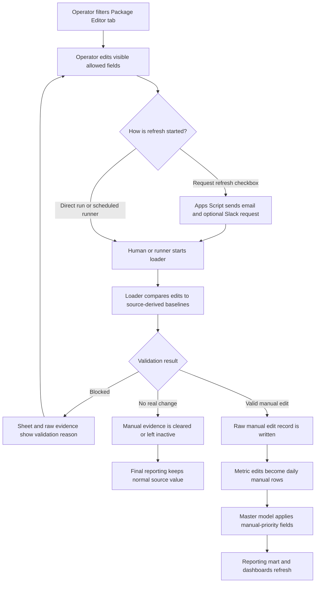
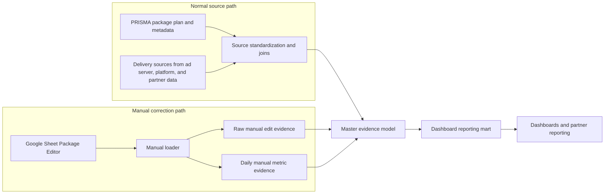

# Product Brief: Manual Data Editor

Also known in implementation docs as the manual package editor.

## Executive Summary

The Manual Data Editor is a controlled correction path for the master data model. It gives operators a familiar Google Sheet surface for changing package dates, delivered metrics, planned totals, and package metadata, then turns those changes into auditable `man_*` evidence that the model can apply before the reporting mart and dashboards refresh.

The important product idea is that this is not a spreadsheet patch. The sheet is the editing interface; the loader is the publisher; the manual landing tables are the evidence store; and the master model is where valid manual values become final reporting values. That separation keeps edits visible, reviewable, reversible, and easier to debug.

For a tech team, the system is best understood as three connected products: a sheet UI for human correction, a loader with validation and allocation logic, and a model integration layer that preserves manual evidence while keeping dashboard fields stable.

## One-Minute Talk Track

The Manual Data Editor lets operators correct package reporting values without making ad hoc warehouse patches. A user edits controlled fields in Google Sheets, the loader validates those edits against source-derived baselines, and valid changes become manual evidence in the data model. The dashboard uses the corrected final values, while engineers can still trace exactly what changed, why it changed, and where it entered the model.

## The Problem

Teams sometimes find package-level reporting values that need human correction before the upstream source catches up. Without a controlled editor, those corrections tend to become scattered fixes: a dashboard-only override, a one-off SQL patch, a copied spreadsheet, or an undocumented manual adjustment.

That creates four practical problems:

| Problem | What It Looks Like | Cost |
|---|---|---|
| Corrections are hard to audit | Nobody can easily tell who changed what, which package/date was affected, or whether the change is still needed | Debugging gets slow and trust erodes |
| Dashboard fixes bypass the model | A report can look right while the master model still contains the old value | Downstream users see inconsistent numbers |
| Manual rows can break grain | A weekly correction, full-flight planned total, and package metadata edit all behave differently | Simple-looking edits can distort totals |
| Operators need speed | The user who sees the issue may not be the person who can safely update the warehouse | Engineers become the bottleneck for every small correction |

## Problems And Bottlenecks Resolved

| Bottleneck | Before The Editor | What The Editor Changes | Remaining Boundary |
|---|---|---|---|
| Engineer-only correction loop | Every small package correction needs someone comfortable with SQL, BigQuery, and model context | Operators can make controlled edits in the Sheet while engineers keep the loader and model guardrails | The loader still has to run before anything reaches reporting |
| Dashboard-only fixes | A report can be patched without changing the model, leaving downstream users with different answers | Manual values enter as backend evidence and flow through the same model path as normal reporting | Dashboards still need their normal refresh cycle |
| Unclear request versus publish step | A checked box can look like it performed work when it only sent a message | The brief and workflow map call out the request checkbox as notification-only | Publishing remains a separate loader responsibility |
| Manual edits that outlive their need | A stale override can keep masking a source value after upstream data catches up | The loader compares to source-derived baselines and can clear manual evidence when the normal source matches | This depends on the next loader run |
| Date-grain confusion | Weekly delivery edits, full-flight planned totals, and package metadata changes are easy to mix up | The workflow separates date-bound metrics from full-flight planned values and package-wide metadata | Invalid grain choices are blocked instead of guessed |
| Slow debugging | A mismatch can send people hunting across Sheet values, scripts, tables, models, and dashboard filters | The runbook and map define a fixed trace path from visible cell to raw evidence, daily evidence, model, mart, and dashboard | Live proof still has to be collected when diagnosing a real incident |

## The Solution

The Manual Data Editor gives operators a curated package list in Google Sheets. They filter to the package, edit visible allowed fields, and request or run a refresh. The loader compares the edited values to source-derived baselines, blocks invalid rows, writes valid edits into manual landing tables, and refreshes the editor values and markers.

The master model then uses manual-priority behavior: when valid manual evidence exists at the right grain, final reporting fields use the manual value; otherwise they use the normal source value. The reporting mart keeps the dashboard output aligned with the master model instead of creating a separate manual-reporting universe.

## Visual Aid 1: Operator Workflow

This view explains the working path from the editor's point of view. It separates the notification button from the loader path because the request checkbox does not publish data.

## Visual Aid 2: How It Integrates With The Main Data Model

This view is for engineers. The manual editor is a sidecar evidence path that feeds the same master model, not a separate reporting stack.

## Slide-Ready Presentation Notes

| Slide | Main Message | Suggested Visual | Speaker Notes |
|---|---|---|---|
| 1. What it is | Manual Data Editor is the controlled correction lane for package reporting | Product title plus one-minute talk track | Lead with: this is not a spreadsheet patch; it is a Sheet UI plus loader plus model evidence path |
| 2. Why it exists | It removes ad hoc fixes, dashboard-only patches, and engineer-only correction queues | Problems and bottlenecks table | Emphasize the operating pain: corrections need to be fast, but still traceable |
| 3. What it resolves | The system separates operator action, validation, manual evidence, and reporting output | Bottleneck-to-control matrix | Call out request confusion, stale manual values, date-grain mistakes, and debugging time |
| 4. Operator workflow | User edits visible fields, then request or loader path starts refresh | Visual Aid 1 | Make the request checkbox boundary explicit: it notifies only |
| 5. Model integration | Manual evidence overlays the normal master model instead of replacing it | Visual Aid 2 | Say metric edits are package/date, metadata is package-wide, and final fields keep `man_*` proof nearby |
| 6. Validation guardrails | The loader blocks bad dates, duplicate active edits, incomplete new rows, and partial planned edits | Field behavior table | This is where the product prevents easy-but-wrong manual data |
| 7. Debugging path | Tech team can trace the same row across Sheet, raw evidence, daily evidence, model, mart, and dashboard | Workflow contract table | Mention dashboard filters as a known trap before changing model logic |
| 8. Ask from the team | Agree on ownership, run path, and separate live proof plan | Open decisions table | Keep live SQL proof separate from this presentation unless the team explicitly asks for it |

## What Makes This Different

| Design Choice | Why It Matters For Tech Teams |
|---|---|
| Sheet UI, warehouse evidence | Operators get a familiar editing surface while engineers still get auditable backend records |
| Source-derived baselines | The loader compares against normal source values, not manual-affected final dashboard fields, so stale manual values do not keep re-marking themselves |
| Manual-priority model fields | Final reporting fields remain stable, while `man_*` fields show where manual evidence changed the result |
| Separate raw and daily manual layers | Package-level metadata and date-bound metric edits can use different grains without pretending they are the same kind of change |
| Notification is separate from publishing | The request checkbox sends a request only; validation, warehouse writes, and dashboard reflection happen in the loader path |

## Who This Serves

| Audience | Need | Success Looks Like |
|---|---|---|
| Media operators | Correct a package value without writing SQL | They can find the package, edit the allowed field, and understand validation feedback |
| Data engineers | Keep manual edits traceable and reversible | They can inspect the raw edit, daily allocation, model field, and mart output separately |
| Analytics and dashboard owners | Avoid dashboard-only fixes | They can explain why a final field changed and whether manual evidence is still active |
| Support and QA | Debug mismatches quickly | They can follow the row from visible sheet value to hidden marker, raw table, daily table, model, mart, and dashboard |

## Workflow Contract

| Layer | Owner | Grain | Writes? | Role | Primary Proof |
|---|---|---|---:|---|---|
| Package Editor tab | Operator plus loader | One visible package/editor row | Yes, sheet values | Human edit surface and validation feedback | Visible value, color marker, status, reason |
| Request notification | Apps Script | One request event | No warehouse writes | Alerts Gene or Slack that refresh is needed | Email or Slack message, checkbox reset |
| Loader | R workflow | Editor row, package, and date range | Yes | Detects edits, validates, allocates daily metrics, writes evidence | Loader status and validation output |
| Raw manual evidence | BigQuery landing table | One row per editor row | Yes | Stores active and blocked edit decisions | [Raw manual edits table](https://console.cloud.google.com/bigquery?project=looker-studio-pro-452620&ws=!1m5!1m4!4m3!1slooker-studio-pro-452620!2slanding!3smaster_data_model_manual_package_edits_raw) |
| Daily manual evidence | BigQuery landing table | Package/date for active metric edits | Yes | Converts metric replacements into model-ready daily rows | [Daily manual rows table](https://console.cloud.google.com/bigquery?project=looker-studio-pro-452620&ws=!1m5!1m4!4m3!1slooker-studio-pro-452620!2slanding!3smaster_data_model_manual_package_daily) |
| Master evidence model | Data model SQL | Package/date evidence layer | Deployment only | Applies valid manual values before reporting | [Master evidence model](https://console.cloud.google.com/bigquery?project=looker-studio-pro-452620&ws=!1m5!1m4!4m3!1slooker-studio-pro-452620!2smaster_stg!3sdata_model) |
| Reporting mart | Data model SQL | Dashboard-ready package/date | Deployment only | Recalculates dashboard-ready final output | [Dashboard reporting mart](https://console.cloud.google.com/bigquery?project=looker-studio-pro-452620&ws=!1m5!1m4!4m3!1slooker-studio-pro-452620!2smaster_stg!3sdata_model_mart) |

## Field Behavior

| Edit Type | Where The User Edits | How It Applies | Important Boundary |
|---|---|---|---|
| Delivered metric correction | `Spend`, `Impressions`, `Clicks`, `Video Plays`, `Video Completions` | Applies only inside the delivery override date range | Date-bound and allocated into daily evidence |
| Planned metric correction | `Planned Spend`, `Planned Impressions` | Applies across the full package flight | Partial-date planned edits are blocked |
| Flight date correction | `Flight Start Date`, `Flight End Date` | Applies package-wide | Not the same as delivery override dates |
| Metadata correction | Advertiser, campaign, package, channel, supplier, site, and related fields | Applies package-wide | Does not need a metric edit to be active |
| Manual-only package | New sheet row with required IDs, dates, metadata, and at least one metric | Adds model rows only when valid | Missing metadata or invalid dates block the row |

## Terms This Brief Uses

| Term | Plain-English Meaning |
|---|---|
| Baseline | The current source value the loader uses to decide whether a sheet value is a real manual edit |
| Grain | The level of detail of a record, such as package, package/date, or editor row |
| Landing table | A warehouse table used to capture incoming evidence before the main model applies it |
| Mart | A dashboard-ready model layer shaped for reporting, filtering, and rollups |
| Manual evidence | Backend fields and rows that prove a final value came from an approved manual correction |

## Scope

In scope for the current product story:

- Explain what the Manual Data Editor is and why it exists.
- Explain how edits move from Sheet to loader to manual evidence to master model to mart.
- Make the request notification boundary unmistakable.
- Show how metric, planned, metadata, and manual-only package edits differ.
- Give engineers enough structure to debug a row without reading every script first.

Out of scope for this brief:

- Running live SQL validation.
- Rebuilding live Sheet formatting.
- Changing loader behavior.
- Proving current production row counts, modified times, or dashboard state.
- Replacing the detailed QA runbook.

## Success Criteria

| Success Signal | How We Know |
|---|---|
| Tech team can explain the product in one minute | They can say: sheet edits create validated manual evidence, and the model applies it before reporting |
| Tech team does not confuse request with publish | They understand the checkbox sends a request only |
| Engineers know where to debug | They can name the sheet value, raw evidence, daily evidence, master model, and mart as separate checks |
| Operators retain a simple path | The tech explanation does not make the user-facing Sheet workflow more complex |
| Documentation stays honest | The brief says what is locally documented and does not claim fresh live validation |

## Source References

| Reference | Why It Matters |
|---|---|
| [Manual editor README](/Users/eugenetsenter/Looker_clonedRepo/looker_personal/master_data_model/manual_package_edits/README.md) | Primary local explanation of the Sheet workflow, source behavior, edit rules, and scripts |
| [Manual editor QA runbook](/Users/eugenetsenter/Looker_clonedRepo/looker_personal/master_data_model/manual_package_edits/QA_RUNBOOK.md) | Operational map for debugging rows, tables, validation rules, and gotchas |
| [Manual workflow map](/Users/eugenetsenter/Looker_clonedRepo/looker_personal/master_data_model/docs/manual-data-editor-workflow-map.html) | Existing visual artifact for the workflow and integration map |
| [Manual loader](/Users/eugenetsenter/Looker_clonedRepo/looker_personal/master_data_model/manual_package_edits/load_manual_package_edits.R) | Loader entrypoint that refreshes editor data, detects edits, validates rows, and writes manual evidence |
| [Request notification Apps Script](/Users/eugenetsenter/Looker_clonedRepo/looker_personal/master_data_model/manual_package_edits/apps_script/Code.js) | Sheet notification code; important because it does not publish data |

## Open Decisions

| Decision | Recommended Default | Why |
|---|---|---|
| Presentation format | Use this brief as the talk track and the Mermaid diagrams as slides | It gives the tech team both the product story and the system map |
| Product name in presentation | Say "Manual Data Editor" first, then "manual package editor" as the implementation area | The user-facing name is easier to understand; the folder name is useful for engineers |
| Live proof plan | Keep it separate from this brief | The user explicitly requested no live SQL validation for this task |
| Next artifact | Create a one-page architecture slide or polish the existing HTML map | The team may need either a presentation view or a browser explainer, depending on the meeting |

## Vision

If this works well, the Manual Data Editor becomes the standard correction lane for package reporting: quick enough for operators, strict enough for engineers, and transparent enough for dashboard owners. Instead of treating manual fixes as exceptions, the model treats them as first-class evidence with a clear lifecycle: requested, validated, applied, superseded, and cleared when the normal source catches up.
