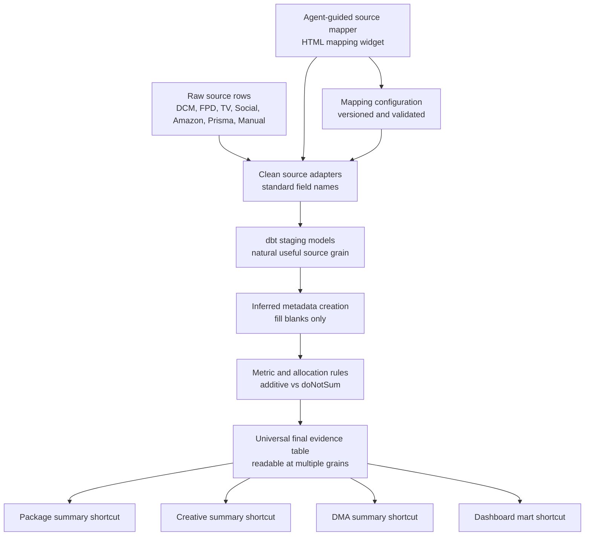
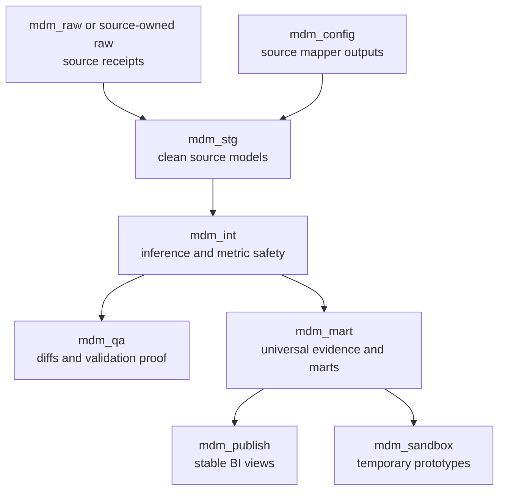
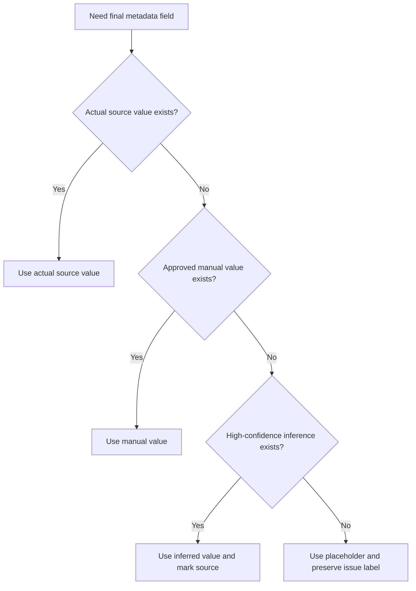
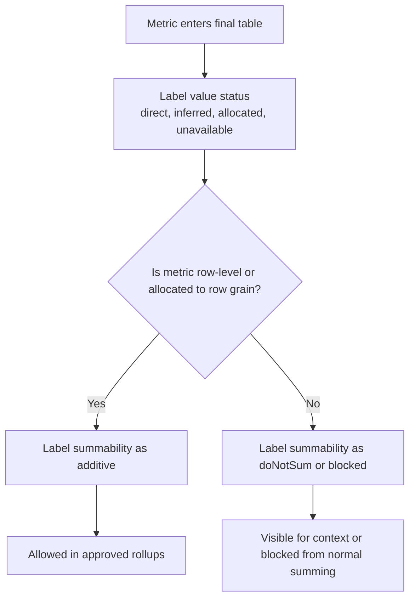

# Architecture Diagrams

Diagrams live in a companion so the SPEC kernel stays prose-only.

## Universal Final Evidence Flow

## dbt And BigQuery Zone Flow

## Metadata Selection Flow

## Metric Safety Flow

