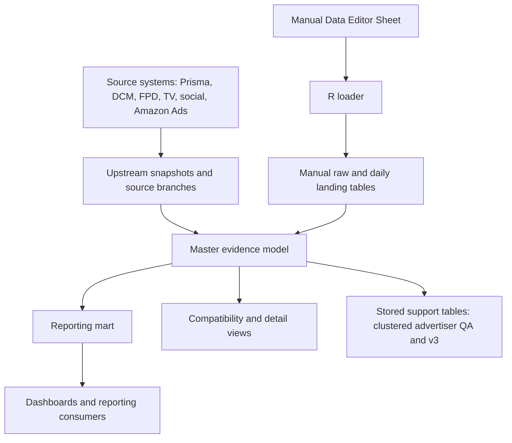

# Architecture

**Date:** 2026-06-15  
**System Type:** BigQuery data model with Sheet-backed manual correction workflow

## High-Level Architecture

## Architectural Responsibilities

| Area | Responsibility | Local Definition |
|---|---|---|
| Upstream source refresh | Materialize stored source table siblings before the master model reads them | [create_master_data_model_upstream_tables_sched.sql](/Users/eugenetsenter/Looker_clonedRepo/looker_personal/master_data_model/create_master_data_model_upstream_tables_sched.sql) |
| Master evidence layer | Combine source rows, preserve issue labels, apply valid manual values, and calculate package/date rollups | [create_master_stg_data_model.sql](/Users/eugenetsenter/Looker_clonedRepo/looker_personal/master_data_model/create_master_stg_data_model.sql) |
| Reporting mart | Apply reporting-only exclusions and recalculate package rollups after filtering | [create_master_stg_data_model_mart.sql](/Users/eugenetsenter/Looker_clonedRepo/looker_personal/master_data_model/create_master_stg_data_model_mart.sql) |
| Manual editor loader | Detect edited Sheet cells, validate them, write raw/daily manual rows, and refresh visible values | [load_manual_package_edits.R](/Users/eugenetsenter/Looker_clonedRepo/looker_personal/master_data_model/manual_package_edits/load_manual_package_edits.R) |
| Manual editor UX tools | Manage Sheet formatting, filters, slicers, helper columns, and visual markers | [manual_package_edits](/Users/eugenetsenter/Looker_clonedRepo/looker_personal/master_data_model/manual_package_edits) |
| Apps Script audit and request control | Stamp row-level manual-edit audit fields and send a refresh request without running the loader | [Code.js](/Users/eugenetsenter/Looker_clonedRepo/looker_personal/master_data_model/manual_package_edits/apps_script/Code.js) |
| Stored support table refresh | Refresh the clustered advertiser QA table and v3 evaluation table from current master/source inputs | [run_master_data_model_clustered_advertiser_refresh.sh](/Users/eugenetsenter/Docs/R_Studio_Projects/universal_cron_runner/automation_hub/workloads/ops/bq_trigger/run_master_data_model_clustered_advertiser_refresh.sh) |

## Model Layers

| Layer | Grain | Key Principle |
|---|---|---|
| Main evidence model | Package/date plus explicit synthetic rows for non-Prisma sources | Preserve evidence and issue labels before reporting filters. |
| Reporting mart | Dashboard-ready package/date | Filter low-signal rows and recalculate rollups after filtering. |
| Delivery detail v2 | Lower-grain DCM/FPD delivery detail | Preserve creative/detail without duplicating package/date metrics. |
| V3 lowest-grain table | Natural source grain plus one planned carrier per package/date | Evaluation-only; proves whether one table can roll up planned and actual metrics without a user-selected grain. |
| One-table sample views | Mixed package/detail rows | Historical comparison only; consumers must filter row level before summing. |

## Data Flow

| Step | What Happens |
|---|---|
| 1 | Source rows from Prisma, DCM, FPD, TV, social, and Amazon Ads are shaped into model-compatible branches. |
| 2 | Some sources use synthetic package keys because they do not naturally share Prisma package IDs. |
| 3 | Manual raw and daily landing rows are joined into the evidence model after normal source rows are assembled. |
| 4 | Manual `man_*` values take priority where valid and grain-compatible. |
| 5 | Package rollups are calculated after final metric selection. |
| 6 | The mart filters reporting-only rows and recalculates rollups for dashboard use. |

## Safety Rules Embedded In The Design

| Rule | Architecture Effect |
|---|---|
| Do not silently collapse lower-grain fields | Creative/detail fields live in sibling detail views, not the package/date model. |
| Keep unmatched delivery visible but non-inflating | Rows can preserve raw evidence and issue labels without contributing to final package actuals unless approved. |
| Keep Sheet UX separate from data loading | R refreshes values and writes warehouse rows; JavaScript owns formatting and slicer repair. |
| Treat request refresh as notification only | Apps Script stamps audit cells during user edits, then sends a message and resets the checkbox when refresh is requested; it does not validate, load, or deploy data. |
| Verify live warehouse behavior before claims | Local SQL is deploy input, not proof of current production state. |

## Main Risks

| Risk | Mitigation |
|---|---|
| Local SQL may drift from live views | Compare live BigQuery definitions before deploying or claiming current behavior. |
| Lower-grain fields can duplicate metrics | Use delivery-detail views or explicit `doNotSum` context fields. |
| User Sheet formatting can be overwritten | Do not run setup/rebuild scripts unless a full rebuild is explicitly approved. |
| Manual values can re-mark themselves if baselines use final fields | Loader uses source-derived baselines instead of manual-affected final dashboard fields. |
| Row counts and source totals naturally fluctuate | Keep counts in run-specific proof notes, not durable docs. |
| Stored evaluation tables can go stale after base changes | Run `Master Data Model Clustered Advertiser Refresh` or the v3 builder in the same work session and verify the live tables before claiming freshness. |
