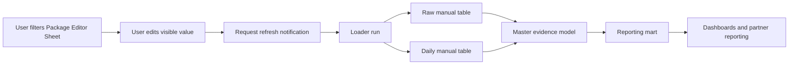

# Manual Package Editor Workflow

**Date:** 2026-06-15  
**Purpose:** Explain the Sheet-backed manual correction path in a way that connects user action, loader behavior, warehouse evidence, and dashboard reflection.

## Plain-English Flow

## User-Facing Contract

| User Action | What It Means | What It Does Not Mean |
|---|---|---|
| Filter with slicers | Narrows visible package rows in the Sheet | Does not change backend data. |
| Edit a visible value | Proposes a correction for a date, metric, or metadata field | Does not write BigQuery until the loader runs. |
| Check Request refresh | Sends a notification email and optional Slack message | Does not validate rows, run the loader, or update dashboards. |
| Fix red row feedback | Makes a started/manual-only row eligible for validation | Does not guarantee final publish until loader/backend validation passes. |

## Backend Flow

| Step | Owner | Output |
|---|---|---|
| Sheet read | R loader | Visible values, hidden baselines, and marker state. |
| Edit detection | R loader | Changed cells compared to source-derived baselines and prior raw rows. |
| Validation | R loader | Active valid rows or blocked rows with reasons. |
| Raw write | BigQuery landing table | One row per editor row with current, replacement, validation, and metadata evidence. |
| Daily allocation | R loader | Package/date manual metric rows with proof totals. |
| Model merge | SQL evidence model | Final fields use valid manual values where grain-compatible. |
| Mart filter | SQL reporting mart | Dashboard-ready totals after reporting exclusions. |

## Edit Rules

| Edit Family | Grain | Rule |
|---|---|---|
| Flight dates | Package | Applies to every model row for that package. |
| Metadata | Package | Applies package-wide, even outside metric override dates. |
| Delivered metrics | Package/date window | Applies only to the selected delivery override dates. |
| Planned metrics | Full flight | Partial-range planned edits are blocked. |
| Manual-only rows | New package/date rows | Require package identity, dates, at least one metric, and required metadata. |

## Visual Markers

| Marker | Meaning |
|---|---|
| Orange | Visible value differs from the current dashboard/source baseline. |
| Purple | Value is already backed by a valid active manual update. |
| Red | Started row is incomplete or invalid and must be fixed before load. |

## Key Safeguards

| Safeguard | Why It Exists |
|---|---|
| Source-derived baselines | Prevent manual-affected final fields from re-marking stale manual values. |
| Daily total proof | Ensures allocated daily rows sum back to the replacement total within tolerance. |
| Backend validation | Blocks invalid rows even if Sheet formatting missed them. |
| Separate formatting scripts | Keeps routine data refresh from overwriting live user formatting. |
| Notification-only Apps Script | Keeps the request button honest: it asks for refresh; it does not perform refresh. |

## Primary References

| Reference | Use |
|---|---|
| [Manual editor README](/Users/eugenetsenter/Looker_clonedRepo/looker_personal/master_data_model/manual_package_edits/README.md) | Normal workflow, edit rules, and user-facing meaning. |
| [Manual editor QA runbook](/Users/eugenetsenter/Looker_clonedRepo/looker_personal/master_data_model/manual_package_edits/QA_RUNBOOK.md) | Proof path, queries, troubleshooting, and gotchas. |
| [Manual editor loader](/Users/eugenetsenter/Looker_clonedRepo/looker_personal/master_data_model/manual_package_edits/load_manual_package_edits.R) | Implementation of edit detection, validation, writes, and refresh. |
| [Request notification Apps Script](/Users/eugenetsenter/Looker_clonedRepo/looker_personal/master_data_model/manual_package_edits/apps_script/Code.js) | Notification control implementation. |

