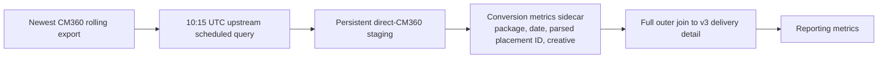

# Direct CM360 Conversion Source Migration

This guide records the deployed replacement of the RTL conversion Google Sheet mirror with a direct Campaign Manager 360 (CM360) BigQuery source. It is for the people who build and validate the master data model.

The direct source was deployed to V3 on July 13, 2026 after isolated candidate QA, SQL Change Guard validation, and a focused live reconciliation.[^1]

## Status and decision

| Area | Deployed behavior | Historical reference |
| --- | --- | --- |
| Conversion source | The newest eligible enriched export in the [Adswerve CM360 dataset](https://console.cloud.google.com/bigquery?project=giant-spoon-299605&p=giant-spoon-299605&d=ALL_DCM_adswerve&page=dataset) updates [persistent direct CM360 history](https://console.cloud.google.com/bigquery?project=looker-studio-pro-452620&p=looker-studio-pro-452620&d=master_stg&t=rtl_cm360_direct_conversions&page=table) | The [legacy-schema compatibility table](https://console.cloud.google.com/bigquery?project=looker-studio-pro-452620&p=looker-studio-pro-452620&d=landing&t=rtl_conv_report&page=table) is refreshed from that history for optional comparison; its Sheet read path is retired |
| Automatic refresh | The existing `master_data_model_upstream_tables_sched` BigQuery schedule runs the direct-history `MERGE` daily at 10:15 UTC | The universal runner triggers that schedule, then runs the RTL compatibility R loader before its clustered-advertiser/V3 step |
| History | Persistent staging[^2] retains older dates while a rolling export updates matching source records | The runner refreshes the dashboard's 18-column compatibility table from persistent history; the legacy Sheet loader is retired and V3 does not read the compatibility table |
| Connection to the model | Direct conversion metrics join V3 delivery at package/date/parsed-placement/creative detail; unmatched conversion evidence remains separate | The former Sheet-shaped `conversion_activity` CTEs are removed from the canonical builder rather than built empty and filtered out later |
| QA candidate | [Isolated V3 direct-CM360 candidate](https://console.cloud.google.com/bigquery?project=looker-studio-pro-452620&p=looker-studio-pro-452620&d=master_stg&t=data_model_v3_cm360_direct_qa&page=table) and prior source QA objects preserve review evidence | The production cutover has passed |
| Cutover state[^5] | Active in [V3](https://console.cloud.google.com/bigquery?project=looker-studio-pro-452620&p=looker-studio-pro-452620&d=master_stg&t=data_model_v3&page=table) | Roll back only if a focused live check fails |

The direct source family is `giant-spoon-299605.ALL_DCM_adswerve.Ritual_conversions_last14_cm360_1123381_1665558564_*`. Each export contains a rolling last-14-day window[^6], so the loader must select exactly one newest export rather than scan all matching tables together. Scanning all exports would count overlapping dates repeatedly.

## Target flow

```text
Newest CM360 last-14-day export
        |
        v
10:15 UTC master upstream scheduled query
        |
        v
Persistent direct-CM360 staging table (raw evidence[^7] and history)
        |
        v
Conversion metrics at package + date + parsed placement ID + creative
        |
        v
Join to matching v3 delivery-detail rows
        |
        v
Master-model reporting fields
```



The production staging table is [direct CM360 RTL conversion history](https://console.cloud.google.com/bigquery?project=looker-studio-pro-452620&p=looker-studio-pro-452620&d=master_stg&t=rtl_cm360_direct_conversions&page=table).

## What the direct staging table must preserve

The staging table retains every source field from CM360, including the conversion and revenue breakdowns. This keeps the source auditable and avoids losing a field that may become useful later.

| Field group | Fields to retain |
| --- | --- |
| Delivery and conversion context | `date`, `advertiser`, `campaign`, `site`, `activity_group`, `activity`, `creative`, `placement`, `package_roadblock` |
| Conversion metrics | `total_conversions`, `activity_click_through_conversions`, `activity_view_through_conversions` |
| Revenue metrics | `total_conversions_revenue`, `activity_click_through_revenue`, `activity_view_through_revenue` |
| Staging metadata | `package_id`, `placement_id`, `conversion_row_key`, `model_detail_key`, `source_table_name`, `source_exported_at`, `data_refresh_date`, `staged_at` |

`data_refresh_date` answers “when did this staging table receive the row?” `source_exported_at` records when the selected CM360 export table landed in BigQuery. They are intentionally separate: a late staging rerun should not disguise an older source export as fresh source data.

## Keys and grain

“Foreign key” is the right relationship idea here, although BigQuery does not enforce foreign-key constraints[^8]. The model will store a deterministic[^9] logical join key[^10] rather than rely on a package/date-only shortcut. The key is calculated at the row's grain[^11], meaning the exact level of detail that one row represents.

| Key | Purpose | Fields |
| --- | --- | --- |
| `conversion_row_key` | Identifies a raw CM360 staging row for `MERGE` updates | package, date, placement, creative, activity, advertiser, campaign, site, activity group, and package roadblock |
| `model_detail_key` | Identifies the lowest shared conversion-to-delivery detail grain | package, date, parsed placement ID, creative |

Direct CM360 preserves the full descriptive `placement` source field. Its `placement_id` is parsed from the embedded ID in that string because v3 DCM detail rows store that ID, not the full description. `activity` belongs in the raw merge key because it distinguishes conversion outcomes such as purchase and add-to-cart. It is intentionally not part of `model_detail_key`: the delivery model has no matching activity dimension, and adding it to the join would either create unmatched rows or multiply delivery metrics.

The activity-level source data is aggregated at `package_id + date + placement + creative` before it joins the model. V3 exposes `conv_site_visits`, `conv_view_products`, `conv_add_to_carts`, `conv_begin_checkouts`, and `conv_purchases`, along with total, click-through, view-through, and revenue measures. Multi-valued activity and activity-group fields remain available as `conv_activities` and `conv_activity_groups`. New activity names remain preserved in raw staging; adding a new wide `conv_*` field[^12] is a deliberate schema change, not an automatic silent behavior change.

## Rolling-window history rule

The direct source is not a full historical replacement on each run. The routine loader:

1. Select the one newest CM360 export using the export timestamp in its table name.
2. Standardize and validate its source fields and keys.
3. `MERGE` matching raw conversion rows into persistent staging.
4. Insert genuinely new rows.
5. Keep staging rows outside the newest 14-day window; never delete history merely because it is absent from the new rolling export.

This makes corrected values inside the rolling window refreshable while retaining older conversion history. It rejects a table whose parsed report window exceeds 14 days, so the historical backfill cannot be accidentally selected by routine refreshes.

The `MERGE` is repeat-safe: rerunning the schedule, using its **Run now** control, or running the universal runner updates the same raw CM360 records instead of appending duplicates. The universal runner triggers this same schedule immediately before its clustered-advertiser/V3 step; it is not a second CM360-loader path.

## Model integration rule: join, do not union

The conversion metrics sidecar full-outer-joins existing V3 delivery-detail rows using `model_detail_key`. It is not a separate conversion-source branch, and the other branches do not need placeholder conversion fields merely to satisfy a conversion union.

The join must remain one-to-one[^13] at the delivery-detail grain. Conversion outcomes can have several activities for one delivery row; aggregating the sidecar first prevents row multiplication[^14], which would duplicate spend, impressions, clicks, or other delivery metrics.

The full outer join has three visible outcomes: `delivery_with_conversion`, `delivery_only`, and `conversion_only`. A conversion-only row carries its conversion fields and logical detail key but has null delivery metrics. This preserves every direct-CM360 conversion without attaching it to a broader package or date and without inventing impressions, clicks, or cost.

## QA and release checks

| Check | Deployed proof |
| --- | --- |
| Newest source selection | Routine script accepts one enriched table only when its parsed report window is 0–14 days |
| Source preservation | All direct CM360 fields and staging metadata are retained in production history |
| Historical merge | 5,394 unique source records cover Apr 30–Jul 12; older history remains after routine updates |
| Activity metrics | All five published activity measures reconcile exactly to raw CM360 values[^16] |
| Model join | 1,555 unique matches, 350 explicit conversion-only rows, and no conversion-only delivery metrics |
| Freshness | `source_exported_at`, `data_refresh_date`, and `staged_at` are visible in V3 |
| Deployment comparison[^17] | Isolated candidate passed all 13 SQL Change Guard checks before production deployment |

After the model change is approved and deployed, refresh the dependent stored model table[^18] in the same session and run a focused live check of the changed conversion fields.

## Deployed implementation and QA evidence

The QA candidate remains review evidence; production now uses the scripts below and does not read the retired Sheet source.

- [QA builder SQL](../model/branches/digital/conversions/create_rtl_cm360_direct_conversions_qa.sql) selects the newest single rolling export and creates the three QA tables.
- [Raw direct-CM360 QA staging](https://console.cloud.google.com/bigquery?project=looker-studio-pro-452620&p=looker-studio-pro-452620&d=master_stg&t=rtl_cm360_direct_conversions_qa&page=table) preserves all direct source fields, parsed IDs, merge key, logical model key, source export timestamp, and staging refresh date.
- [Detail-metrics QA sidecar](https://console.cloud.google.com/bigquery?project=looker-studio-pro-452620&p=looker-studio-pro-452620&d=master_stg&t=rtl_cm360_conversion_metrics_detail_qa&page=table) contains activity metrics and `model_detail_join_status`. It keeps unmatched source keys visible rather than joining them at a broader grain.
- [Full-outer detail QA output](https://console.cloud.google.com/bigquery?project=looker-studio-pro-452620&p=looker-studio-pro-452620&d=master_stg&t=rtl_cm360_dcm_detail_full_outer_qa&page=table) demonstrates the final join shape: matched delivery-plus-conversion rows, delivery-only rows, and conversion-only rows. Conversion-only rows retain conversion metrics but have null DCM delivery metrics.

The candidate is not the persistent production staging table; it remains evidence for the source contract and safe join shape.

### Historical direct-source QA candidate

The [direct-history QA builder](../model/branches/digital/conversions/create_rtl_cm360_direct_history_qa.sql) now combines the one-time enriched historical CM360 backfill with the enriched current seed. Its [history staging QA table](https://console.cloud.google.com/bigquery?project=looker-studio-pro-452620&p=looker-studio-pro-452620&d=master_stg&t=rtl_cm360_direct_conversions_history_qa&page=table) preserves every source field and chooses the newest export if a logical activity record appears more than once. Its [history full-outer QA output](https://console.cloud.google.com/bigquery?project=looker-studio-pro-452620&p=looker-studio-pro-452620&d=master_stg&t=rtl_cm360_dcm_detail_history_full_outer_qa&page=table) proves the same delivery-only, delivery-with-conversion, and conversion-only behavior across the direct-history seed.

Production uses two deliberate modes:

1. A one-time bootstrap from the approved enriched historical and current exports.
2. A routine `MERGE` in the existing daily 10:15 UTC upstream BigQuery schedule. It accepts only an enriched rolling export with both package-roadblock and placement fields, updates matching raw records, retains older history, and must reject an export that lacks either field instead of joining at a broader grain.

## Rollback boundary

1. Rebuild V3 from the direct staging table after the source-history refresh is verified.
2. Reconcile direct conversion and activity totals, join statuses, and conversion-only delivery-null behavior.
3. Keep the legacy-schema compatibility table as optional direct-history comparison evidence only; do not use it as a V3 source.

If the live check fails, restore the prior conversion-source branch. The new direct staging table remains as evidence for investigation; it does not need to be deleted to roll back the model connection.

## Reusable checklist for another conversion source

Before adding another conversion source, document and prove these items:

| Decision | Question to answer |
| --- | --- |
| Source contract[^20] | Which exact table family is authoritative[^21], and how is the newest export selected? |
| Grain | What one source row represents, and what is the lowest grain it shares with delivery data? |
| Stable keys | Which key supports history-preserving `MERGE`, and which logical key supports the model join? |
| Field contract | Which raw fields are retained, which metric fields are published, and how are new activity types handled? |
| History behavior | Is the source full history, a rolling window, or a correction feed? |
| Metric safety | How does the join avoid multiplying delivery metrics? |
| Freshness | Which fields distinguish source-export time from staging refresh time? |
| Cutover proof | What QA comparison and focused live check prove the source is safe to use? |

[^1]: **QA candidate:** A separate test version used to check a proposed change without affecting production data.
[^2]: **Staging table:** A holding table that keeps source data before it feeds the model.
[^3]: **Sidecar:** A separate supporting table that joins to the main model instead of becoming a new model branch.
[^4]: **Delivery-detail rows:** The detailed advertising-delivery records that the conversion summary must match.
[^5]: **Cutover:** The switch from the current production source to the new source.
[^6]: **Rolling last-14-day window:** A report that covers only the most recent period; here, the last 14 days.
[^7]: **Raw evidence:** The original source rows, retained without combining them.
[^8]: **Foreign-key constraint:** A database rule that enforces a valid relationship between records. The model uses the relationship idea, but BigQuery does not enforce it here.
[^9]: **Deterministic:** Produces the same result whenever it receives the same inputs.
[^10]: **Logical join key:** A calculated value used to match the same conversion summary to its related delivery record.
[^11]: **Grain:** The level of detail that one row represents.
[^12]: **Wide `conv_*` field:** A separate named column for each activity type, rather than one shared activity column.
[^13]: **One-to-one join:** Each conversion summary matches only one delivery record.
[^14]: **Row multiplication:** An accidental repeat of rows caused by a join, which can inflate totals.
[^15]: **Wildcard export:** A pattern that can select several similarly named report tables.
[^16]: **Reconcile:** Confirm that totals agree between the source and the derived table.
[^17]: **Deployment comparison:** A test that compares the proposed version with the current production version before release.
[^18]: **Dependent stored model table:** A saved downstream table that must be refreshed after its input changes.
[^19]: **Legacy fallback:** An older path kept temporarily as a backup and comparison point.
[^20]: **Source contract:** The documented rules for which source to use and how to use it.
[^21]: **Authoritative:** Treated as the official source for this purpose.

## Related documentation

- [Master data model overview](../README.md)
- [Current v3 source inventory](../README_v2.md)
- [Digital conversion branch guide](../model/branches/digital/README_digital-conversions-pipeline.md)
- [Conversion helper guide](../model/branches/digital/conversions/README.md)
