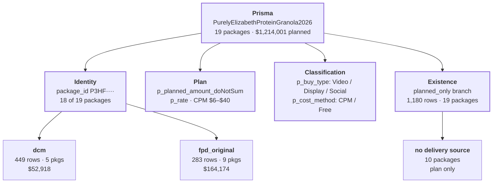

# v3 Prisma Lineage — Purely Elizabeth

**Object:** `looker-studio-pro-452620.master_stg.data_model_v3`
**Filter:** `_advertiser_name = 'Purely Elizabeth'`
**Snapshot:** 2026-08-07 20:22 UTC

## About this document

This is the Purely Elizabeth cut of the [full v3 lineage map](v3-prisma-lineage.md). Read the
full map for how the model works; read this one for how Purely Elizabeth actually sits in it.

PE is the cleanest Prisma case in the warehouse: **every single row traces back to a Prisma
package**, with zero orphans. That makes it the best worked example of the Prisma spine
functioning as designed — and, because it exercises three of the model's quality flags, a
useful reference for what those flags mean in practice.

---

## 1. Scale and shape

| | |
|---|---|
| Rows | 1,912 |
| Packages | 19 |
| Branches present | 3 of 10 |
| Planned spend | $1,214,001 |
| Final spend | $217,092 |
| Final impressions | 17,354,607 |
| Final clicks | 10,960 |
| Flight | 2026-07-06 → 2026-10-31 |
| Delivery to date | **17.9%** of plan |

One campaign, one agency, one audience: **PurelyElizabethProteinGranola2026**, bought through
**MIQ Digital USA**, targeting **HealthyMaximalist**. The 17.9% delivery figure is not
under-pacing — the flight runs to 31 October and the snapshot is 7 August.

---

## 2. What Prisma contributes here

All four Prisma contributions are live for PE, and one of them does almost all the work.



**Every actual PE has comes through a Prisma package ID.** There is no social branch, no
Amazon branch, no TV — so unlike Olipop or MassMutual, PE has no delivery that bypasses the
spine. If the Prisma match broke, PE would report **zero**.

---

## 3. Branch composition

Only three of the model's ten branches appear.

| Branch | Rows | Pkgs | Planned spend | Final spend | Final impressions | Final clicks |
|---|---:|---:|---:|---:|---:|---:|
| `planned_only` | 1,180 | 19 | $1,059,795 | — | — | — |
| `dcm` | 449 | 5 | $47,370 | $52,918 | 3,221,759 | 693 |
| `fpd_original` | 283 | 9 | $106,836 | $164,174 | 14,132,848 | 10,267 |

**FPD carries PE, not DCM.** First-party data supplies 76% of final spend and 81% of
impressions from only 9 packages. This matches the model's `FPD ▸ DCM` precedence — where
both exist, FPD wins.

### Branches absent from PE

Seven of ten branches never appear: `social`, `wp_search_data_template`, `amazon_ads`,
`fpd_updated_package`, `tv_combined`, `manual_package_edits`, `cm360_direct_conversion`.

This matters for dashboard design. A PE view built on the full-model template will render
seven permanently empty sections, and any Prisma-vs-platform reconciliation panel has nothing
to reconcile.

---

## 4. Quality flags in play

| `qa_data_issues` | Branch | Rows | Pkgs | Final spend | Final imps |
|---|---|---:|---:|---:|---:|
| `missing_actuals` | `planned_only` | 1,152 | 18 | — | — |
| `no_issues` | `dcm` | 222 | 5 | $52,918 | 3,215,000 |
| `actual_source_conflict` | `dcm` | 210 | 4 | **suppressed** | **suppressed** |
| `no_issues` | `fpd_original` | 157 | 9 | $137,661 | 11,265,536 |
| `actual_source_conflict` | `fpd_original` | 126 | 4 | $26,513 | 2,867,312 |
| `no_issues` | `planned_only` (OOH) | 28 | 1 | — | — |
| `missing_prisma_daily` | `dcm` | 12 | 1 | $0 | 6,722 |
| `missing_prisma_daily \| low_signal_dcm` | `dcm` | 5 | 1 | $0 | 37 |

**No `missing_prisma_package` anywhere.** Zero orphaned rows, zero
`UnmatchedDigitalPackage`. Every PE package type is `Package` except one `OOH`.

`missing_prisma_daily` is the milder cousin of orphaning: the package *is* in Prisma, but that
specific date has no Prisma daily plan row. PE has 17 such rows on one package, carrying 6,759
impressions and $0.

---

## 5. Case study: `actual_source_conflict`

Four YouTube packages are flagged `actual_source_conflict`. Package `P3HF6GF`
(YouTubeInStream15, CPM $13) shows exactly why the flag exists:

| Date | Branch | Rows | Source cost | Source imps | Final spend | Final imps |
|---|---|---:|---:|---:|---:|---:|
| 2026-07-20 | `dcm` | 6 | $1,508 | 116,033 | **NULL** | **NULL** |
| 2026-07-20 | `fpd_original` | 3 | $754 | 58,030 | $754 | 58,030 |
| 2026-07-21 | `dcm` | 6 | $1,544 | 118,736 | **NULL** | **NULL** |
| 2026-07-21 | `fpd_original` | 3 | $772 | 59,379 | $772 | 59,379 |
| 2026-07-22 | `dcm` | 6 | $1,651 | 127,034 | **NULL** | **NULL** |
| 2026-07-22 | `fpd_original` | 3 | $826 | 63,519 | $826 | 63,519 |

DCM reports **exactly twice** FPD's rows, cost and impressions, every single day. This is a
duplicate feed, not extra delivery. The model detects the overlap, keeps FPD, and nulls the
DCM side.

Across PE, the suppressed DCM rows hold **$47,663 and 5,089,720 impressions**, replaced by
FPD's $26,513 and 2,867,312. Had the guard not fired, PE would over-report spend by roughly
$21,000 and impressions by ~2.2M — about 10% and 13% of its totals.

> [!important] Do not treat `actual_source_conflict` DCM rows as missing data.
> They are deliberately suppressed duplicates. Any "fix" that back-fills them re-introduces
> the double-count.

---

## 6. Package inventory

All 19 packages, by planned spend.

| # | Package ID | Package | Buy type | Cost method | Planned | Final | Branches |
|---:|---|---|---|---|---:|---:|---|
| 1 | `P3HF5H5` | PremiumCTVWrap | Video | CPM $36 | $300,000 | $82,015 | dcm, fpd, planned |
| 2 | `ccdooh` | Columbus Circle DOOH | — | — | $210,000 | — | planned_only |
| 3 | `P3HF69N` | AmazonPrimeVideo | Video | CPM $40 | $185,000 | $47,145 | fpd, planned |
| 4 | `P3HF8G6` | CostcoRMN | Display | CPM $15 | $125,000 | — | planned_only |
| 5 | `P3HF88Q` | TikTok | Social | CPM $9 | $100,000 | $20,215 | fpd, planned |
| 6 | `P3HF6GF` | YouTubeInStream15 | Video | CPM $13 | $52,000 | $14,628 | conflict |
| 7 | `P3HF75D` | YouTubeShorts | Video | CPM $9 | $51,000 | $13,777 | conflict |
| 8 | `P3HF7L0` | YouTubeBumpers | Video | CPM $6 | $51,000 | $13,080 | conflict |
| 9 | `P3HF7T8` | Instagram | Social | CPM $7 | $50,000 | $5,352 | fpd, planned |
| 10 | `P3HF7QB` | FacebookAwareness | Social | CPM $7 | $40,000 | $9,545 | fpd, planned |
| 11 | `P3HF6JR` | YouTubeInStream30 | Video | CPM $14 | $40,000 | $11,335 | conflict |
| 12 | `P3J34ZD` | MetaConversion | Social | CPM $18 | $10,000 | — | planned_only |
| 13 | `P3HFHLK` | AVImps | Display | Free | $0 | — | planned_only |
| 14 | `P3HFHNG` | AVBLS | Display | Free | $0 | — | planned_only |
| 15 | `P3HFHNY` | AVInMarket | Display | Free | $0 | — | planned_only |
| 16 | `P3HFHQB` | AVRMNMeasurement | Display | Free | $0 | — | planned_only |
| 17 | `P3HFJ19` | AVSigma | Display | Free | $0 | — | planned_only |
| 18 | `P3HFJ2H` | AVBrandGuard | Display | Free | $0 | — | planned_only |
| 19 | `P3HFJ2N` | AVCustomCreative | Display | Free | $0 | — | planned_only |

---

## 7. Two things that will trip up a PE report

### 7.1 `ccdooh` is not a Prisma package

Eighteen packages carry Prisma-format IDs (`P3HF····`, `P3J····`). One does not:
**`ccdooh`** — "Columbus Circle DOOH", package type `OOH`, $210,000 planned. Its
`p_buy_type`, `p_cost_method` and `p_rate` are all `NULL`, because it never came from Prisma.

It is a manually-injected planned package: `qa_media_data_type = 'manual'` but
`qa_row_data_source_primary = 'planned_only'`.

Consequences:

- It is **17.3% of PE's planned budget** — the second-largest line — so excluding it
  understates the plan badly.
- It will never receive actuals from any digital source. An out-of-home buy has no DCM
  placement and no FPD row.
- Any report grouping by `p_buy_type` drops it into a `NULL` bucket.

### 7.2 Seven of nineteen packages are $0 added-value

Packages 13–19 are all `cost_method = Free`, $0 planned, 73 rows each — 511 rows total, or
**27% of PE's row count** for zero dollars. They are measurement and brand-safety add-ons
(Sigma, BrandGuard, BLS, In-Market), not media.

A package-count metric will report 19 when only 12 are spending, and only 9 have ever
delivered. Prefer counting packages with `_planned_spend > 0`.

---

## 8. Reproducing this

```sql
SELECT qa_row_data_source_primary AS branch,
       qa_data_issues            AS data_issues,
       _package_type             AS package_type,
       COUNT(*)                  AS record_count,
       COUNT(DISTINCT _package_id) AS package_count,
       ROUND(SUM(_planned_spend),0) AS planned_spend,
       ROUND(SUM(_spend),0)         AS final_spend,
       SUM(_impressions)            AS final_impressions
FROM `looker-studio-pro-452620.master_stg.data_model_v3`
WHERE _advertiser_name = 'Purely Elizabeth'
GROUP BY 1,2,3
ORDER BY record_count DESC;
```

## Provenance

| | |
|---|---|
| **Source of truth** | `looker-studio-pro-452620.master_stg.data_model_v3` (TABLE) |
| **Prisma entry** | `20250327_data_model.prisma_expanded_full` |
| **Snapshot** | 2026-08-07 20:22 UTC · 1,912 PE rows · 19 packages |
| **Full model map** | [`v3-prisma-lineage.md`](v3-prisma-lineage.md) |

### Open question

`ccdooh` carries $210,000 of plan with no path to actuals. Whether OOH delivery should be
captured — manually or from a vendor feed — or whether the package should be excluded from
pacing denominators, is a reporting decision this model cannot make on its own.
