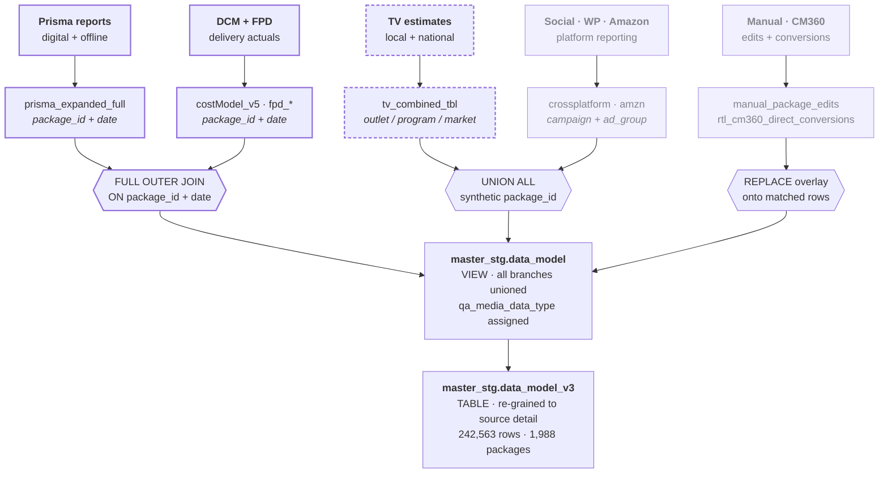
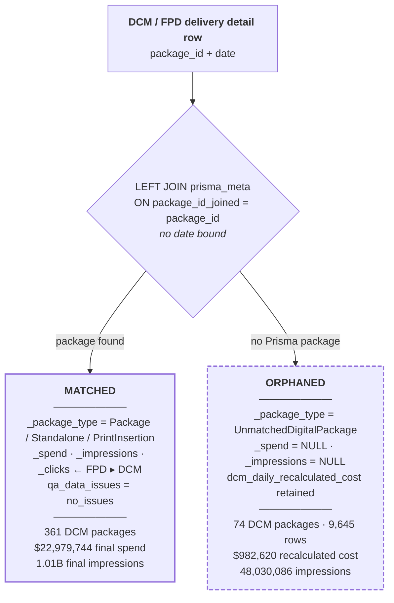

# v3 Data Model — Prisma Lineage Map

**Object:** `looker-studio-pro-452620.master_stg.data_model_v3`
**Snapshot:** 2026-08-07 20:22 UTC

## About this document

This is for anyone tracing where a number in the v3 model came from, or deciding whether a
given branch belongs in a Prisma-based rollup. It explains what Prisma contributes, maps all
ten v3 branches by their relationship to it, documents the join that gates every digital
final metric, and lists the naming and provenance traps that make the lineage easy to misread.

Every count and sum was read from the live warehouse at the snapshot above — see
[Provenance](#provenance) for why that mattered. `data_model_v3` is a live table that
refreshes; treat the figures here as of the snapshot, not as durable constants.

**Related:** for a worked single-advertiser example, see
[`v3-prisma-lineage-purely-elizabeth.md`](v3-prisma-lineage-purely-elizabeth.md). For the
CM360 conversion branch, see
[`rtl-direct-cm360-conversion-migration.md`](rtl-direct-cm360-conversion-migration.md).

---

## Summary

Ten branches land in v3. Prisma is the plan of record for **four** of them by join, for
**one** more by a different shape entirely, and for **none** of the rest.

| | |
|---|---|
| Rows | 242,563 |
| Packages | 1,988 |
| Advertisers | 13 |
| Branches | 10 |
| Planned spend | $140,277,990 |
| Final spend | $95,675,335 |
| Final impressions | 7,236,544,092 |
| Date span | 2025-01-01 → 2027-02-01 |

---

## 1. What Prisma is, and what it contributes

Prisma is the media planning and buying system where the plan is authored. It is the system
of record for **what was bought** — packages, flights, rates, cost methods, planned budgets.
It is *not* a source of delivery. Ad servers (DCM/CM360), platform APIs, TV estimates and
manual entry record **what was delivered**.

The v3 model is fundamentally a marriage of those two halves. Prisma contributes four things,
and it is worth separating them, because losing Prisma costs you all four at once.

### 1.1 Identity — the package spine

`package_id` is the join key that makes cross-source reporting possible at all. A DCM
placement, an FPD row, and a plan number are three unrelated facts until a shared package ID
binds them. Prisma supplies that ID.

This is the contribution that makes the others load-bearing: **when the Prisma match fails,
the model cannot attribute the delivery it already has**, so the actuals are discarded too.
See [section 4](#4-the-prisma-gate-and-what-falls-through-it).

### 1.2 The plan — the denominator

Every pacing, delivery-vs-plan, and remaining-budget metric divides by a Prisma number.

| Field | Meaning |
|---|---|
| `p_planned_amount_doNotSum` | Planned spend for the package |
| `p_planned_impressions_doNotSum` | Planned impressions |
| `p_planned_units_doNotSum` | Planned units |
| `p_planned_clicks` | Planned clicks |
| `p_rate` | Negotiated rate |

The `doNotSum` suffix is a warning, not decoration: these are package-level values repeated
across every detail row, so summing them across a detail-grain result multiplies them.

### 1.3 Classification — the grouping vocabulary

The commercial dimensions reports group by:

| Field | Meaning |
|---|---|
| `p_buy_type` | Video, Display, Social, … |
| `p_buy_category` | Commercial category of the buy |
| `p_cost_method` | CPM, CPC, Flat, Free, … |
| `p_unit_type` | Unit the rate is priced in |
| `p_max_report_date` | Latest Prisma report date for the package |

### 1.4 Existence — plans that have no delivery yet

A Prisma package with no matching delivery row still produces rows, via the `planned_only`
branch. This is why `planned_only` is the largest branch by package count (1,165 of 1,988):
a plan that has not started, or is under-delivering, stays **visible** rather than silently
absent. Reporting can show a zero, not a gap.

### 1.5 What Prisma does not contribute

**No actuals whatsoever.** Zero spend, impressions, clicks or video metrics originate in
Prisma. If a number describes delivery, it came from DCM, FPD, a platform API, a TV estimate,
Amazon, or a manual edit.

---

## 2. The shape of the thing

v3 does not re-source anything. It snapshots `master_stg.data_model` into `stable`, then
re-attaches actuals at their native source grain. So every question about Prisma is really a
question about the stable view underneath — and there, Prisma enters at exactly **one
object**: `20250327_data_model.prisma_expanded_full`.



**Solid** = carries Prisma planning data. **Dashed** = Prisma planning data arriving in the
linear shape, which has no `package_id` to join on. **Faint** = no Prisma relationship.

The two entry modes are the whole story: what joins to the spine can orphan; what unions
alongside it never meets it at all.

---

## 3. Prisma has two shapes, not one

It is tempting to read TV as "outside Prisma" because its rows carry a synthetic
`tv_pkg:<md5>` key and `p_planned_amount_doNotSum` is `NULL`. That reads the key, not the
data. **TV estimates are Prisma planning data** — Prisma is the plan of record for linear as
well as digital. The two differ in shape, and the shape determines how they enter the model.

| | Digital shape | Linear shape |
|---|---|---|
| **Path** | Prisma reports → `landing.prisma_master_2025` → `prisma_expanded_full` | `tv_local_estimates` + `tv_national_estimates` → `tv_combined_tbl` |
| **Grain** | package / date | outlet / program / market / date |
| **Key** | real `package_id` | **none** — model mints `tv_pkg:<md5>` |
| **Fields** | `planned_daily_spend_pk`, `planned_daily_impressions_pk` | `net_cost`, `net_impressions`, `total_units` |
| **Entry** | `FULL OUTER JOIN` on package_id + date | `UNION ALL` |

The warehouse corroborates this directly: `Prisma.stg__linear_combined` lives *in the Prisma
dataset*, reads `landing.tv_combined`, and re-emits it with Prisma-shaped planning fields —
`planned_cost_pk`, `planned_imps_pk`, `planned_spots` — which
`prisma__stg__digital_plus_linear_view` then unions with the digital path. The intent to
treat TV as Prisma planning is already modelled upstream.

> [!warning] The master model does not read that view.
> The TV branch reads `landing.tv_combined_tbl` directly and hashes its own key. So the
> Prisma-shaped linear view exists, and the master model bypasses it. That is the single
> clearest place where the lineage could be consolidated.

This also explains a number that otherwise looks like a bug: TV's `_planned_spend` and
`_spend` are *exactly* equal at **$41,992,643**. For linear, the estimate is simultaneously
the plan and the only delivery evidence, so `net_cost` populates both fields.

---

## 4. The Prisma gate, and what falls through it

Inside the digital branch, every final metric is gated on the Prisma lookup succeeding. This
is the highest-consequence expression in the model:

```sql
CASE
  WHEN prisma_package_id IS NULL THEN NULL
  ELSE COALESCE(NULLIF(fpd_orig_spend + fpd_updated_spend, 0), d_daily_recalculated_cost)
END AS final_spend
```

The same `WHEN prisma_package_id IS NULL THEN NULL` guard repeats on `final_impressions`,
`final_clicks`, `final_video_plays` and `final_video_comps`. Delivery that cannot find a
Prisma package still produces a row — with its raw `dcm_*` and `fpd_*` columns fully
populated — but contributes nothing to any reportable total.



The orphaned side is real delivery: **9,645 DCM rows across 74 packages** holding $982,620 of
recalculated cost and 48.0M impressions, none of which reaches `_spend` or `_impressions`. A
further **3 FPD packages (315 rows)** orphan the same way.

`dcm_daily_recalculated_cost` is per-placement, not a repeated package-level value, so
summing it across detail rows is legitimate.

### 4.1 `_package_type` has four values, not two

Matching is not binary. A matched row lands in one of several package types, and three of
them produce final spend normally:

| `_package_type` | Meaning | Produces actuals? |
|---|---|---|
| `Package` | Standard Prisma package | Yes |
| `Standalone` | Prisma package flagged standalone | Yes |
| `PrintInsertion` | Print insertion order | Yes |
| `OOH` | Out-of-home buy | Plan only |
| `UnmatchedDigitalPackage` | **No Prisma match** | **No — all finals NULL** |

Only `UnmatchedDigitalPackage` is a failure state. Reports that filter to
`_package_type = 'Package'` will silently drop legitimate Standalone and PrintInsertion
delivery — 3 DCM packages ($83,558), 13 FPD packages ($58,258), and 46 fpd_updated packages
($1,428,010).

### 4.2 `actual_source_conflict` — a dedup guard, not an error

When DCM and FPD both report the same package/date, the model keeps FPD and nulls the DCM
rows, flagging both sides `actual_source_conflict`. This is correct behaviour: DCM commonly
reports the same delivery at a multiple of FPD's volume. A worked example is in the
[Purely Elizabeth doc](v3-prisma-lineage-purely-elizabeth.md#5-case-study-actual_source_conflict),
where DCM reports exactly 2× FPD's impressions on the same package-days.

Do not treat `actual_source_conflict` rows with NULL spend as missing data. They are
deliberately suppressed duplicates.

---

## 5. The ten v3 branches, by Prisma relationship

| Branch | Rows | Pkgs | Planned spend | Final spend | Final impressions | Relationship to Prisma |
|---|---:|---:|---:|---:|---:|---|
| `dcm` | 107,028 | 438 | $20,267,162 | $22,979,744 | 1,011,270,485 | **joins** — 361 match, **74 orphan**, 3 standalone |
| `planned_only` | 55,842 | 1,165 | $51,918,746 | — | — | **is Prisma** — plan with no delivery row; **zero** rows carry actuals |
| `social` | 32,536 | 239 | $13,136,490 | $14,148,180 | 4,152,806,091 | **none** — synthetic `social:` key; plan from `repo_int.crossplatform_pacing_tbl` |
| `wp_search_data_template` | 24,992 | 152 | — | $1,415,871 | 41,426,563 | **none** — no plan at all |
| `fpd_original` | 12,531 | 99 | $9,731,088 | $11,557,325 | 432,874,162 | **joins** — 75 match, **3 orphan**, 13 standalone, 8 print |
| `amazon_ads` | 4,413 | 17 | — | $304,671 | 48,780,809 | **none** — synthetic `amazon_ads:` key; "plan" is the Amazon ad-group budget |
| `fpd_updated_package` | 2,162 | 62 | $2,920,950 | $3,276,900 | 181,568,078 | **joins** — all match; mostly Standalone |
| `tv_combined` | 1,816 | 106 | $41,992,643 | $41,992,643 | 1,281,822,970 | **Prisma · linear** — no `package_id`, unioned on `tv_pkg:<md5>` |
| `manual_package_edits` | 820 | 15 | $310,910 | $0 | 85,994,934 | **overlay** — wins over everything; suppresses lower-grain actuals on its package/date |
| `cm360_direct_conversion` | 423 | 7 | — | — | — | **no spine** — conversions with no unique DCM detail row |

CM360 conversions attach to DCM rows on a four-part key —
`package_id | date | placement_id | creative_name` — and only when the match is *unique*.
Ambiguous and zero matches fall out into the standalone branch above.

---

## 6. Traps in the lineage

**01 — The `p_` prefix does not mean "from Prisma."**
Amazon's `p_planned_amount_doNotSum` is `SAFE_CAST(NULLIF(ad_group_budget_amount,'') AS
FLOAT64)` — the Amazon ad-group budget, across just 17 packages. Social and TV are hardcoded
`NULL`. Only the digital branch fills it from Prisma.

**02 — `qa_data_source` for DCM names a table the model never reads.**
It reports `giant-spoon-299605.data_model_2025.new_md`, but the physical read is
`looker-studio-pro-452620.DCM.20250505_costModel_v5`. Fine as upstream provenance, misleading
as a lineage citation.

**03 — Prisma dimensions are broadcast across the whole package.**
`prisma_meta` joins on `package_id` with no date bound and keeps the latest `report_date`, so
a package's current metadata is applied to every date — including dates outside the Prisma
flight. `missing_prisma_daily` marks rows where the package exists in Prisma but that
specific date has no Prisma daily plan row.

**04 — `doNotSum` fields are package-level, repeated across detail rows.**
`p_planned_amount_doNotSum`, `p_planned_impressions_doNotSum`, `p_planned_units_doNotSum` and
the `qa_pkg_*_doNotSum` family all repeat their package value on every detail row. Summing
them at v3's detail grain multiplies by the row count. Use `_planned_spend` for additive
planned totals.

**05 — Filtering to `_package_type = 'Package'` drops real delivery.**
Standalone and PrintInsertion rows are matched and produce actuals. See
[section 4.1](#41-_package_type-has-four-values-not-two).

**06 — The root-level v3 script is stale.**
`master_data_model/create_master_stg_data_model_v3.sql` has no CM360 branch and does not match
production. The canonical file is `model/final_model/create_master_stg_data_model_v3.sql`.

**07 — Two upstream typos are load-bearing.**
Prisma exposes `initative` (not `initiative`) and the production object is named
`prisma_porcessed`. Both are referenced as-is in SQL.

---

## Provenance

Every count, sum and branch name here was read from the live warehouse, not from local SQL.
That mattered twice: the live table carries a `cm360_direct_conversion` branch that the
root-level local script does not contain, and the manual branch is named
`manual_package_edits`, not `manual_package_daily`. A file-based map would have got both wrong.

| | |
|---|---|
| **Source of truth** | `looker-studio-pro-452620.master_stg.data_model_v3` (TABLE) |
| **Upstream** | `master_stg.data_model` (VIEW, 113,466 chars DDL) |
| **Prisma entry** | `20250327_data_model.prisma_expanded_full` — the only Prisma read |
| **Linear path** | `landing.tv_local_estimates` + `tv_national_estimates` → `tv_combined_tbl` |
| **Corroboration** | `Prisma.stg__linear_combined` → `prisma__stg__digital_plus_linear_view` |
| **Snapshot** | 2026-08-07 20:22 UTC · 242,563 rows · 1,988 packages · 13 advertisers |

### Open questions

- `tv_local_estimates` / `tv_national_estimates` carry no descriptions or DDL lineage in the
  warehouse. Whether they are literally Prisma exports or a separate linear planning feed
  cannot be settled from BigQuery metadata alone.
- `manual_package_edits` reports $310,910 planned and $0 final against 85,994,934 impressions.
  Impressions without spend is worth confirming as intended.
