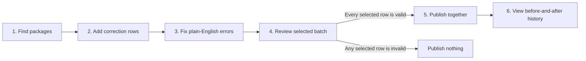

# Manual Data Editor Redesign Candidate

This folder documents a proposed replacement for the current Manual Data Editor workflow. It keeps Google Sheets as the user-facing editor, but separates source data, correction instructions, validation, publishing, and history so a refresh cannot silently reinterpret or overwrite a user's work.

> **Status:** Design candidate only. Nothing in this folder is connected to the production Sheet, loader, or data model.

## Example Google Sheet

[Open the interactive user-experience mockup](https://docs.google.com/spreadsheets/d/1pj4gzIz_xv5s3YIKLODFX6VWsvKCikY6ZNHZSXoiIkU/edit)

The mockup uses fictional package data. It demonstrates the intended workflow, dropdowns, validation messages, multi-row publishing, blocked-batch behavior, and read-only change history. It does not publish data.

## Problem This Candidate Solves

The current editor uses one large grid for several different jobs: displaying refreshed source values, accepting manual edits, detecting intent, validating rows, publishing data, and showing results. When those jobs disagree, the system can lose or misclassify edits.

This candidate establishes a simpler boundary:

- Source refreshes update the package list only.
- Users create explicit correction instructions in a separate working area.
- Submitted corrections receive permanent identities and history.
- The backend validates a complete selected batch before publishing anything.
- Sheet status updates cannot alter the published model result.

## Proposed User Experience

The Sheet contains five user-facing tabs:

| Tab | What the user does | What the system does |
|---|---|---|
| `START HERE` | Reads three short steps and the color guide | Explains the complete workflow on one screen |
| `1 FIND PACKAGE` | Filters packages and chooses `YES` beside packages needing correction | Copies the selected package identity into correction rows |
| `2 MAKE CORRECTIONS` | Chooses the field, action, new value, applicable dates, and reason | Locks package IDs and current values; validates each selected row |
| `3 REVIEW & PUBLISH` | Reviews the complete batch and publishes when enabled | Shows exactly what will change and blocks partial publication |
| `CHANGE HISTORY` | Looks up prior changes | Shows the batch, result, before value, after value, user evidence, and reason |

### Editing Rules

- Yellow cells are the only user inputs.
- Gray cells are locked or calculated.
- Green means the correction is ready.
- Red gives a plain-English instruction for fixing the row.
- One row changes one field. Several rows can correct several fields or packages at once.
- `0` is a valid replacement value.
- Clearing a value requires the explicit `Clear the value` action.
- Leaving a new-value cell blank never silently means clear.

## Publishing Rules

Selected correction rows form one batch.

- If every selected row passes, the complete batch publishes as one version.
- If any selected row fails, none of the selected rows publish.
- A user may deselect a bad row and intentionally create a different batch.
- The backend never silently publishes only the valid subset.
- Retrying the same batch cannot apply it twice.

## Proposed Backend Boundary

| Component | Responsibility | Safety boundary |
|---|---|---|
| Source snapshot | Supplies current package identity and source values | Cannot modify correction rows |
| Correction ledger | Stores permanent field-level instructions | Append-only during normal operation |
| Batch validator | Checks identity, values, dates, conflicts, and source version | Writes validation evidence before publication |
| Model publisher | Activates one completed correction version | Leaves the prior version active on failure |
| Sheet status sync | Displays `Draft`, `Needs Fix`, `Published`, or `Reverted` | Updates status cells only; never republishes data |
| Run history | Stores attempts, errors, retries, and before/after results | Supports reconciliation, replay, and rollback |

## Traceability Contract

Every submitted field correction should be traceable through these values:

| Evidence | Purpose |
|---|---|
| Correction ID | Permanent identity for the visible correction row |
| Batch ID | Connects all rows published together |
| Package ID and friendly name | Identifies the affected package without relying on Sheet position |
| Field and action | Records whether the user selected replace, clear, or revert |
| Before and after values | Shows the exact model effect |
| Effective dates | Limits date-bound metric corrections |
| User reason | Records why the correction was requested |
| User and service evidence | Distinguishes the requester from the publishing service when available |
| Source and Sheet revision | Records what the correction was validated against |
| Code or deployment version | Identifies the implementation that processed the batch |
| Validation and publication result | Records success, rejection, retry, failure, or rollback |
| Timestamps | Records submission, validation, publication, status synchronization, and rollback times |

## Known Failure Cases That Must Become Tests

| Failure case | Required behavior in the redesign |
|---|---|
| Replacement value is `0` | Store and publish zero; never treat it as blank or false |
| User wants to clear a value | Require the explicit clear action |
| Source package disappears | Preserve the submitted correction and stable package identity |
| Sheet rows are sorted or moved | Continue using permanent correction IDs, not row numbers |
| Generated values resemble manual edits | Treat only explicit correction instructions as manual intent |
| Human edit stamps are missing | Preserve the correction; record the identity boundary instead of discarding it |
| One selected row is invalid | Publish none of the selected rows and identify the exact problem |
| Warehouse publication succeeds but Sheet status update fails | Keep the published version and retry status synchronization only |
| A refresh runs while users are editing | Refresh source display only; never rewrite correction rows |
| Formatting or helper automation fails | Leave correction and model history intact |
| The same batch is submitted twice | Return the stored result without duplicating the model effect |

## Implementation Plan

1. **Prototype:** Reproduce the five-tab workflow with fictional data and no production writes.
2. **Ledger and dry run:** Create versioned correction, field-instruction, batch, and run contracts; show the proposed before/after result without changing the model.
3. **Validation:** Implement the known failure cases above as automated tests and plain-English Sheet feedback.
4. **Publishing:** Add all-or-nothing version activation, reconciliation, safe retry, and rollback.
5. **Parallel pilot:** Run the candidate beside the current workflow with a small approved package set.
6. **Cutover:** Retire full-grid writeback only after the pilot proves no lost edits, partial publishes, unexplained drift, or formatting changes.

## Proof Required Before Production

- Every known failure case passes end to end.
- Multi-row batches publish all selected rows or none.
- The active model version reconciles to the correction and run ledgers.
- A failed status synchronization can retry without republishing.
- A previous completed version can be restored without deleting history.
- Routine refreshes do not change submitted corrections or Sheet formatting.
- Documentation identifies the production owner, alert owner, service identity, retention policy, and exact model integration target.

## Open Decisions

- Confirm that one field per correction row is acceptable for the production interface.
- Confirm all-or-nothing publishing as the default selected-batch behavior.
- Choose the runtime and service identity for validation and publishing.
- Decide how human identity is captured when Google does not expose the editor email.
- Choose the correction-history retention and deletion policy.
- Choose the exact model integration target and production cutover owner.

## Explicitly Not Implemented Here

- No production Sheet changes
- No loader or Apps Script changes
- No BigQuery objects
- No data-model integration
- No deployment or scheduled job
