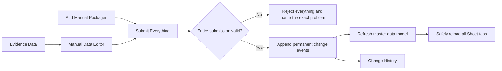

# Formula-Guarded Manual Edits Redesign Candidate

## Purpose and Status

This document is for the builder and reviewers of a possible Manual Data Editor replacement. It defines the approved user experience, data ownership, submission rules, history contract, and proof required before production work begins. Start with **User Experience**, then use **Builder Contract** for implementation planning.

> **Status:** Design candidate only. Nothing in this folder is connected to the production Google Sheet, loader, manual-edit tables, or master data model.

## Intended Outcome

Keep Google Sheets as the familiar editing surface while removing hidden columns, Sheet validation rules, retained-row behavior, and refresh-driven overwrites.

Every submitted cell change becomes a permanent history event with its prior value, new value, submitting user, and timestamp. The newest active event supplies the applicable `man_*` field. A refresh can never erase unsaved work or delete submitted history.

## User Experience

The workbook has four visible tabs.

| Tab | What the user does | What the system does |
|---|---|---|
| **Manual Data Editor** | Types corrections directly over calculated final-value cells | Detects cells whose expected formulas were replaced, cleared, or changed |
| **Add Manual Packages** | Types one or many packages that do not exist in source systems | Creates audited manual-only packages and generates their internal IDs |
| **Evidence Data** | Reads source values when troubleshooting | Reloads read-only evidence fields from the master data model |
| **Change History** | Reviews submitted changes and results | Reloads the permanent cell-level history; users cannot edit the audit record |

### Editing Existing Packages

- Refreshed editable values are formulas calculated from evidence plus the latest active manual events.
- Typing a value replaces the formula and marks that cell as an unsaved correction.
- Clearing an edited value means reset: stop applying the manual correction and return to the evidence-driven result.
- Multiple rows and columns can be changed before one submission.

### Adding Manual-Only Packages

- New packages are entered only on **Add Manual Packages**, never in blank rows on the main editor.
- A package is manual-only only when it does not exist in another source system.
- The system generates a stable internal ID such as `MAN-20260717-0001` after a valid submission.
- The user supplies readable business fields such as Package Friendly Name, advertiser, campaign, channel, flight dates, and metrics.
- A manual-only package can be removed with **Deactivate Manual Package**. Deactivation hides it from active results but preserves its complete history.

## Submission Contract

There is one **Submit Everything** action for both editable tabs.

1. The submitter becomes the recorded owner of the entire batch.
2. The script finds every replaced, cleared, or altered expected formula and every populated new-package row.
3. The script validates the complete batch without writing data.
4. If any item is invalid, the entire batch is rejected and nothing is saved.
5. A rejection names the tab, Package Friendly Name, cell, entered value, plain-English reason, and required correction.
6. If valid, the script appends one history event per changed cell before starting any refresh.
7. The master data model refresh runs, followed by a safe Sheet reload.

The button submits immediately without a preview or second confirmation.

## Refresh Safety Contract

A refresh must scan for unsafe work before changing Evidence Data, formulas, rows, or history displays.

Unsafe work includes:

- a formula replaced by a typed value;
- a cleared formula cell;
- an altered or deleted formula;
- a populated new-package draft row; or
- a submission already in progress.

If unsafe work exists, refresh stops without writing and reports how many unsaved changes must be submitted. If history is saved but the later model refresh fails, the user sees **Edits saved; refresh failed** and the permanent events remain available for retry.

## Row Ownership

There is no separate exclusion list and the Sheet never decides that a row exists merely by retaining old content.

| Row evidence | Can create an active Editor row? |
|---|---|
| Current Evidence Data | Yes, as a normal package |
| Active audited manual-only creation event | Yes, as a manual-only package |
| Previous Sheet contents | No |
| Old correction for a package missing from current evidence | No |
| Change History alone | No |
| Deactivated manual-only record | No |

An old correction remains auditable after its normal evidence row disappears, but it cannot recreate that row. This replaces duplicated exclusion logic with one clear ownership rule.

## Metric Meaning

| Correction type | Effective scope |
|---|---|
| Planned metrics | Entire package flight |
| Delivered metrics | User-entered delivery correction date range |
| Package metadata | Every date for that package |
| Reset | Removes the active manual correction for that field and scope |

Sheet formulas and model SQL must follow one written calculation contract. Shared test examples must prove that both implementations produce the same final values for planned, delivered, metadata, reset, and manual-only cases.

## Permanent `manual_edits` History

The proposed `manual_edits` table is append-only: submitting, resetting, applying, failing, retrying, or deactivating adds history rather than rewriting an earlier event.

| Field | Purpose |
|---|---|
| Submission ID and event sequence | Groups the batch and provides a stable order when timestamps match |
| Package key and Package Friendly Name | Identifies the affected package in readable and stable forms |
| Row origin | Distinguishes normal evidence rows from manual-only rows |
| Field and action | Records replace, reset, create, or deactivate |
| Previous and submitted values | Shows the exact change |
| Effective dates | Records the date scope for metric corrections |
| Submitted by and submitted at | Records the Google account and change timestamp |
| Apply status and status timestamp | Distinguishes saved, applied, rejected, refresh failed, and deactivated events |
| Error reason | Preserves a plain-English failure explanation when applicable |

The current manual result is derived by selecting the newest ordered event for each package, field, and effective scope. A newest `RESET` or `DEACTIVATE` event prevents an older value from remaining active. History is never deleted to calculate current state.

## How This Addresses the Six Audited Risks

| Original risk | Redesign answer |
|---|---|
| False red incomplete-row styling | Removes the Sheet styling rule and never uses blank flight dates to infer row origin |
| Raw trafficking strings shown as Package Friendly Name | Never substitutes a raw package name; a missing friendly name displays **Friendly name unavailable** while the raw name remains separately labeled reference data |
| Planned metrics tied to delivery dates | Applies planned corrections to the full flight and delivery dates only to delivered metrics |
| Excluded packages can return | Uses current evidence or an active manual-only creation event as the only row owners; retained Sheet content and old correction history cannot create rows |
| Refresh can overwrite active work | Blocks refresh on unsafe edits and saves permanent history before refreshing |
| Two competing definitions of a row | Separates normal evidence rows from audited manual-only rows and removes the Sheet itself as a row source |

## Builder Contract

The builder should keep these responsibilities separate.

| Component | Single responsibility |
|---|---|
| Sheet formula builder | Produce the expected editable formulas from Evidence Data and active manual results |
| Submission scanner | Identify changed formula cells and new-package drafts without writing |
| Batch validator | Return all-or-nothing approval with exact user-facing rejection reasons |
| History writer | Append cell-level events exactly once per submission |
| Current-manual selector | Derive the latest active event for each package, field, and scope |
| Model refresh | Apply current manual events to the corresponding `man_*` fields |
| Refresh guard | Refuse any destructive reload while unsafe work exists |
| History renderer | Reload the read-only Change History tab from permanent events |

## Proof Required Before Production

- Existing-package edits work for one cell, multiple fields, and multiple package rows.
- New manual-only packages can be submitted in one batch and receive stable generated IDs.
- Reset and deactivation preserve history while removing active manual effects.
- One invalid item rejects the entire mixed batch with an exact, understandable reason.
- An unsafe refresh changes no Sheet data and preserves every typed value.
- A history-write failure leaves the Sheet unchanged and refresh blocked.
- A model-refresh failure after a successful history write preserves the submission for retry.
- Repeating a submission or retry cannot append duplicate events.
- Formula and model calculations match for every supported metric and effective-date scope.
- Each of the six audited risks has an end-to-end regression test.
- Live visual verification confirms the four-tab layout and user-facing error messages before production use.

## Open Builder Decisions

- Exact editable field inventory and formula contract.
- Exact generated manual-package ID format and collision prevention.
- How a manual-only package is explicitly linked and retired if it later appears in a source system.
- Exact retry owner and user notification when model refresh fails after history is saved.
- Exact production model version and deployment sequence.

## Explicitly Not Implemented Here

This candidate does not create or alter a Google Sheet, Apps Script, BigQuery table, SQL model, loader, scheduled job, permission, or production documentation. Those changes require an implementation plan, isolated test assets, and end-to-end proof.
