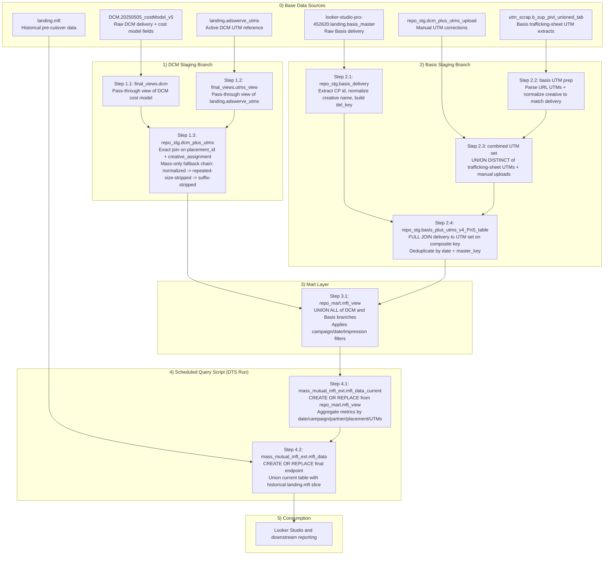

# MFT Data Pipeline

Complete documentation of the MFT (MassMutual Full-funnel Tracking) data pipeline that unifies DCM and Basis programmatic advertising data with UTM parameter enrichment.

The final reporting endpoint is `looker-studio-pro-452620.mass_mutual_mft_ext.mft_data`.

## Pipeline Overview

```
┌─────────────────────────────────────────────────────────────────────────────────┐
│                              BASE DATA SOURCES                                 │
├─────────────────────────────────────────────────────────────────────────────────┤
│ DCM: DCM.20250505_costModel_v5                                                 │
│ BASIS: looker-studio-pro-452620.landing.basis_master                          │
│ UTM: landing.adswerve_utms, b_sup_pivt_unioned_tab, dcm_plus_utms_upload      │
└─────────────────────────────────────┬───────────────────────────────────────────┘
                                      │
                                      ▼
┌─────────────────────────────────────────────────────────────────────────────────┐
│                            STAGING LAYER (Views)                               │
├─────────────────────────────────┬───────────────────────────────────────────────┤
│ DCM branch                      │ Basis branch                                  │
│ final_views.dcm                 │ repo_stg.basis_delivery                       │
│ final_views.utms_view           │ repo_stg.basis_plus_utms_v4_PnS_table         │
│ repo_stg.dcm_plus_utms          │                                               │
└────────────────┬────────────────┴────────────────┬───────────────────────────────┘
                 │                                  │
                 └──────────────┬───────────────────┘
                                ▼
┌─────────────────────────────────────────────────────────────────────────────────┐
│                              MART LAYER                                        │
│                    repo_mart.mft_view (unioned mart view)                      │
└─────────────────────────────────────┬───────────────────────────────────────────┘
                                      │
                                      ▼
┌─────────────────────────────────────────────────────────────────────────────────┐
│                    SCHEDULED QUERY SCRIPT (2-STEP BUILD)                       │
├─────────────────────────────────────────────────────────────────────────────────┤
│ Step 1: CREATE OR REPLACE mass_mutual_mft_ext.mft_data_current                 │
│         FROM repo_mart.mft_view (aggregated by date/campaign/UTMs/placement)   │
│                                                                                 │
│ Step 2: CREATE OR REPLACE mass_mutual_mft_ext.mft_data                         │
│         = mft_data_current                                                      │
│           UNION ALL                                                             │
│           historical backfill from landing.mft (pre-cutover dates)             │
└─────────────────────────────────────┬───────────────────────────────────────────┘
                                      │
                                      ▼
┌─────────────────────────────────────────────────────────────────────────────────┐
│                       FINAL REPORTING ENDPOINT                                 │
│             looker-studio-pro-452620.mass_mutual_mft_ext.mft_data              │
└─────────────────────────────────────────────────────────────────────────────────┘
```

### Mermaid Diagram (Full Pipeline)


```mermaid
flowchart TD
    %% Sources
    subgraph S["0) Base Data Sources"]
        DCM0["DCM.20250505_costModel_v5<br/>Raw DCM delivery + cost model fields"]
        BASIS0["looker-studio-pro-452620.landing.basis_master<br/>Raw Basis delivery"]
        UTM1["landing.adswerve_utms<br/>Active DCM UTM reference"]
        UTM2["utm_scrap.b_sup_pivt_unioned_tab<br/>Basis trafficking-sheet UTM extracts"]
        UTM3["repo_stg.dcm_plus_utms_upload<br/>Manual UTM corrections"]
        HIST0["landing.mft<br/>Historical pre-cutover data"]
    end

    %% DCM staging path
    subgraph D["1) DCM Staging Branch"]
        D1["Step 1.1: final_views.dcm<br/>Pass-through view of DCM cost model"]
        D2["Step 1.2: final_views.utms_view<br/>Pass-through view of landing.adswerve_utms"]
        D3["Step 1.3: repo_stg.dcm_plus_utms<br/>Exact join on placement_id + creative_assignment<br/>Mass-only fallback chain: normalized -> repeated-size-stripped -> suffix-stripped"]
    end

    %% Basis staging path
    subgraph B["2) Basis Staging Branch"]
        B1["Step 2.1: repo_stg.basis_delivery<br/>Extract CP id, normalize creative name, build del_key"]
        B2["Step 2.2: basis UTM prep<br/>Parse URL UTMs + normalize creative to match delivery"]
        B3["Step 2.3: combined UTM set<br/>UNION DISTINCT of trafficking-sheet UTMs + manual uploads"]
        B4["Step 2.4: repo_stg.basis_plus_utms_v4_PnS_table<br/>FULL JOIN delivery to UTM set on composite key<br/>Deduplicate by date + master_key"]
    end

    %% Mart
    subgraph M["3) Mart Layer"]
        M1["Step 3.1: repo_mart.mft_view<br/>UNION ALL of DCM and Basis branches<br/>Applies campaign/date/impression filters"]
    end

    %% Scheduled endpoint build
    subgraph Q["4) Scheduled Query Script (DTS Run)"]
        Q1["Step 4.1: mass_mutual_mft_ext.mft_data_current<br/>CREATE OR REPLACE from repo_mart.mft_view<br/>Aggregate metrics by date/campaign/partner/placement/UTMs"]
        Q2["Step 4.2: mass_mutual_mft_ext.mft_data<br/>CREATE OR REPLACE final endpoint<br/>Union current table with historical landing.mft slice"]
    end

    %% Consumption
    subgraph C["5) Consumption"]
        C1["Looker Studio and downstream reporting"]
    end

    %% Edges: source -> dcm
    DCM0 --> D1
    UTM1 --> D2
    D1 --> D3
    D2 --> D3

    %% Edges: source -> basis
    BASIS0 --> B1
    UTM2 --> B2
    UTM3 --> B3
    B2 --> B3
    B1 --> B4
    B3 --> B4

    %% Edges: branch -> mart -> endpoint
    D3 --> M1
    B4 --> M1
    M1 --> Q1
    HIST0 --> Q2
    Q1 --> Q2
    Q2 --> C1
```

## Table of Contents

- [Data Sources](#data-sources)
- [DCM Plus UTMs Lineage Note](docs/dcm_plus_utms_lineage.md)
- [Staging Layer](#staging-layer)
- [Mart and Endpoint Layer](#mart-and-endpoint-layer)
- [UTM Processing Scripts](#utm-processing-scripts)
- [Key Concepts](#key-concepts)
- [Current State](#current-state)
- [Usage Examples](#usage-examples)
- [Safe Query Guardrails](#safe-query-guardrails)
- [Offline Sheet Daily Sync](#offline-sheet-daily-sync)
- [Changelog Policy](#changelog-policy)

---

## Data Sources

### Client-Shared Basis Dependency Audit

`repo_mart.mft_clean_view` is a client-shared reporting view. Treat any change to its upstream Basis branch as a client-impacting migration, even when the change only touches staging tables.

| Area | Current verified state | Migration rule |
|------|------------------------|----------------|
| Client-facing view | [`repo_mart.mft_clean_view`](https://console.cloud.google.com/bigquery?project=looker-studio-pro-452620&p=looker-studio-pro-452620&d=repo_mart&t=mft_clean_view&page=table) reads [`repo_mart.mft_view`](https://console.cloud.google.com/bigquery?project=looker-studio-pro-452620&p=looker-studio-pro-452620&d=repo_mart&t=mft_view&page=table). | Do not change without comparing the full downstream reporting slice. |
| Active Basis source for MFT | [`repo_stg.basis_delivery`](https://console.cloud.google.com/bigquery?project=looker-studio-pro-452620&p=looker-studio-pro-452620&d=repo_stg&t=basis_delivery&page=table) reads [`landing.basis_master`](https://console.cloud.google.com/bigquery?project=looker-studio-pro-452620&p=looker-studio-pro-452620&d=landing&t=basis_master&page=table). | This is separate from the Looker-owned [`repo_stg.basis_master2`](https://console.cloud.google.com/bigquery?project=looker-studio-pro-452620&p=looker-studio-pro-452620&d=repo_stg&t=basis_master2&page=table) refresh path. |
| Giant Spoon dependency | [`landing.basis_master`](https://console.cloud.google.com/bigquery?project=looker-studio-pro-452620&p=looker-studio-pro-452620&d=landing&t=basis_master&page=table) is a Looker-project base table, but recent load jobs are run by `big-query-api@giant-spoon-299605.iam.gserviceaccount.com`. | Migrating MFT requires replacing that load path, not just repointing the view to [`repo_stg.basis_master2`](https://console.cloud.google.com/bigquery?project=looker-studio-pro-452620&p=looker-studio-pro-452620&d=repo_stg&t=basis_master2&page=table). |
| Direct migrated-table dependency | Live MFT view definitions did not reference [`repo_stg.basis_master2`](https://console.cloud.google.com/bigquery?project=looker-studio-pro-452620&p=looker-studio-pro-452620&d=repo_stg&t=basis_master2&page=table), [`repo_stg.basis_gsheet2`](https://console.cloud.google.com/bigquery?project=looker-studio-pro-452620&p=looker-studio-pro-452620&d=repo_stg&t=basis_gsheet2&page=table), [`20250327_data_model.basis_utms_stg`](https://console.cloud.google.com/bigquery?project=looker-studio-pro-452620&p=looker-studio-pro-452620&d=20250327_data_model&t=basis_utms_stg&page=table), or [`utm_scrap.basis_utms_0519`](https://console.cloud.google.com/bigquery?project=looker-studio-pro-452620&p=looker-studio-pro-452620&d=utm_scrap&t=basis_utms_0519&page=table). | Do not assume the earlier Basis migration changed MFT output. Verify lineage and metrics directly. |

Verification snapshot from 2026-07-01:

| Candidate path | Rows after MFT filters | Date range | Spend | Impressions | Clicks | Result |
|----------------|-----------------------:|------------|------:|------------:|-------:|--------|
| Current MFT Basis branch from [`landing.basis_master`](https://console.cloud.google.com/bigquery?project=looker-studio-pro-452620&p=looker-studio-pro-452620&d=landing&t=basis_master&page=table) | 129,249 | 2025-03-24 to 2026-06-02 | 2,375,039.02 | 93,537,044 | 42,687 | Active client path |
| Candidate branch from [`repo_stg.basis_master2`](https://console.cloud.google.com/bigquery?project=looker-studio-pro-452620&p=looker-studio-pro-452620&d=repo_stg&t=basis_master2&page=table) | 42,704 | 2025-03-24 to 2025-09-28 | 1,132,512.80 | 58,792,005 | 36,525 | Not safe for direct cutover |

The direct [`repo_stg.basis_master2`](https://console.cloud.google.com/bigquery?project=looker-studio-pro-452620&p=looker-studio-pro-452620&d=repo_stg&t=basis_master2&page=table) candidate is not a valid replacement for MFT today because it has no 2026 Basis rows and materially different 2025 totals.

Before any MFT Basis migration:

1. Build a Looker-owned replacement for [`landing.basis_master`](https://console.cloud.google.com/bigquery?project=looker-studio-pro-452620&p=looker-studio-pro-452620&d=landing&t=basis_master&page=table) at the same table grain and freshness.
2. Recreate the full Basis branch in an isolated QA object, not by changing [`repo_stg.basis_delivery`](https://console.cloud.google.com/bigquery?project=looker-studio-pro-452620&p=looker-studio-pro-452620&d=repo_stg&t=basis_delivery&page=table) in place.
3. Compare the current and candidate Basis branches by date, campaign, placement, creative, UTM fields, spend, impressions, and clicks.
4. Compare the full [`repo_mart.mft_view`](https://console.cloud.google.com/bigquery?project=looker-studio-pro-452620&p=looker-studio-pro-452620&d=repo_mart&t=mft_view&page=table) output and the client-facing [`repo_mart.mft_clean_view`](https://console.cloud.google.com/bigquery?project=looker-studio-pro-452620&p=looker-studio-pro-452620&d=repo_mart&t=mft_clean_view&page=table) aggregation before approval.
5. Keep the current live path unchanged until the candidate proves metric parity or the approved differences are documented.

### DCM Data

#### DCM Cost Model
**Table**: `looker-studio-pro-452620.DCM.20250505_costModel_v5`

| Attribute | Value |
|-----------|-------|
| **Rows** | 129,733 |
| **Purpose** | DoubleClick Campaign Manager delivery data with cost modeling |
| **Update Frequency** | Daily |
| **Shared With** | ADIF pipeline |

**Key Fields**:
- `date` - Delivery date
- `campaign` - Campaign name
- `package_roadblock` - Package/roadblock identifier
- `placement_id` - Unique placement identifier used in UTM matching
- `ad` - DCM ad label retained in the output
- `creative` - Creative name used in exact and normalized UTM matching
- `impressions` - Ad impressions delivered
- `clicks` - Click-through events
- `media_cost` - Raw media cost
- `daily_recalculated_cost` - Normalized daily cost (used in final output)

---

### Basis Data

#### Basis Master (Delivery)
**Table**: [`looker-studio-pro-452620.landing.basis_master`](https://console.cloud.google.com/bigquery?project=looker-studio-pro-452620&p=looker-studio-pro-452620&d=landing&t=basis_master&page=table)

| Attribute | Value |
|-----------|-------|
| **Rows** | 215,813 |
| **Purpose** | Programmatic ad delivery from Basis DSP for the MFT Basis branch |
| **Update Frequency** | Loaded repeatedly by a Giant Spoon service account |
| **Last Verified** | Jul 1, 2026 |

**Key Fields**:
- `date` - Delivery date
- `campaign` - Campaign name
- `package` - Package identifier
- `tactic` - Media tactic
- `placement` - Placement name (includes CP_XXXXX ID)
- `creative_name` - Creative asset name
- `impressions` - Ad impressions
- `clicks` - Click events
- `media_cost` - Spend

**Migration note**: [`repo_stg.basis_master2`](https://console.cloud.google.com/bigquery?project=looker-studio-pro-452620&p=looker-studio-pro-452620&d=repo_stg&t=basis_master2&page=table) is not currently the live MFT Basis source. A direct replacement would drop 2026 Basis delivery from the MFT branch, so it is not approved for client-facing cutover without a separate replacement-source migration and validation.

---

### UTM Metadata Sources

#### 1. Adswerve UTMs Landing Table (Active DCM UTMs)
**Table**: `looker-studio-pro-452620.landing.adswerve_utms`

| Attribute | Value |
|-----------|-------|
| **Object Type** | Base table |
| **Purpose** | Active UTM reference consumed by `final_views.utms_view` |
| **Used By** | `repo_stg.dcm_plus_utms` via `final_views.utms_view` |

**Key Fields**:
- `Campaign` - Campaign name
- `Site_Name` - Publisher/site
- `Package_Name` - Package identifier
- `Placement_Name` - Placement name
- `Ad_Name` - Human-readable ad label from the UTM source
- `_UTM_Source` - Traffic source tag
- `_UTM_Medium` - Marketing medium tag
- `_UTM_Campaign` - Campaign tag
- `_UTM_Content` - Content variation tag
- `_UTM_Term` - Search term tag

**Note**: the live `final_views.utms_view` definition currently selects from this table. A commented historical reference to `giant-spoon-299605.data_model_2025.mm_utms_snapshot` still appears in that view text, but it is not the active source.
**Join note**: `repo_stg.dcm_plus_utms` matches DCM to UTMs on `placement_id` and `creative_assignment` first, then only allows looser fallback matching for Mass rows from the DCM branch.

---

#### 2. Basis UTM mappings

Basis UTMs are maintained through two business-input surfaces and one production lookup. Use the terms below so the overall workflow is not confused with the `utm_source` URL field.

| Surface | What it means | When to update it |
|---|---|---|
| [UTM mapping workbook repository](https://drive.google.com/drive/u/0/folders/166VjC19FKzYTRM7hRh2z287e2EW97zho) | Partner-maintained campaign trafficking workbooks. The current FY26 workbook is [MassMutual FY26 Q1 Traffic Sheet](https://docs.google.com/spreadsheets/d/1ZPa_UOkiGftXEfTQaeUSyM1qyM9_RtJ4/edit#gid=1699937212). | Add a complete worksheet for each new campaign or quarter, including FY26 Q2/Q3. |
| [UTM mapping supplement](https://docs.google.com/spreadsheets/d/1kpiBT7IIbWjfUpJ1_BzFSL0d6ukojwW54XkBftep4nM/edit) | Internal correction sheet for urgent missing placement-and-creative mappings or confirmed aliases. Production reads its first tab, `Sheet1`. | Use when delivery has started but the partner workbook is missing a mapping, or when a confirmed naming variant needs an immediate correction. |
| [MFT UTM lookup table](https://console.cloud.google.com/bigquery?project=looker-studio-pro-452620&p=looker-studio-pro-452620&d=utm_scrap&t=b_sup_pivt_unioned_tab&page=table) | Materialized production lookup used by the Basis delivery join. Required grain is one placement plus one normalized creative name. | Refresh after either business-input surface changes. |

The production lookup is built from the [Basis UTM union view](https://console.cloud.google.com/bigquery?project=looker-studio-pro-452620&p=looker-studio-pro-452620&d=utm_scrap&t=b_sup_pivt_unioned&page=table), which combines the loaded trafficking-workbook mappings with the UTM mapping supplement.

**Key fields**:
- `tag_placement` - Exact Basis placement name
- `name` - Creative name used to build the placement-plus-creative lookup key
- `url` - Full URL containing the UTM parameter values

**Important loading rule**: adding a worksheet to a trafficking workbook does not load it automatically. The [Basis UTM loader](</Users/eugenetsenter/Looker_clonedRepo/looker_personal/util/basis_utms/essential/util__basis__utm_pivot_longer_loop.r>) has an explicit file, worksheet, and BigQuery destination table for every input. A new FY26 Q2/Q3 worksheet must be added to that configuration and to the production union before it can reach MFT.

**URL Parsing Logic**:
```sql
REGEXP_EXTRACT(url, 'utm_source=(.*?)&')  AS utm_source,
REGEXP_EXTRACT(url, 'utm_medium=(.*?)&')  AS utm_medium,
REGEXP_EXTRACT(url, 'utm_campaign=(.*?)&') AS utm_campaign,
REGEXP_EXTRACT(url, 'utm_term=(.*)')      AS utm_term,
REGEXP_EXTRACT(url, r'[?&]utm_content=([^&#]*)') AS utm_content
```

---

#### 3. DCM Plus UTMs Upload (Manual Corrections)
**Table**: `looker-studio-pro-452620.repo_stg.dcm_plus_utms_upload`

| Attribute | Value |
|-----------|-------|
| **Rows** | 97 |
| **Purpose** | Manual UTM corrections and additions |
| **Update** | As needed |

Used for edge cases where automated matching fails.

---

## Staging Layer

### DCM Branch

#### View: `final_views.dcm`
**Definition**: Simple pass-through from cost model
```sql
SELECT * FROM looker-studio-pro-452620.DCM.20250505_costModel_v5
```

#### View: `final_views.utms_view`
**Definition**: Pass-through view of the active Adswerve landing table
```sql
SELECT * FROM `looker-studio-pro-452620.landing.adswerve_utms`
```

#### View: `repo_stg.dcm_plus_utms`
**Purpose**: Enriches DCM delivery data with UTM parameters
**Local deploy SQL**: `scripts/sql/repo_stg__dcm_plus_utms.sql`
**Focused lineage note**: [docs/dcm_plus_utms_lineage.md](docs/dcm_plus_utms_lineage.md)

**Key Features**:
- Exact-key join first: `placement_id + creative_assignment`.
- Mass-only fallback chain when the exact key misses:
  - `utm_norm`: case-insensitive `campaign` + `placement_id`, plus lowercase creative matching with `px` removed
  - `utm_loose`: same fallback, plus whitespace removal and removal of one or more trailing size tokens such as `_0x0`, `_0 x 0`, or repeated `_0x0_0x0`
  - `utm_extless`: same fallback, plus common file-type suffix stripping such as `_jpg`
- Placement-name-only rescue after the creative chain misses:
  - same-campaign placement rescue on `campaign + placement_id`
  - final placement-only rescue on `placement_id` when the placement exists in the UTM source but campaign text differs
- Final DCM placement fallback after all UTM placement lookups miss:
  - backfill `placement_name` from the live DCM `placement` field
  - backfill `utm_placement_id` from DCM `placement_id`
  - do not backfill creative-level UTM fields from this last-resort fallback
- UTM fields use exact-first fallback (`COALESCE(exact, normalized, loose_norm, extless_norm)`).
- `TO_JSON_STRING`-based deduplication preserves one row per fully identical output record.
- Direct parents: `final_views.dcm` and `final_views.utms_view`.
- Lowest-level inputs: `DCM.20250505_costModel_v5` and `landing.adswerve_utms`.
- Not a direct parent: `repo_stg.dcm_plus_utms_upload` belongs to the Basis branch, not this DCM branch.

**Mass QA helpers**:
- Validation summary: `scripts/sql/qa__repo_stg__dcm_plus_utms_mass_validation.sql`
- Residual exception list: `scripts/sql/qa__repo_stg__dcm_plus_utms_mass_exceptions.sql`
- Recommended commands from `/Users/eugenetsenter/Looker_clonedRepo/looker_personal/mft`:

```bash
./scripts/bq-safe-query.sh --allow-select-star --file scripts/sql/qa__repo_stg__dcm_plus_utms_mass_validation.sql
./scripts/bq-safe-query.sh --allow-select-star --file scripts/sql/qa__repo_stg__dcm_plus_utms_mass_exceptions.sql
```

**How to validate this view safely**:

1. Start with the Mass reporting slice only.
   - Scope: `date >= DATE '2025-01-01'`, `package_roadblock LIKE '%MASS%'`, and `impressions > 10`.
   - Reason: the fallback chain is intentionally limited to Mass rows, so the first QA pass should use the same slice.
2. Prove completeness before checking naming details.
   - Run `qa__repo_stg__dcm_plus_utms_mass_validation.sql`.
   - Confirm the row count is stable, the `match_type` split makes sense, and the remaining `unmatched` rows are small enough to review separately.
3. Review the residual exception list before changing SQL.
   - Run `qa__repo_stg__dcm_plus_utms_mass_exceptions.sql`.
   - Treat the remaining unmatched rows as source exceptions unless the grouped output shows a repeatable formatting pattern that the SQL still misses.
4. Validate `utm_content` only for matched rows.
   - `package_id` should appear inside `utm_content` for matched rows.
   - `placement_id` should also appear in `utm_content` for matched rows, but group misses first because one bad source UTM tag can repeat across many daily delivery rows.
5. Validate creative fidelity with `utm_creative_assignment`, not `utm_content`.
   - Do not use `utm_content` as the main creative-name proof. That field often shortens the creative label, for example `homeoff` instead of `HomeOffice`.
   - Use the DCM `creative` field against the selected `utm_creative_assignment`.
   - Compare them at the same normalization level as the winning `match_type`:
     - `exact`: literal equality
     - `normalized`: lowercase/trim plus `px` removal
     - `loose_norm`: the same, plus whitespace removal and repeated trailing size-token stripping
     - `extless_norm`: the same, plus common file-suffix stripping
6. Pull row-level samples last.
   - Start with grouped summaries by `match_type`, campaign, `package_id`, `placement_id`, and the UTM tail value found in `utm_content`.
   - Only inspect individual rows after the grouped summary identifies the repeated mismatch pattern.
7. Treat placement-name rescue separately from creative rescue.
   - If a creative still does not match but the placement exists in the UTM source, the view can safely backfill `placement_name` and `utm_placement_id` from the placement row alone.
   - Do not assume that creative-level fields like `utm_content` or `utm_term` are safe to backfill from that placement-only rescue.
8. Treat DCM placement fallback as placement-only metadata.
   - If no UTM placement exists at all, the view can still use the live DCM `placement` field to avoid a blank `placement_name`.
   - This should not be treated as a UTM match; creative-level UTM fields should remain null unless a real UTM row is found.

**What this validation proved on 2026-03-13**:
- `package_id` appeared in `utm_content` for `100%` of matched Mass-slice rows.
- `placement_id` appeared in `utm_content` for `99.52%` of matched Mass-slice rows, with one repeated source-tag defect driving the misses.
- Literal creative-name checks against `utm_content` were not reliable; `utm_creative_assignment` was the correct creative validation field.

**What the repeated-size correction proved on 2026-07-15**:

| Check | Verified result |
|---|---|
| Repeated-size recovery | All 336 `WhatItsAllAbout30_0x0_0x0` delivery records matched the existing `WhatItsAllAbout30_0x0` UTM assignments across seven placements. |
| Delivery preservation | The staging view retained 153,564 unique delivery keys with 1,455,294,999 impressions and 1,069,079 clicks. |
| Stored endpoint | The scheduled refresh succeeded and the final table contains all 336 corrected records, representing 9,301,443 impressions, $188,927.59 in cost, and 754 clicks. |
| Remaining UTM gaps | 885 records remain: 736 belong to campaigns absent from the UTM reference, 40 use one missing placement, and 109 have real placement-to-creative assignment differences. |

---

### Basis Branch

#### View: `repo_stg.basis_delivery`
**Location**: Defined in `sql/base/basis/stg__basis__delivery.sql`
**Purpose**: Adds join helper fields to [`landing.basis_master`](https://console.cloud.google.com/bigquery?project=looker-studio-pro-452620&p=looker-studio-pro-452620&d=landing&t=basis_master&page=table)

**Key Transformations**:

1. **Placement ID Extraction**:
```sql
REGEXP_EXTRACT(placement, r'CP_(\d+)') AS id
```

2. **Creative Name Normalization** (for UTM matching):
```sql
LOWER(
  REGEXP_REPLACE(
    REGEXP_REPLACE(
      LOWER(
        REPLACE(
          REGEXP_EXTRACT(
            creative_name,
            r'^(?:\d+_)?([^_]+.*?)(?:_\d+x\d+.*)?$'  -- strip prefix & size
          ),
          ' ', ''  -- remove spaces
        )
      ),
      r'(^peacock_|_peacock$)', ''  -- drop "peacock"
    ),
    r'[^a-zA-Z0-9]', ''  -- keep only alphanumeric
  )
) AS cleaned_creative_name
```

3. **Composite Join Key**:
```sql
CONCAT(
  LOWER(placement),
  " || ",
  cleaned_creative_name
) AS del_key
```

**Example Transformation**:
| Input | Output |
|-------|--------|
| `123_PEACOCK_Stay Ready_300x250_v2` | `stayready` |
| `CP_45678_MassMutual_Display` | `massmutual_display` → key: `cp_45678_massmutual_display \|\| stayready` |

---

#### View: `repo_stg.basis_plus_utms_v4_PnS_table`
**Purpose**: Joins Basis delivery with UTM parameters from multiple sources

**Full SQL Structure**:
```sql
WITH
-- 1. Delivery data (filtered)
del AS (
  SELECT *
  FROM `looker-studio-pro-452620.repo_stg.basis_delivery`
  WHERE campaign NOT LIKE '%GE%'
    AND campaign NOT LIKE 'Ritual%'
),

-- 2. UTM source from dcm_plus_utms_upload
utm4 AS (
  SELECT
    placement,
    -- Normalized creative name (same regex as basis_delivery)
    REGEXP_REPLACE(...) AS cleaned_creative_name_2,
    utm_source, utm_medium, utm_campaign, utm_content, utm_term,
    CONCAT(LOWER(placement), " || ", cleaned_creative_name_2) AS utm_utm_key
  FROM looker-studio-pro-452620.repo_stg.dcm_plus_utms_upload
),

-- 3. UTM source from trafficking sheets
utm1 AS (
  SELECT
    tag_placement AS placement,
    name AS creative_name,
    -- Extract UTMs from URL
    REGEXP_EXTRACT(url, 'utm_source=(.*?)&') AS utm_source,
    REGEXP_EXTRACT(url, 'utm_medium=(.*?)&') AS utm_medium,
    REGEXP_EXTRACT(url, 'utm_campaign=(.*?)&') AS utm_campaign,
    REGEXP_EXTRACT(url, 'utm_term=(.*)') AS utm_term,
    REGEXP_EXTRACT(url, r'[?&]utm_content=([^&#]*)') AS utm_content,
    -- Normalized creative + composite key
    ...
  FROM `looker-studio-pro-452620.utm_scrap.b_sup_pivt_unioned_tab`
),

-- 4. Combined UTM reference (deduplicated)
utm AS (
  SELECT DISTINCT
    placement, cleaned_creative_name_2,
    utm_source, utm_medium, utm_campaign, utm_content, utm_term,
    CONCAT(LOWER(placement), " || ", cleaned_creative_name_2) AS utm_utm_key
  FROM utm1
  UNION DISTINCT
  SELECT * FROM utm4
),

-- 5. Full join delivery + UTMs
joined AS (
  SELECT
    del.*,
    utm.placement AS placement__utms,
    utm_source, utm_medium, utm_campaign, utm_term, utm_content,
    utm.utm_utm_key AS utm_key,
    COALESCE(del.del_key, utm_utm_key) AS master_key
  FROM del
  FULL JOIN utm ON del_key = utm.utm_utm_key
  WHERE campaign NOT LIKE '%GE%'
    AND campaign NOT LIKE 'Ritual%'
),

-- 6. Deduplicate by date + master_key
ranked AS (
  SELECT
    joined.*,
    ROW_NUMBER() OVER (
      PARTITION BY date, master_key
      ORDER BY placement
    ) AS rn
  FROM joined
)

SELECT * EXCEPT(rn, meta_data_date_pull, package, gmail_dt, meta_data_date_range)
FROM ranked
WHERE rn = 1
ORDER BY date DESC NULLS FIRST
```

**Key Features**:
- FULL JOIN captures UTM-only records (for validation)
- UNION DISTINCT combines multiple UTM sources
- Per-day deduplication ensures unique records
- Campaign filtering removes non-MassMutual data

---

## Mart and Endpoint Layer

### Final Endpoint: `mass_mutual_mft_ext.mft_data`

**Location**: `looker-studio-pro-452620.mass_mutual_mft_ext.mft_data`

| Attribute | Value |
|-----------|-------|
| **Total Rows** | 304,632 |
| **Date Range** | 2022-01-01 to 2026-02-09 |
| **Last Modified (UTC)** | 2026-02-11 10:00:31 |
| **Primary Use** | Final endpoint consumed by Looker Studio/reporting |

**Refresh Pattern**:
1. Scheduled query script rebuilds `mass_mutual_mft_ext.mft_data_current`.
2. Script then rebuilds `mass_mutual_mft_ext.mft_data` for final consumption.

**Current-table build step**:
```sql
CREATE OR REPLACE TABLE `looker-studio-pro-452620.mass_mutual_mft_ext.mft_data_current` AS
SELECT
  date,
  campaign,
  COALESCE(REGEXP_EXTRACT(placement_name, r'\(\s*([A-Za-z]+)'), utm_source) AS partner,
  placement_name,
  utm_source,
  utm_medium,
  utm_campaign,
  utm_content,
  utm_term,
  SUM(cost) AS cost,
  SUM(impressions) AS impressions,
  SUM(clicks) AS clicks,
  SUM(video_audio_plays) AS video_audio_plays,
  SUM(video_audio_fully_played) AS video_audio_fully_played
FROM `looker-studio-pro-452620.repo_mart.mft_view`
GROUP BY 1,2,3,4,5,6,7,8,9
ORDER BY date;
```

---

### Upstream Mart View: `repo_mart.mft_view`

**Location**: `looker-studio-pro-452620.repo_mart.mft_view`

This mart view remains the unioned transformation layer and feeds the endpoint build above.

---

### Final Endpoint Schema (`mass_mutual_mft_ext.mft_data`)

| Column | Type | Description |
|--------|------|-------------|
| `date` | DATE | Delivery date |
| `campaign` | STRING | Campaign name |
| `partner` | STRING | Partner/publisher extracted from placement or fallback to `utm_source` |
| `placement_name` | STRING | Placement identifier |
| `utm_source` | STRING | Traffic source |
| `utm_medium` | STRING | Marketing medium |
| `utm_campaign` | STRING | Campaign tag for analytics tracking |
| `utm_content` | STRING | Content variation identifier |
| `utm_term` | STRING | Search/targeting term |
| `cost` | FLOAT | Spend amount |
| `impressions` | INTEGER | Ad impressions |
| `clicks` | INTEGER | Click-through events |
| `video_audio_plays` | INTEGER | Video/audio starts |
| `video_audio_fully_played` | INTEGER | Video/audio completions |

---

## UTM Processing Scripts

### R Script: `util/basis_utms/essential/util__basis__utm_pivot_longer_loop.r`

**Purpose**: Processes Basis trafficking sheets to extract UTM parameters

#### Configured inputs

The loader uses the `data_sources` configuration near the top of the script. Each row names:

| Setting | Meaning |
|---|---|
| `source_id` | Short readable campaign or flight label |
| `excel_file_path` | Downloaded copy of the partner workbook |
| `sheet_name` | Exact worksheet to read |
| `bq_table_name` | Landing table that receives the normalized mappings |

The current FY26 Q1 row reads worksheet `MASSMUTUAL004_updated 1.14.26` from the downloaded FY26 workbook and replaces the [FY26 Q1 landing table](https://console.cloud.google.com/bigquery?project=looker-studio-pro-452620&p=looker-studio-pro-452620&d=landing&t=basis_utms_pivoted_fy26_q1&page=table). The loader does not discover new workbook tabs by itself.

#### Processing Steps

**1. Auto-detect Header Row**
```r
# Read first 20 rows to find header
temp_df <- read_excel(file_path, sheet = sheet_name, n_max = 20, col_names = FALSE)

# Find row containing "Property" in first column
header_row <- which(temp_df[[1]] == "Property")
skip_rows <- header_row[1] - 1
```

**2. Read and Clean Data**
```r
new_df <- read_excel(file_path, sheet = sheet_name, skip = skip_rows) %>%
  clean_names()
```

**3. Normalize Column Names**

Trafficking sheets have wide format with multiple creatives:
```
creative_1_name, creative_1_url, creative_2_name, creative_2_url, ...
```

Script normalizes to:
```
creative_1_name, creative_1_url, creative_2_name, creative_2_url, ...
```

**4. Pivot to Long Format**

Converts wide creative columns to rows for easier processing.

**5. Extract UTM Parameters**

Uses regex to parse URLs and extract individual UTM values.

**6. Upload and promote**

The script replaces each configured landing table. Production promotion is a separate step: include the landing table in the active union, run the scheduled query named `UTM UPDATES`, and verify the refreshed MFT UTM lookup table before refreshing the final MFT table.

---

### Related Files

| File | Purpose |
|------|---------|
| `util/basis_utms/essential/util__basis__utm_pivot_longer_loop.r` | Primary batch UTM extraction script |
| `util/basis_utms/essential/util_b_utm_validation.r` | BigQuery validation helper |
| `util/basis_utms/essential/stg3_b_plus_utms_PnS.sql` | Basis + UTM staging query |
| `util/basis_utms/archive/util__basis__utm_pivot_longer.r` | Legacy exploratory version (archived) |
| `util/basis_utms/archive/util__basis__utm_pivot_longer_clean.r` | Legacy single-flight version (archived) |
| `util/basis_utms/archive/union_basis_utms.ipynb` | Legacy notebook union workflow (archived) |
| `util/basis_utms/archive/b_utms_diagram.md` | Legacy diagram (archived) |
| `sql/base/basis/stg__basis__delivery.sql` | Basis delivery staging view |
| `util/basis_utms/essential/load_basis_utms_union.sql` | Critical union build for `landing.basis_utms_unioned` |
| `util/basis_utms/essential/stg__basis__utms.sql` | Basis UTM staging |
| `sql/base/basis/stg2__basis__plus_utms.sql` | Combined Basis + UTMs |

---

## Key Concepts

### 1. Creative Name Normalization

**Problem**: Same creative has different names across systems.

| System | Example Name |
|--------|--------------|
| DCM | `MassMutual_StayReady_300x250_v2` |
| Basis | `123_PEACOCK_Stay Ready_300x250` |
| UTM Sheet | `stay-ready-creative` |

**Solution**: Multi-step regex normalization:

```sql
-- Step-by-step transformation
'123_PEACOCK_Stay Ready_300x250_v2'
  → '123_PEACOCK_Stay Ready'           -- Strip size suffix
  → 'peacock_stay ready'               -- Lowercase
  → 'stay ready'                       -- Remove "peacock"
  → 'stayready'                        -- Remove spaces
  → 'stayready'                        -- Keep alphanumeric only
```

**Impact**: Increases UTM match rate from ~40% to ~85%.

---

### 2. Composite Join Keys

**Structure**:
```
del_key = LOWER(placement) || " || " || cleaned_creative_name
```

**Example**:
```
cp_45678_massmutual_display || stayreadybrandv2
```

**Why**: Single creative can run on multiple placements. Composite key ensures unique matching.

---

### 3. Multi-Source UTM Strategy

**Branch Split**:
1. `landing.adswerve_utms` - Active UTM source for the DCM branch
2. `b_sup_pivt_unioned_tab` - Trafficking sheet extracts for the Basis branch
3. `dcm_plus_utms_upload` - Manual corrections for the Basis branch

**Combination Logic**:
```sql
utm AS (
  SELECT DISTINCT ... FROM utm1    -- Trafficking sheets
  UNION DISTINCT
  SELECT * FROM utm4               -- Manual uploads
)
```

**Note**: the Basis branch combines the two sources above with `UNION DISTINCT`, while the DCM branch reads from `landing.adswerve_utms` through `final_views.utms_view`.

---

### 4. Deduplication Strategies

**DCM Branch**: Full row deduplication
```sql
ROW_NUMBER() OVER (
  PARTITION BY TO_JSON_STRING(joined)  -- Hash all columns
  ORDER BY placement_id
)
```

**Basis Branch**: Date + Key deduplication
```sql
ROW_NUMBER() OVER (
  PARTITION BY date, master_key
  ORDER BY placement
)
```

---

### 5. Minimum Impression Threshold

**Filter**: `impressions > 10`

**Rationale**:
- Removes test impressions
- Filters data noise
- Reduces row count ~15%
- Improves query performance

---

## Current State

### Final Endpoint Snapshot

| Metric | Value |
|--------|-------|
| Endpoint Table | `looker-studio-pro-452620.mass_mutual_mft_ext.mft_data` |
| Total Rows | 304,632 |
| Date Range | 2022-01-01 to 2026-02-09 |
| Last Refresh (UTC) | 2026-02-11 10:00:31 |

---

### Data Distribution

#### By Source
| Source | Records | Percentage |
|--------|---------|------------|
| Basis | 82,710 | 61.6% |
| DCM | 51,573 | 38.4% |
| **Total** | **134,283** | 100% |

#### By UTM Source
| utm_source | utm_medium | Records | % of Total |
|------------|------------|---------|------------|
| basis | ott | 50,474 | 37.6% |
| basis | audio | 11,604 | 8.6% |
| mindbodygreen | standard | 11,127 | 8.3% |
| basis | ctv | 8,776 | 6.5% |
| basis | display | 7,349 | 5.5% |
| investmentnews | standard | 3,922 | 2.9% |
| thenewyorktimes | standard | 3,285 | 2.4% |
| wallstreetjournal | standard | 3,179 | 2.4% |
| advisorperspectives | standard | 2,889 | 2.2% |
| financialtimes | standard | 2,441 | 1.8% |

#### By Campaign
| Campaign | Description |
|----------|-------------|
| MassMutualWealthManagement2025 | Wealth management focus |
| MassMutualLVGP2025 | LVGP initiative |
| Massachusetts Mutual Full Funnel Branding FY25 | Brand awareness |
| MassMutual20252026Media | General media |
| MassMutualStayReady2025 | Stay Ready campaign |
| MassMutualVolatility2025 | Market volatility messaging |

---

### Update Schedule

| Component | Frequency | Last Updated |
|-----------|-----------|--------------|
| MFT Endpoint (`mass_mutual_mft_ext.mft_data`) | Daily scheduled query | Feb 11, 2026 10:00 UTC |
| DCM Cost Model | Daily | Jan 9, 2026 |
| Basis Master | Loaded repeatedly by Giant Spoon service account | Jul 1, 2026 17:38 UTC |
| MM UTMs Snapshot | Daily | Jan 12, 2026 |
| UTM Pivot Table | As needed | Jan 12, 2026 |

---

## Usage Examples

### Safe Query Guardrails

Use `scripts/bq-safe-query.sh` to reduce accidental token-heavy outputs and expensive scans.

What it enforces by default:
- Blocks `SELECT *` (unless `--allow-select-star` is passed)
- Auto-appends `LIMIT 50` to `SELECT` queries that do not already include a limit
- Runs a dry-run check first and aborts if bytes processed exceed `176000000000` (about `$1` at `$6.25/TiB`)
- Caps returned rows with `bq query -n 50` and `--max_rows_per_request=50`
- Supports `--schema-only` mode to list all table columns without querying table data
- When a guardrail blocks a query, it prints summary-first SQL suggestions for safer analysis
- Guardrail failures also print one-run and session-level commands to bypass limits when needed

Examples:

```bash
# List all columns safely (no data row scan/output)
./scripts/bq-safe-query.sh --schema-only \
"looker-studio-pro-452620.mass_mutual_mft_ext.mft_data"

# Dry-run only (no result rows returned)
./scripts/bq-safe-query.sh --dry-run-only --sql \
"SELECT date, campaign, SUM(cost) AS spend
 FROM `looker-studio-pro-452620.mass_mutual_mft_ext.mft_data`
 WHERE date >= '2026-01-01'
 GROUP BY 1,2"

# Run query with tighter limits
./scripts/bq-safe-query.sh --max-rows 25 --max-bytes 100000000 --sql \
"SELECT date, utm_source, impressions
 FROM `looker-studio-pro-452620.mass_mutual_mft_ext.mft_data`
 WHERE date >= DATE_SUB(CURRENT_DATE(), INTERVAL 7 DAY)
 ORDER BY date DESC"

# If blocked by guardrails, the script now suggests summary SQL recipes
./scripts/bq-safe-query.sh --sql \
"SELECT * FROM `looker-studio-pro-452620.repo_stg.adif__prisma_expanded_plus_dcm_updated_fpd_view` LIMIT 1010"

# Bypass limits for one run (use carefully)
./scripts/bq-safe-query.sh --allow-select-star --max-rows 1000000 \
  --max-bytes 999999999999999 --sql "<your query>"
```

Environment defaults you can set once:

```bash
export BQ_SAFE_PROJECT_ID="looker-studio-pro-452620"
export BQ_SAFE_LOCATION="US"
export BQ_SAFE_MAX_ROWS="50"
export BQ_SAFE_MAX_BYTES="176000000000"
export BQ_SAFE_SCHEMA_MAX_ROWS="10000"
```

MCP policy in this repo:
- Use the same guardrails for BigQuery MCP `run_query` calls (no `SELECT *`, small limits, summary-first).
- If a request is too large, summarize first (counts/date span/top dimensions), then drill down with explicit columns.

### Offline Sheet Daily Sync

Use:
- `scripts/sql/mft_offline_daily_sheet_sync.sql` as the local SQL template
- `scripts/setup-mft-offline-daily-sheet-sync.sh` to render that SQL and create or update the BigQuery scheduled query
- `scripts/sql/stg__mm__mft_offline_connected_gsheet.sql` for direct BigQuery paste/run of staging DDL (no shell wrapper)
- `scripts/sql/mft_offline_update_manual.sql` for direct BigQuery paste/run of output table refresh SQL (no shell wrapper)

Behavior:
- Final table is native BigQuery (`mass_mutual_mft_ext.mft_offline`).
- SQL lives in `scripts/sql/mft_offline_daily_sheet_sync.sql` and is parameterized by the shell script.
- Setup script creates/updates staging external table `repo_stg.stg__mm__mft_offline_connected_gsheet` from the Sheet range.
- Scheduled query runs a single `SELECT` from staging and writes native output to `mft_offline`.
- Output columns are standardized to lowercase and mapped to actual sheet names (`date`, `channel`, `business_unit`, `campaign`, `partner`, `placement`, `spend`, `impressions`, `cpm`, `data_type`, `month`, `quarter`, `year`, `key_simp`, `total_act_cost_key`, `total_est_cost_key`, `full_key`, `year_quarter`).
- Output excludes rows where `COALESCE(spend, 0) + COALESCE(impressions, 0) = 0`.
- Scheduled-query transfer params include `destination_table_name_template` (`mft_offline`) and `write_disposition` (default `WRITE_TRUNCATE`).
- Default schedule is `every day 06:00` (adjustable with `--schedule`).
- The scheduled query identity (user or service account) must have access to the source Google Sheet.

Create a new schedule:

```bash
./scripts/setup-mft-offline-daily-sheet-sync.sh
```

Update an existing schedule:

```bash
./scripts/setup-mft-offline-daily-sheet-sync.sh \
  --transfer-config-id "projects/671028410185/locations/us/transferConfigs/699421ab-0000-2129-a27e-883d24f0f1b8"
```

Optional overrides:

```bash
./scripts/setup-mft-offline-daily-sheet-sync.sh \
  --schedule "every day 08:00" \
  --sql-file "scripts/sql/mft_offline_daily_sheet_sync.sql" \
  --staging-dataset "repo_stg" \
  --staging-table "stg__mm__mft_offline_connected_gsheet" \
  --write-disposition "WRITE_TRUNCATE" \
  --sheet-range "'[NEW] INTERNAL | COMBINED DATA'!A:U" \
  --service-account "bq-scheduler@looker-studio-pro-452620.iam.gserviceaccount.com" \
  --print-sql
```

Verify after creation:

```bash
bq ls --transfer_config --transfer_location=US --project_id=looker-studio-pro-452620
bq head -n 5 looker-studio-pro-452620:mass_mutual_mft_ext.mft_offline
```

### Query 1: Daily Performance by Channel
```sql
SELECT
  date,
  utm_medium AS channel,
  SUM(cost) AS total_spend,
  SUM(impressions) AS total_impressions,
  SUM(clicks) AS total_clicks,
  SAFE_DIVIDE(SUM(clicks), SUM(impressions)) * 100 AS ctr_pct
FROM `looker-studio-pro-452620.mass_mutual_mft_ext.mft_data`
WHERE date >= '2025-01-01'
GROUP BY 1, 2
ORDER BY 1 DESC, 3 DESC
```

### Query 2: Publisher Performance
```sql
SELECT
  utm_source AS publisher,
  COUNT(DISTINCT date) AS active_days,
  SUM(impressions) AS total_impressions,
  SUM(clicks) AS total_clicks,
  SUM(cost) AS total_spend,
  SAFE_DIVIDE(SUM(cost), SUM(impressions)) * 1000 AS cpm
FROM `looker-studio-pro-452620.mass_mutual_mft_ext.mft_data`
WHERE utm_medium = 'standard'  -- Direct publisher buys
GROUP BY 1
HAVING total_impressions > 10000
ORDER BY total_spend DESC
```

### Query 3: Partner Performance (Last 30 Days)
```sql
SELECT
  partner,
  campaign,
  SUM(impressions) AS impressions,
  SUM(clicks) AS clicks,
  SAFE_DIVIDE(SUM(clicks), SUM(impressions)) * 100 AS ctr_pct,
  SUM(cost) AS spend,
  SAFE_DIVIDE(SUM(video_audio_fully_played), SUM(video_audio_plays)) * 100 AS completion_rate_pct
FROM `looker-studio-pro-452620.mass_mutual_mft_ext.mft_data`
WHERE date >= DATE_SUB(CURRENT_DATE(), INTERVAL 30 DAY)
GROUP BY 1, 2
HAVING impressions > 1000
ORDER BY spend DESC
LIMIT 20
```

### Query 4: UTM Match Rate Analysis
```sql
SELECT
  CASE
    WHEN utm_source IS NULL THEN 'No UTM Match'
    ELSE 'UTM Matched'
  END AS match_status,
  COUNT(*) AS records,
  SUM(impressions) AS impressions,
  SUM(cost) AS spend
FROM `looker-studio-pro-452620.mass_mutual_mft_ext.mft_data`
GROUP BY 1
```

### Query 5: Video Completion by Campaign
```sql
SELECT
  campaign,
  SUM(video_audio_plays) AS plays,
  SUM(video_audio_fully_played) AS fully_played,
  SAFE_DIVIDE(SUM(video_audio_fully_played), SUM(video_audio_plays)) * 100 AS completion_rate_pct,
  SUM(cost) AS spend
FROM `looker-studio-pro-452620.mass_mutual_mft_ext.mft_data`
GROUP BY 1
HAVING plays > 0
ORDER BY completion_rate_pct DESC
```

---

## Comparison with ADIF Pipeline

| Aspect | MFT Endpoint | ADIF Pipeline |
|--------|----------|---------------|
| **Primary Purpose** | UTM-enriched delivery tracking | Planned vs actual reconciliation |
| **Client Focus** | MassMutual | Forevermark US |
| **Shared Source** | DCM.20250505_costModel_v5 | DCM.20250505_costModel_v5 |
| **Unique Sources** | Basis DSP, UTM sheets | FPD, Prisma, TV estimates |
| **Join Strategy** | LEFT JOIN (preserve delivery) | FULL OUTER JOIN (capture gaps) |
| **Key Enrichment** | UTM parameters | First-party data, planned budgets |
| **Output Columns** | 14 | 18 |
| **Row Count** | 304,632 | 12,085 |

---

## Maintenance

### How to keep Basis UTMs updated

#### New campaign or quarter

1. Ask the partner to add a new worksheet to the UTM mapping workbook repository. The worksheet must contain every placement, every creative, and the complete tagged URL. Do not reuse the FY26 Q1 worksheet for Q2/Q3.
2. Download the latest workbook. The FY26 file is an uploaded Excel workbook in Drive, not a native Google Sheet, so the worksheet name must be checked in the actual workbook.
3. Add one row to `data_sources` in the [Basis UTM loader](</Users/eugenetsenter/Looker_clonedRepo/looker_personal/util/basis_utms/essential/util__basis__utm_pivot_longer_loop.r>) with the downloaded file, exact worksheet name, and a clearly named landing table.
4. Run the loader and verify the new landing table contains one valid row per placement-and-creative mapping. Reject blank placement names, creative names, or URLs.
5. Add the landing table to the active Basis workbook union. Confirm the [Basis UTM union view](https://console.cloud.google.com/bigquery?project=looker-studio-pro-452620&p=looker-studio-pro-452620&d=utm_scrap&t=b_sup_pivt_unioned&page=table) can see the new rows.
6. Run the scheduled query named `UTM UPDATES`. Confirm the [MFT UTM lookup table](https://console.cloud.google.com/bigquery?project=looker-studio-pro-452620&p=looker-studio-pro-452620&d=utm_scrap&t=b_sup_pivt_unioned_tab&page=table) contains the new placement-and-creative keys.
7. Check the [Basis delivery-to-UTM view](https://console.cloud.google.com/bigquery?project=looker-studio-pro-452620&p=looker-studio-pro-452620&d=repo_stg&t=basis_plus_utms_v4_PnS_table&page=table). The new campaign's active delivery rows should have populated `utm_source`, `utm_medium`, `utm_campaign`, `utm_content`, and `utm_term`.
8. Run the scheduled query named `ext_mm_mft_scheadule_s2`, then verify the [stored MFT table](https://console.cloud.google.com/bigquery?project=looker-studio-pro-452620&p=looker-studio-pro-452620&d=mass_mutual_mft_ext&t=mft_data&page=table). Reconcile rows, impressions, cost, and clicks so UTM enrichment does not change delivery totals.

#### Urgent missing CTV mappings

CTV mappings may be extrapolated only when the same placement already has a valid B2C CTV mapping and the business owner confirms that the destination and campaign values are not creative-specific.

| Keep from the same-placement template | Change for the missing creative |
|---|---|
| Destination URL, `utm_source`, `utm_medium`, `utm_campaign`, `utm_term`, package ID, placement ID, and publisher portion | Video length and creative-name portion of `utm_content`; creative lookup name |

Add the derived rows to the UTM mapping supplement, then follow steps 6-8 above. Never copy a URL from a different placement, because the package, placement, publisher, campaign, or audience values may differ.

For FY26 CTV, `_0x0` is a size placeholder, not a separate creative or a site value. Treat names such as `autograph` and `autograph_0x0` as the same creative family. The deployed [FY26 CTV join-key correction](scripts/sql/repo_stg__basis_delivery_fy26_ctv_utm_key.sql) applies consistent cleanup to the confirmed Autograph and Play by Play delivery variants without changing displayed creative names or delivery metrics.

### Routine checks

- Daily: review new campaigns and confirm the latest final-table refresh succeeded.
- Weekly: group blank Basis UTMs by placement and creative, then classify each gap using the troubleshooting matrix below.
- Monthly: confirm the loader configuration, active union, scheduled-query names, and workbook repository still match the live production path.

## Changelog Policy

- Use `CHANGELOG.md` for concise daily essentials only.
- Use `CHANGELOG_EXTENDED.md` for session-level and implementation-level detail.
- Keep both files in sync when logging new work:
  - summarize only the key outcomes in `CHANGELOG.md`
  - preserve full technical context in `CHANGELOG_EXTENDED.md`
- Preserve unrelated history:
  - do not delete or rewrite unrelated prior entries unless explicitly requested
  - scope updates to current-thread work by default
- Keep `CHANGELOG.md` entries consistent and preview-friendly:
  - bold each primary item title
  - keep `What` and `Why` concise and outcome-focused
  - keep paths in a dedicated collapsible section using `<details>` and put each path on its own line as a clickable link
  - keep long URLs on separate lines for readability

---

## Troubleshooting

### Issue: Low UTM Match Rate

**Symptoms**: Many NULL values in utm_source/utm_medium

**Diagnosis**:
```sql
SELECT
  COUNT(*) AS total,
  COUNTIF(utm_source IS NULL) AS no_utm,
  COUNTIF(utm_source IS NULL) / COUNT(*) * 100 AS pct_unmatched
FROM `looker-studio-pro-452620.mass_mutual_mft_ext.mft_data`
```

**Basis diagnosis matrix**:

| What the live checks show | Meaning | Action |
|---|---|---|
| Placement is absent from the MFT UTM lookup table | The campaign worksheet was not loaded or promoted into the active union. | Check the loader configuration, landing table, and union before changing matching logic. |
| Placement exists, but the delivered creative does not | The workbook or supplement is missing that placement-and-creative mapping. | Add a source-backed mapping, or use the confirmed same-placement CTV extrapolation rule above. |
| Placement and creative exist in the lookup, but the delivery-to-UTM view is blank | The two creative names normalize to different join keys. | Compare the exact delivery and lookup names. Treat `_0x0` as an alias, and test any broader cleanup rule for regressions before deployment. |
| The delivery-to-UTM view is populated, but the stored MFT table is blank | The final table is stale. | Run `ext_mm_mft_scheadule_s2` and verify the stored table after the run succeeds. |

**Do not use the DCM correction upload for Basis gaps.** Basis workbook mappings belong in the partner workbook flow; urgent Basis corrections belong in the UTM mapping supplement.

---

### Issue: Duplicate Records

**Symptoms**: Same date/placement appearing multiple times

**Diagnosis**:
```sql
SELECT date, campaign, partner, placement_name, COUNT(*) AS dupes
FROM `looker-studio-pro-452620.mass_mutual_mft_ext.mft_data`
GROUP BY 1, 2, 3, 4
HAVING COUNT(*) > 1
ORDER BY dupes DESC
```

**Solutions**:
1. Check deduplication logic in staging views
2. Verify join keys are unique
3. Review source data for duplicates

---

## Contact

For questions or issues with this pipeline, contact the data engineering team.

**Related Documentation**:
- [ADIF Pipeline README](../adif/README.md) - Sister pipeline for Forevermark
- [Basis UTMs Diagram](../util/basis_utms/archive/b_utms_diagram.md) - Legacy diagram
- [DCM Cost Model](../sql/base/dcm/) - Shared DCM processing

**Last Updated**: July 15, 2026
