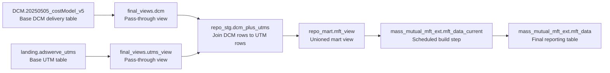

# `repo_stg.dcm_plus_utms` Lineage

This note documents the live lineage of `looker-studio-pro-452620.repo_stg.dcm_plus_utms`.

## What This Object Is

- BigQuery object: `looker-studio-pro-452620.repo_stg.dcm_plus_utms`
- Object type: `VIEW`
- Local deploy SQL: `scripts/sql/repo_stg__dcm_plus_utms.sql`
- Main job: take DCM delivery rows and add UTM fields to them

## High-Level Lineage



## Direct Upstream Parents

| Parent object | Type | Role in the view |
|---|---|---|
| `looker-studio-pro-452620.final_views.dcm` | View | Supplies the DCM delivery row that is kept as the base of the output |
| `looker-studio-pro-452620.final_views.utms_view` | View | Supplies UTM lookup rows used to enrich each DCM row |

## Lowest-Level Base Sources

| Base object | Type | How we know | Notes |
|---|---|---|---|
| `looker-studio-pro-452620.DCM.20250505_costModel_v5` | Base table | Live `final_views.dcm` definition | This is the DCM delivery source |
| `looker-studio-pro-452620.landing.adswerve_utms` | Base table | Live `final_views.utms_view` definition | This is the active UTM source |

## Step-By-Step Transformation Logic

### 1. Build `utm_exact`

The view starts by reading `final_views.utms_view` and keeping one UTM row for each exact key:

- key: `placement_id + creative_assignment`
- tie-break order:
  - newest `last_updated`
  - newest `placement_end_date`
  - newest `start`

This means the view picks the most recent UTM row when duplicate exact matches exist.

### 2. Build `utm_norm`

The view then prepares a Mass-row fallback lookup from the same UTM source with normalized text:

- `campaign_norm` = lowercase and trimmed `campaign`
- `placement_id_norm` = lowercase and trimmed `placement_id`
- `creative_norm` = lowercase and trimmed `creative_assignment` with `px` removed

It also deduplicates those normalized keys with the same "most recent row wins" rule.

### 3. Build `utm_loose`

The next fallback keeps the same normalized `campaign` and `placement_id`, then makes the creative key more forgiving:

- lowercase
- trim whitespace
- remove `px`
- remove all remaining internal whitespace
- strip a trailing size token such as `_0x0`, `_0 x 0`, or `_1x1`

This catches rows where DCM and the UTM sheet describe the same creative but disagree on size-token formatting.

### 4. Build `utm_extless`

The last fallback starts from the same loose creative key and also strips a trailing file-type suffix such as `_jpg`, `_jpeg`, `_png`, `_gif`, `_webp`, `_html5`, or `_mp4`.

This catches cases where the DCM creative name adds an asset suffix but the UTM row does not.

### 5. Build Placement-Name Rescue Lookups

After the creative-based lookup chain, the view prepares two placement-name-only rescue lookups:

- `utm_placement_campaign`
  - keyed by normalized `campaign + placement_id`
  - used when the placement exists for the same campaign but the creative still does not match
- `utm_placement_any`
  - keyed by normalized `placement_id`
  - used only after the same-campaign placement rescue misses, to catch placement rows where the campaign text differs but the placement_id exists in the UTM source

These rescue lookups only fill placement-level fields. They do not backfill creative-level UTM fields such as `utm_content`.

### 6. Final DCM Placement Fallback

If no UTM row exists even at the placement-only level, the view falls back to the live DCM `placement` field:

- `placement_name` <- `dcm.placement`
- `utm_placement_id` <- `dcm.placement_id`

This avoids blank placement metadata for delivery rows whose placement is present in DCM but missing entirely from the UTM source.
It is still not treated as a creative-level UTM match.

### 7. Join DCM Rows to UTM Rows

The main `joined` step starts from `final_views.dcm`, so every output row is anchored on a DCM row.

It first builds helper keys on the DCM side:

- `is_mass_row` = `package_roadblock LIKE '%MASS%'`
- `campaign_norm`
- `placement_id_norm`
- `creative_norm`
- `creative_loose_norm`
- `creative_extless_norm`

It then tries four joins in this order:

1. Exact join
   - `utm_exact.placement_id = dcm.placement_id`
   - `utm_exact.creative_assignment = dcm.creative`
2. Normalized Mass-row fallback
   - only runs when the exact join missed
   - only runs when `is_mass_row = TRUE`
   - matches on normalized `campaign`, normalized `placement_id`, and normalized `creative`
3. Loose Mass-row fallback
   - only runs when exact and normalized both missed
   - only runs when `is_mass_row = TRUE`
   - matches on normalized `campaign`, normalized `placement_id`, and size-stripped creative
4. Extension-stripped Mass-row fallback
   - only runs when the first three joins missed
   - only runs when `is_mass_row = TRUE`
   - matches on normalized `campaign`, normalized `placement_id`, and file-suffix-stripped creative
5. Same-campaign placement-name rescue
   - only runs when the first four joins missed
   - only runs when `is_mass_row = TRUE`
   - matches on normalized `campaign` and normalized `placement_id`
   - only fills placement-level fields
6. Placement-only rescue
   - only runs when the same-campaign placement rescue also missed
   - only runs when `is_mass_row = TRUE`
   - matches on normalized `placement_id`
   - only fills placement-level fields
7. Final DCM placement fallback
   - only applies after every UTM lookup misses
   - uses the live DCM `placement` field for `placement_name`
   - uses DCM `placement_id` for `utm_placement_id`
   - does not fill creative-level UTM fields

The UTM output fields use `COALESCE(exact, normalized, loose, extless)`, so the strictest match always wins when multiple fallback keys could match.

### 8. Add Output UTM Fields

The view keeps the DCM delivery columns and adds these enrichment fields:

- `utm_key`
- `utm_source`
- `utm_ad_name`
- `placement_name`
- `utm_placement_id`
- `utm_campaign`
- `utm_medium`
- `utm_content`
- `utm_term`
- `utm_creative_assignment`
- `utm_utm_key`

### 9. Deduplicate Final Rows

The last `ranked` step uses `ROW_NUMBER()` over `TO_JSON_STRING(joined)` and keeps `rn = 1`.

In plain English: if the full output row is identical more than once, the view keeps only one copy.

## Downstream Consumers

| Downstream object | How it uses `repo_stg.dcm_plus_utms` |
|---|---|
| `looker-studio-pro-452620.repo_mart.mft_view` | Reads it directly as the DCM branch of the unioned mart |
| `looker-studio-pro-452620.mass_mutual_mft_ext.mft_data_current` | Scheduled query aggregates from `repo_mart.mft_view` |
| `looker-studio-pro-452620.mass_mutual_mft_ext.mft_data` | Final reporting table built from `mft_data_current` plus historical backfill |

## Important Non-Dependencies

These objects are easy to confuse with the lineage, but they are not direct parents of `repo_stg.dcm_plus_utms`:

- `looker-studio-pro-452620.repo_stg.dcm_plus_utms_upload`
  - used in the Basis branch, not in this DCM view
- `giant-spoon-299605.data_model_2025.mm_utms_snapshot`
  - appears as a commented historical reference in the live `final_views.utms_view` text
  - it is not the active source that `repo_stg.dcm_plus_utms` reads today

## How To Re-Check This Later

Use the project guardrail wrapper so the checks stay small and safe:

```bash
./scripts/bq-safe-query.sh --max-rows 20 --sql "SELECT table_name, view_definition FROM \`looker-studio-pro-452620.repo_stg.INFORMATION_SCHEMA.VIEWS\` WHERE table_name = 'dcm_plus_utms'"
```

```bash
./scripts/bq-safe-query.sh --max-rows 20 --sql "SELECT table_name, view_definition FROM \`looker-studio-pro-452620.final_views.INFORMATION_SCHEMA.VIEWS\` WHERE table_name IN ('dcm','utms_view') ORDER BY table_name"
```

```bash
./scripts/bq-safe-query.sh --max-rows 20 --sql "SELECT table_name, view_definition FROM \`looker-studio-pro-452620.repo_mart.INFORMATION_SCHEMA.VIEWS\` WHERE table_name = 'mft_view'"
```

```bash
./scripts/bq-safe-query.sh --allow-select-star --file scripts/sql/qa__repo_stg__dcm_plus_utms_mass_validation.sql
```

```bash
./scripts/bq-safe-query.sh --allow-select-star --file scripts/sql/qa__repo_stg__dcm_plus_utms_mass_exceptions.sql
```

Use this validation order so you do not confuse SQL-join misses with bad source tags:

1. Validate completeness first on the Mass reporting slice:
   - `date >= DATE '2025-01-01'`
   - `package_roadblock LIKE '%MASS%'`
   - `impressions > 10`
2. Read the validation summary before looking at samples:
   - confirm row-count stability
   - confirm `match_type` distribution
   - confirm the remaining `unmatched` rows are isolated enough to inspect separately
3. Read the exception output before changing SQL:
   - if the remaining misses group into “no placement in UTMs” or true creative mismatches, treat them as source exceptions
   - if the misses group into one repeatable formatting pattern, consider whether a new fallback rule is justified
4. For matched rows, validate `utm_content` against IDs first:
   - `package_id` should appear in `utm_content`
   - `placement_id` should also appear, but group misses before pulling daily rows because one wrong source tag can repeat many times
5. Validate creative fidelity with `utm_creative_assignment`, not with `utm_content`:
   - `utm_content` often abbreviates creative names
   - compare DCM `creative` to `utm_creative_assignment` using the normalization level implied by the winning `match_type`
6. Treat placement-name rescue separately from creative rescue:
   - a placement-only rescue can safely fill `placement_name` and `utm_placement_id`
   - it should not be treated as proof that creative-level UTM fields are safe to reuse
7. Treat final DCM placement fallback as the last resort:
   - it can remove blank placement names safely when DCM itself already has the placement label
   - it should still be counted separately from real UTM matches when explaining residual UTM nulls

## Evidence Used For This Note

- Local SQL in `scripts/sql/repo_stg__dcm_plus_utms.sql`
- Local QA SQL in `scripts/sql/qa__repo_stg__dcm_plus_utms_mass_validation.sql`
- Local QA SQL in `scripts/sql/qa__repo_stg__dcm_plus_utms_mass_exceptions.sql`
- Live BigQuery view metadata for:
  - `repo_stg.dcm_plus_utms`
  - `final_views.dcm`
  - `final_views.utms_view`
  - `repo_mart.mft_view`
