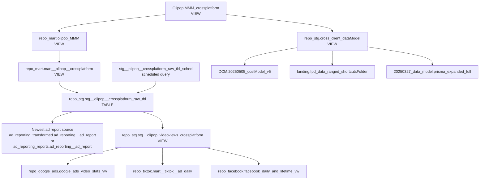

# Olipop SQL Folder Guide

This folder holds a small set of Olipop-specific SQL assets.

Verified against live BigQuery on `2026-03-31`. When a local SQL file and the live warehouse object disagree, this guide treats the live BigQuery object as the source of truth.

## What Is In This Folder

| File | Target object | Plain-English purpose | In the current `Olipop.MMM_crossplatform` graph? | Live alignment |
| --- | --- | --- | --- | --- |
| `olipop_MMM.sql` | `looker-studio-pro-452620.repo_mart.olipop_MMM` | Builds the weekly Olipop social summary used by the top-level MMM view. | Yes | Matches the live view definition. |
| `stg__olipop_vidlength.sql` | `looker-studio-pro-452620.repo_stg.stg__olipop_vidlength` | Creates a cross-platform lookup of ad-to-video duration metadata. | No | Matches the live view definition closely and points to the same live object. |
| `stg__ad_group_history_deduped.sql` | `looker-studio-pro-452620.repo_google_ads.stg__ad_group_history_deduped` | Keeps only the newest Google Ads ad-group-history row per `id`. | No | The live table exists with the expected schema; the object itself is a table, so BigQuery does not store the build SQL on the table metadata. |

## Live `Olipop.MMM_crossplatform` Dependency Graph



## Dependency Write-Up

### 1. `looker-studio-pro-452620.Olipop.MMM_crossplatform`

- Type: view
- Role: top-level weekly MMM output for Olipop
- Live behavior:
  - Builds a `social` branch from `repo_mart.olipop_MMM`
  - Builds a `digital` branch from `repo_stg.cross_client_dataModel`
  - Returns `data_source`, `package`, `Product`, `Tactic`, `date_week`, `impressions`, `clicks`, and `spend`
- Important live filters:
  - The digital branch keeps rows where `advertiser_name LIKE "%Olipop%"`
  - The digital branch also keeps rows where `campaign_name LIKE "%26%"`
- Notes:
  - The `social` branch hardcodes `data_source = "social"` and `package = ""`
  - The `digital` branch hardcodes `data_source = "digital"` and uses `package_name` as `package`

### 2. `looker-studio-pro-452620.repo_mart.olipop_MMM`

- Type: view
- Local file: `olipop_MMM.sql`
- Role: weekly social summary feeding the `social` branch of `Olipop.MMM_crossplatform`
- Live behavior:
  - Reads from `repo_mart.mart__olipop__crossplatform`
  - Filters to `date_day >= '2025-01-01'`
  - Filters to rows where `LOWER(account_name)` contains `olipop`
  - Maps platform names into reporting tactics:
    - `google_ads` -> `OLV`
    - `tiktok_ads` -> `TikTok`
    - `facebook_ads` -> `Meta`
    - `linkedin_ads` -> `LinkedIn`
  - Aggregates to weekly grain with `DATE_TRUNC(date_day, WEEK(SUNDAY))`

### 3. `looker-studio-pro-452620.repo_mart.mart__olipop__crossplatform`

- Type: view
- Current live role: thin pass-through layer over `repo_stg.stg__olipop__crossplatform_raw_tbl`
- Current live definition:

```sql
select * from looker-studio-pro-452620.repo_stg.stg__olipop__crossplatform_raw_tbl
```

- Important note:
  - The nearby repo file [`sql/marts/olipop/mart__olipop__crossplatform.sql`](../sql/marts/olipop/mart__olipop__crossplatform.sql) is related, but it is not a clean copy of the live production path anymore. Its comments describe `mart__olipop__crossplatform`, but its DDL target is `repo_stg.stg__olipop__crossplatform_raw`.

### 4. `stg__olipop__crossplatform_raw_tbl_sched` -> `repo_stg.stg__olipop__crossplatform_raw_tbl`

- Type:
  - scheduled query -> table
- Role: operational builder for the social raw fact table
- Schedule:
  - daily at `10:00 UTC`
- Live scheduled-query update time:
  - `2026-02-23`
- Live behavior:
  - Chooses the freshest delivery table at runtime by comparing `last_modified_time` from:
    - `giant-spoon-299605.ad_reporting_transformed.__TABLES__`
    - `giant-spoon-299605.ad_reporting_reports.__TABLES__`
  - The two candidate delivery tables are:
    - `giant-spoon-299605.ad_reporting_transformed.ad_reporting__ad_report`
    - `giant-spoon-299605.ad_reporting_reports.ad_reporting__ad_report`
  - Reads from exactly one candidate per run, not both
  - Left joins `repo_stg.stg__olipop_videoviews_crossplatform`
  - Adds `video_flag = 'video'` only when `COALESCE(video_play, 0) + COALESCE(video_view, 0) > 0`
- Why this matters:
  - The live scheduled query is the real production source for the raw table
  - The checked-in SQL nearby is older and does not include the runtime source-selection logic
  - The query appears to be designed to protect the build from source lag or source transitions by preferring the fresher delivery table
- Which copy is stale:
  - Production is newer here
  - The stale copy is the local repo SQL in [`sql/marts/olipop/mart__olipop__crossplatform.sql`](../sql/marts/olipop/mart__olipop__crossplatform.sql)
  - That local file hardcodes `ad_reporting_transformed.ad_reporting__ad_report` and therefore no longer describes the live production builder exactly

### 5. `looker-studio-pro-452620.repo_stg.stg__olipop_videoviews_crossplatform`

- Type: view
- Local file: [`sql/stg/stg__olipop_videoviews_crossplatform.sql`](../sql/stg/stg__olipop_videoviews_crossplatform.sql)
- Role: standardized cross-platform video-metrics layer used by the raw social table build
- Live inputs:
  - `repo_google_ads.google_ads_video_stats_vw`
  - `repo_tiktok.mart__tiktok__ad_daily`
  - `repo_facebook.facebook_daily_and_lifetime_vw`
- Live output grain:
  - one row per source/platform plus ad plus day
- Key output fields:
  - `video_play`
  - `video_view`
  - `video_views_p_25`
  - `video_views_p_50`
  - `video_views_p_75`
  - `video_views_p_100`
  - `hookrate_num`

### 6. `looker-studio-pro-452620.repo_stg.cross_client_dataModel`

- Type: view
- Role: digital planning-plus-delivery layer feeding the `digital` branch of `Olipop.MMM_crossplatform`
- This object is not defined in this folder, but it is a direct dependency of the top-level MMM view
- Live behavior:
  - Starts from `DCM.20250505_costModel_v5`
  - Aggregates and normalizes original FPD from `landing.fpd_data_ranged_shortcutsFolder`
  - Aggregates Prisma planning rows from `20250327_data_model.prisma_expanded_full`
  - Full outer joins DCM, FPD, and Prisma by package/date
  - Creates final delivery metrics with `COALESCE(fpd_*, dcm_*)`
  - Adds package-level plan-vs-actual rollups and package-overdelivery flags
  - Joins back the latest Prisma package metadata

### 7. Leaf Dependencies

These are the lowest visible objects in the live graph we inspected during this documentation pass:

| Object | Role in the graph | Primary documentation location |
| --- | --- | --- |
| `giant-spoon-299605.ad_reporting_transformed.ad_reporting__ad_report` | Candidate raw delivery source for the social raw-table build | Documented in this README as a live dependency summary |
| `giant-spoon-299605.ad_reporting_reports.ad_reporting__ad_report` | Alternate candidate raw delivery source for the social raw-table build | Documented in this README as a live dependency summary |
| `repo_google_ads.google_ads_video_stats_vw` | Google Ads video-metrics source | [`sql/stg/stg__olipop_videoviews_crossplatform.sql`](../sql/stg/stg__olipop_videoviews_crossplatform.sql) and this README |
| `repo_tiktok.mart__tiktok__ad_daily` | TikTok video-metrics source | [`sql/stg/stg__olipop_videoviews_crossplatform.sql`](../sql/stg/stg__olipop_videoviews_crossplatform.sql) and this README |
| `repo_facebook.facebook_daily_and_lifetime_vw` | Facebook video-metrics source | [`sql/stg/stg__olipop_videoviews_crossplatform.sql`](../sql/stg/stg__olipop_videoviews_crossplatform.sql) and this README |
| `DCM.20250505_costModel_v5` | DCM delivery/cost-model source for the digital branch | [`docs/SCHEDULED_QUERIES.md`](../docs/SCHEDULED_QUERIES.md) section `mm_dcm_costmodel` and [`sql/base/dcm/20250505_costModel_v5.sql`](../sql/base/dcm/20250505_costModel_v5.sql) |
| `landing.fpd_data_ranged_shortcutsFolder` | Original FPD source for the digital branch | [`FPD/FPD_loader/README.md`](../FPD/FPD_loader/README.md), [`util/data_loaders/FPD_loader/README.md`](../util/data_loaders/FPD_loader/README.md), and this README |
| `20250327_data_model.prisma_expanded_full` | Prisma planning source for the digital branch | [`docs/SCHEDULED_QUERIES.md`](../docs/SCHEDULED_QUERIES.md) section `Prisma_expanded` and this README |

## Script-By-Script Explanation

### `olipop_MMM.sql`

This is the one file in this folder that sits directly in the current live `Olipop.MMM_crossplatform` chain.

What it does:

- reads from `repo_mart.mart__olipop__crossplatform`
- keeps only Olipop account rows
- rolls daily rows into weekly rows
- normalizes tactic names so reporting uses friendlier labels than raw platform codes

Why it exists:

- the top-level `Olipop.MMM_crossplatform` view wants a weekly social summary, not raw ad-day rows

### `stg__olipop_vidlength.sql`

This file builds a small helper view that maps ads to video durations across:

- TikTok
- Facebook
- Google Ads / YouTube

What it outputs:

- `ad_id`
- `ad_name`
- `video_id`
- `duration`
- `video_name`

Current role:

- useful as a video metadata helper
- not referenced by the current live `Olipop.MMM_crossplatform` graph we inspected
- not referenced elsewhere in the local repo search from this documentation pass

### `stg__ad_group_history_deduped.sql`

This file creates one latest-row-per-`id` table from raw Google Ads ad-group history.

What it does:

- partitions rows by ad-group `id`
- orders rows by `updated_at DESC, _fivetran_synced DESC`
- keeps only `ROW_NUMBER() = 1`

Why it exists:

- Google Ads history tables can contain multiple versions of the same ad group
- downstream joins are much safer when they see only the newest version of each record

Current role:

- not used by the current live `Olipop.MMM_crossplatform` graph
- used locally by [`sql/google_ads/stg__ga__combined_history.sql`](../sql/google_ads/stg__ga__combined_history.sql)

## Important Live-vs-Local Drift

| Item | Live BigQuery behavior | Local repo behavior | What to trust for production |
| --- | --- | --- | --- |
| `repo_stg.stg__olipop__crossplatform_raw_tbl` | Built by scheduled query `stg__olipop__crossplatform_raw_tbl_sched`; compares `ad_reporting_transformed` vs `ad_reporting_reports`, picks the fresher source at runtime, and sets `video_flag` from actual plays/views | Related checked-in SQL in [`sql/marts/olipop/mart__olipop__crossplatform.sql`](../sql/marts/olipop/mart__olipop__crossplatform.sql) hardcodes `ad_reporting_transformed` and contains older naming/comments | Trust the live scheduled query and live table metadata |
| `repo_mart.mart__olipop__crossplatform` | Simple live pass-through to `repo_stg.stg__olipop__crossplatform_raw_tbl` | Nearby checked-in SQL mixes raw-table build logic with mart naming | Trust the live view definition first |

## Quick Reference

- Top-level output: `looker-studio-pro-452620.Olipop.MMM_crossplatform`
- Social branch entrypoint in this folder: `olipop_MMM.sql`
- Digital branch entrypoint outside this folder: `looker-studio-pro-452620.repo_stg.cross_client_dataModel`
- Main operational builder to remember: scheduled query `stg__olipop__crossplatform_raw_tbl_sched`
