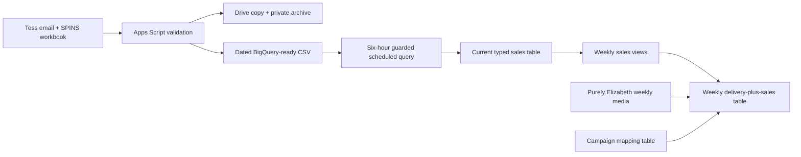

# Purely Elizabeth Sales Reporting

> **Dashboard migration:** The weekly dashboard table adds `product_group_sales_dollars` and `product_group_tdp` as the replacements for `sales_dollars` and `sales_tdp`. The old fields remain temporarily as identical Protein Granola-only compatibility copies. Follow the [weekly sales dashboard migration guide](/Users/eugenetsenter/Looker_clonedRepo/looker_personal/purely_elizabeth/WEEKLY_SALES_DASHBOARD_MIGRATION.md) before the old fields are removed.

This project turns weekly SPINS sales deliveries into verified BigQuery reporting outputs. Gmail and Apps Script preserve each delivery, while a guarded BigQuery scheduled query selects the newest valid snapshot and refreshes the reporting source automatically.

For a short, non-technical overview, use the [Purely Elizabeth sales refresh workflow guide](/Users/eugenetsenter/Looker_clonedRepo/looker_personal/purely_elizabeth/PURELY_ELIZABETH_SALES_REFRESH_WORKFLOW.docx).

## Pipeline Overview

```text
Tess email + SPINS workbook
    -> Drive copy + private Cloud Storage archive
    -> dated BigQuery-ready CSV
    -> six-hour guarded BigQuery scheduled query
    -> current typed sales table
    -> weekly product reporting views
    -> weekly media-and-sales comparison table
```



## Source and Output Contract

| Surface | Purpose | Grain | Current state |
|---|---|---|---|
| [BigQuery-ready external table](https://console.cloud.google.com/bigquery?project=looker-studio-pro-452620&ws=!1m5!1m4!4m3!1slooker-studio-pro-452620!2sPE!3ssales_data_bigquery_ready_external) | Reads immutable dated CSV snapshots from the private bucket | Source row plus source filename | Live |
| [Current typed SPINS sales table](https://console.cloud.google.com/bigquery?project=looker-studio-pro-452620&ws=!1m5!1m4!4m3!1slooker-studio-pro-452620!2sPE!3ssales_data_current) | Newest snapshot that passed the full source contract | Geography, week, and product level | Live; refreshed every six hours |
| [Weekly Protein Granola view](https://console.cloud.google.com/bigquery?project=looker-studio-pro-452620&ws=!1m5!1m4!4m3!1slooker-studio-pro-452620!2sPE!3sprotein_granola_weekly_sales) | Adds Dollar sales and TDP across the approved product and geography set | One row per week | Live and verified |
| [Campaign mapping table](https://console.cloud.google.com/bigquery?project=looker-studio-pro-452620&ws=!1m5!1m4!4m3!1slooker-studio-pro-452620!2sPE!3spurely_elizabeth_campaign_product_mapping) | Assigns product groups for sales eligibility; it never suppresses delivery | One row per advertiser and campaign | Live with two approved campaigns |
| [Delivery-plus-sales weekly table](https://console.cloud.google.com/bigquery?project=looker-studio-pro-452620&ws=!1m5!1m4!4m3!1slooker-studio-pro-452620!2smaster_ext_west!3smart_PE_delivery_plus_sales_weekly) | Compares weekly campaign plan and delivery with Protein Granola sales and TDP | One row per Sunday-ending week | Live; refreshed every six hours by `master_raw_CopyToWest` |
| [UPC comparison view](https://console.cloud.google.com/bigquery?project=looker-studio-pro-452620&ws=!1m5!1m4!4m3!1slooker-studio-pro-452620!2sPE!3ssales_upc_comparison_weekly) | Contains individual UPC rows and compares each UPC with its subcategory and Brand | Geography, week, and UPC | Live and verified |
| [Category, subcategory, and Brand sales view](https://console.cloud.google.com/bigquery?project=looker-studio-pro-452620&ws=!1m5!1m4!4m3!1slooker-studio-pro-452620!2sPE!3ssales_by_category_subcategory_brand_weekly) | Contains summarized category, subcategory, and Brand dollars, units, and TDP; it does not contain individual UPC rows | Geography, week, and product level | Live and verified |
| [Weekly view QA contract](/Users/eugenetsenter/Looker_clonedRepo/looker_personal/purely_elizabeth/protein_granola_weekly_sales.qa.json) | Checks date uniqueness, source coverage, and metric reconciliation | One validation run | Passed on July 14, 2026 |
| [Current-source refresh SQL](/Users/eugenetsenter/Looker_clonedRepo/looker_personal/purely_elizabeth/refresh_sales_data_current.sql) | Selects and validates the newest dated snapshot before replacing the typed table | One scheduled refresh | First automatic run passed on August 3, 2026 |
| [Current-source QA contract](/Users/eugenetsenter/Looker_clonedRepo/looker_personal/purely_elizabeth/sales_data_current.qa.json) | Checks schema, keys, coverage, dates, and metric parity | One validation run | Revalidated with zero failed checks on August 10, 2026 |

## Protein Granola Definition

| Filter | Included values |
|---|---|
| Geography | Total US - MULO; Total US - Natural Expanded Channel |
| Brand | Purely Elizabeth |
| Subcategory | Shelf Stable Granola & Muesli |
| Product level | UPC |
| UPCs | 08-10589-03259; 08-10589-03260; 08-10589-03261 |
| Metrics | Sum of Dollar sales; sum of TDP |

The geography result intentionally adds MULO and Natural Expanded. It is a reporting-defined combined total and does not claim that overlapping physical stores have been deduplicated.

## Verification

The SQL Change Guard passed with zero failed checks. It confirmed:

- One output row per week.
- No missing weekly dates.
- All three approved UPCs are present in the live source.
- Weekly Dollar sales reconcile to the filtered source within the allowed rounding tolerance.
- Weekly TDP reconciles to the filtered source within the allowed rounding tolerance.

Post-deployment verification returned 12 unique weekly rows, zero missing dates, $992,033.87 in Dollar sales, and 193.8 total TDP. The live totals matched the approved source calculation.

The delivery-plus-sales view passed all 10 pre-deployment SQL Change Guard checks. Live verification on July 15, 2026 returned 31 distinct Sunday-ending weeks: 11 sales-only, 19 media-only, and one overlapping week. Sales and TDP reconciled exactly, media measures reconciled within floating-point precision, and no campaign multiplication changed the sales totals.

Campaign mapping assigns a product group only when there is an exact advertiser-and-campaign match. Every campaign's delivery remains in the table: missing or blank mappings are labeled `UNMAPPED` and their sales measures are null. Only a mapped product group with a matching sales source can receive retail sales, so delivery is never silently excluded because its product is unknown.

The joined table reuses the main model's shared media-field names. Its product-specific retail metrics are `product_group_sales_dollars` and `product_group_tdp`; four additional fields provide Total Brand and Total Brand Granola benchmarks.

Production is intentionally metric-only: `_date`, each year-free mapped `product_group` or `UNMAPPED` delivery group, eight approved media measures, two product-group sales measures, and four Brand benchmark measures. Protein Granola populates the product-group measures only for `PROTEIN GRANOLA`; `UNMAPPED` rows retain media and keep every sales field blank.

## Production Sales Comparison Views

Use the [weekly UPC comparison view](https://console.cloud.google.com/bigquery?project=looker-studio-pro-452620&ws=!1m5!1m4!4m3!1slooker-studio-pro-452620!2sPE!3ssales_upc_comparison_weekly) when the chart starts with an individual UPC. It contains one row per week, geography, and UPC, plus that UPC's `subcategory_dollars` and `brand_dollars` comparisons.

Use the [weekly category, subcategory, and Brand sales view](https://console.cloud.google.com/bigquery?project=looker-studio-pro-452620&ws=!1m5!1m4!4m3!1slooker-studio-pro-452620!2sPE!3ssales_by_category_subcategory_brand_weekly) when the chart needs summarized totals rather than individual UPCs. It contains category, subcategory, and Brand rows and must be filtered to one `product_level` before summing `dollars`, `units`, or `tdp`.

The views retain the source terms `category`, `subcategory`, `upc`, `product_level`, `dollars`, `units`, and `tdp`. In the summarized view, category and subcategory metrics sum the UPC rows, while Brand metrics use the source `BRAND` rows. [SPINS defines TDP](https://www.spins.com/cpg-learning-center/glossary/tdp/) as the sum of item distribution points, so summing UPC `tdp` is the source-consistent category and subcategory calculation. The UPC comparison view adds only `subcategory_dollars`, `brand_dollars`, `upc_share_of_subcategory`, and `upc_share_of_brand`. Both production views reconciled to their source inputs on July 30, 2026.

### Source Freshness

The typed SPINS table is refreshed automatically every six hours from the newest valid dated object under the bucket's `bigquery_ready/` prefix. The refresh loads the complete latest file without requiring a fixed number of weeks. It rejects a snapshot before replacement unless its filename date matches its latest data week, every required value has the expected type, both source product levels are present, and the full source key is unique. The reporting views read this current table directly, so they need no manual rebuild.

## Gmail-to-Drive CSV Conversion and Cloud Storage Upload

The [Purely Elizabeth sales attachment downloader](/Users/eugenetsenter/Looker_clonedRepo/looker_personal/purely_elizabeth/download_purely_elizabeth_sales_attachment.gs) searches Gmail for the newest email from `tess.vargas@giantspoon.com` whose subject is exactly `Purely Elizabeth Sales Data`. It saves non-inline attachments into a `Purely Elizabeth Sales Data` folder in My Drive and remembers each saved attachment so a rerun does not create a duplicate.

For `.xlsx`, `.xls`, and `.ods` workbooks, the script also converts the attachment temporarily to Google Sheets. It finds tabs whose names start with `Data thru` followed by a valid date, such as `Data thru 7.12.26`, and exports only the tab with the latest date. The date may use periods, slashes, or hyphens and a two- or four-digit year. The script finds that tab's first row whose column A is `Geography`, removes every row above it, and writes `Geography` as the CSV's first cell. The temporary Google Sheets conversion is then moved to Trash; the original attachment and cleaned CSV remain in the destination Drive folder.

Before upload, the script checks the exact 22-column SPINS contract, row widths, required identifiers, date and numeric values, both `BRAND` and `UPC` product levels, the latest tab date, and uniqueness at the source's full dimension key. It does not require a fixed number of weeks. It then uploads the same bytes to two create-only locations: the readable archive filename at the bucket root and the scheduled-query input `bigquery_ready/YYYY-MM-DD.csv`. When either name already exists, the script accepts it only when both size and MD5 match; a different existing object causes a clear error and remains unchanged.

## Scheduled BigQuery Refresh

The [current-source refresh SQL](/Users/eugenetsenter/Looker_clonedRepo/looker_personal/purely_elizabeth/refresh_sales_data_current.sql) is the canonical warehouse load. The `Purely Elizabeth sales data current refresh` scheduled query runs every six hours in the `US` location. It recreates the external-table definition, profiles every dated ready file, chooses the latest passing snapshot, rechecks its complete row contract, and only then replaces the current typed table.

The first August 3, 2026 automatic run succeeded and loaded 34,042 rows across 156 weeks, from July 23, 2023 through July 12, 2026. On August 10, the scheduled source table rebuilt successfully from the same selected snapshot; the live contract again passed with zero duplicate keys and exact row, dollars, units, and TDP parity to the external file. All three production sales views and the sales-populated rows in the final delivery-plus-sales table end on July 12. The normal schedules remain every six hours.

### Set Up and Run

1. Open [Google Apps Script](https://script.google.com/) and create a new project.
2. Copy the complete contents of the [attachment downloader](/Users/eugenetsenter/Looker_clonedRepo/looker_personal/purely_elizabeth/download_purely_elizabeth_sales_attachment.gs) into the project's `Code.gs` file.
3. Open **Project Settings**, select **Show "appsscript.json" manifest file in editor**, and replace that manifest with the complete [project manifest](/Users/eugenetsenter/Looker_clonedRepo/looker_personal/purely_elizabeth/appsscript.json). The manifest enables Drive API v3 and the narrow Cloud Storage read/write scope.
4. In **Project Settings**, change the Google Cloud Platform project to project number `671028410185`, which is the active `looker-studio-pro-452620` project where the Cloud Storage API is enabled.
5. Select `downloadLatestPurelyElizabethSalesAttachment` at the top of the Apps Script editor and click **Run**.
6. Approve the expanded Gmail, Drive, Sheets, external-request, and Cloud Storage permissions. The execution log returns the Drive filenames, worksheet-selection note, uploaded or verified GCS object paths, and the Drive folder link.

### Cloud Storage Authorization Check

If the upload returns HTTP 403 `Insufficient Permission`, run `diagnosePurelyElizabethGcsAuthorization` from the Apps Script editor before retrying the upload. This read-only function reports:

- The effective Apps Script email and OAuth-token email.
- Whether the live token contains a Cloud Storage write scope.
- Whether that same token has `storage.objects.create` and `storage.objects.get` on the configured bucket.
- A plain-English diagnosis for the failed layer.

The local `gcloud` login and the Apps Script OAuth grant are separate credentials. Refreshing `gcloud` does not refresh Apps Script. When the diagnostic reports a missing write scope, replace the live [project manifest](/Users/eugenetsenter/Looker_clonedRepo/looker_personal/purely_elizabeth/appsscript.json), save it, run the diagnostic again, and approve the newly requested permissions. Do not rerun the upload until `hasStorageWriteScope` is `true` and `grantedBucketPermissions` includes `storage.objects.create`.

The script does not delete, move, label, or mark any email as read. It does not overwrite Cloud Storage objects. Its JavaScript syntax, manifest, dated-tab parsing, latest-date selection, header cleanup, source-contract validation, CSV escaping, create-only GCS request, size/MD5 proof, authorization diagnostics, duplicate prevention, and temporary-file cleanup passed local checks. The complete Apps Script workflow was verified live on August 3, 2026: a rerun selected `Data thru 7.12.26` and verified both the 10,722,295-byte archive object and the identical dated BigQuery-ready object without overwriting either one.

## Current State

The current typed source table, all three weekly sales views, and the sales-populated portion of the final delivery-plus-sales table are live through July 12, 2026. The typed table contains 34,042 rows across 156 weeks with zero duplicate business keys; the three sales views contain 156, 6,956, and 30,779 rows respectively, all ending July 12. The final weekly table has 172 total rows because it also carries future planned media through November 1, while its 156 sales-populated rows end July 12. The guarded source load and broader `master_raw_CopyToWest` workflow each run every six hours.
