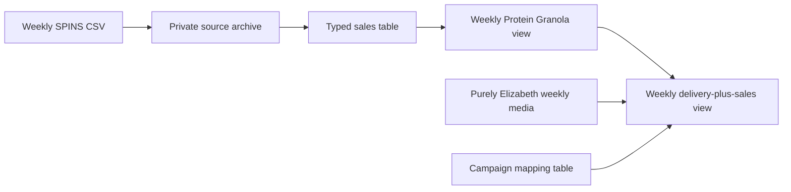

# Purely Elizabeth Sales Reporting

> **Dashboard migration:** The weekly dashboard table renamed `sales_dollars` to `product_group_sales_dollars` and `sales_tdp` to `product_group_tdp`, and added Total Brand and Total Brand Granola benchmarks. Follow the [weekly sales dashboard migration guide](/Users/eugenetsenter/Looker_clonedRepo/looker_personal/purely_elizabeth/WEEKLY_SALES_DASHBOARD_MIGRATION.md) before refreshing dashboard fields.

This project turns weekly SPINS sales deliveries into verified BigQuery reporting outputs. The first live output is a weekly Protein Granola sales view that passed both pre-deployment QA and post-deployment verification.

## Pipeline Overview

```text
Weekly SPINS CSV
    -> private Cloud Storage archive
    -> typed BigQuery sales table
    -> weekly product reporting views
    -> weekly media-and-sales comparison table
```



## Source and Output Contract

| Surface | Purpose | Grain | Current state |
|---|---|---|---|
| [Typed SPINS sales table](https://console.cloud.google.com/bigquery?project=looker-studio-pro-452620&ws=!1m5!1m4!4m3!1slooker-studio-pro-452620!2sPE!3ssales_data_260709) | Current loaded source data | Geography, week, and product level | Live |
| [Weekly Protein Granola view](https://console.cloud.google.com/bigquery?project=looker-studio-pro-452620&ws=!1m5!1m4!4m3!1slooker-studio-pro-452620!2sPE!3sprotein_granola_weekly_sales) | Adds Dollar sales and TDP across the approved product and geography set | One row per week | Live and verified |
| [Campaign mapping table](https://console.cloud.google.com/bigquery?project=looker-studio-pro-452620&ws=!1m5!1m4!4m3!1slooker-studio-pro-452620!2sPE!3spurely_elizabeth_campaign_product_mapping) | Assigns product groups for sales eligibility; it never suppresses delivery | One row per advertiser and campaign | Live with two approved campaigns |
| [Delivery-plus-sales weekly table](https://console.cloud.google.com/bigquery?project=looker-studio-pro-452620&ws=!1m5!1m4!4m3!1slooker-studio-pro-452620!2smaster_ext_west!3smart_PE_delivery_plus_sales_weekly) | Compares weekly campaign plan and delivery with Protein Granola sales and TDP | One row per Sunday-ending week | Live and verified; refreshed every two hours by `master_raw_CopyToWest` |
| [Weekly view QA contract](/Users/eugenetsenter/Looker_clonedRepo/looker_personal/purely_elizabeth/protein_granola_weekly_sales.qa.json) | Checks date uniqueness, source coverage, and metric reconciliation | One validation run | Passed on July 14, 2026 |

## Protein Granola Definition

| Filter | Included values |
|---|---|
| Geography | Total US - MULO; Total US - Natural Expanded Channel |
| Brand | Purely Elizabeth |
| Subcategory | Shelf Stable Granola & Muesli |
| Product level | UPC |
| UPCs | 08-10589-03259; 08-10589-03260; 08-10589-03261 |
| Metrics | Sum of Dollar sales; sum of TDP |

The geography result intentionally adds MULO and Natural Expanded. It is a reporting-defined combined total and does not claim that overlapping physical stores have been deduplicated.

## Verification

The SQL Change Guard passed with zero failed checks. It confirmed:

- One output row per week.
- No missing weekly dates.
- All three approved UPCs are present in the live source.
- Weekly Dollar sales reconcile to the filtered source within the allowed rounding tolerance.
- Weekly TDP reconciles to the filtered source within the allowed rounding tolerance.

Post-deployment verification returned 12 unique weekly rows, zero missing dates, $992,033.87 in Dollar sales, and 193.8 total TDP. The live totals matched the approved source calculation.

The delivery-plus-sales view passed all 10 pre-deployment SQL Change Guard checks. Live verification on July 15, 2026 returned 31 distinct Sunday-ending weeks: 11 sales-only, 19 media-only, and one overlapping week. Sales and TDP reconciled exactly, media measures reconciled within floating-point precision, and no campaign multiplication changed the sales totals.

Campaign mapping assigns a product group only when there is an exact advertiser-and-campaign match. Every campaign's delivery remains in the table: missing or blank mappings are labeled `UNMAPPED` and their sales measures are null. Only a mapped product group with a matching sales source can receive retail sales, so delivery is never silently excluded because its product is unknown.

The joined table reuses the main model's shared media-field names. Its product-specific retail metrics are `product_group_sales_dollars` and `product_group_tdp`; four additional fields provide Total Brand and Total Brand Granola benchmarks.

Production is intentionally metric-only: `_date`, each year-free mapped `product_group` or `UNMAPPED` delivery group, eight approved media measures, two product-group sales measures, and four Brand benchmark measures. Protein Granola populates the product-group measures only for `PROTEIN GRANOLA`; `UNMAPPED` rows retain media and keep every sales field blank.

## Current State

The weekly Protein Granola sales view, campaign mapping table, and delivery-plus-sales weekly table are live. The table is rebuilt by the existing `master_raw_CopyToWest` scheduled query every two hours. The original weekly SPINS source-loading process is still manual; loading a new source week is reflected on the next successful scheduled refresh.
