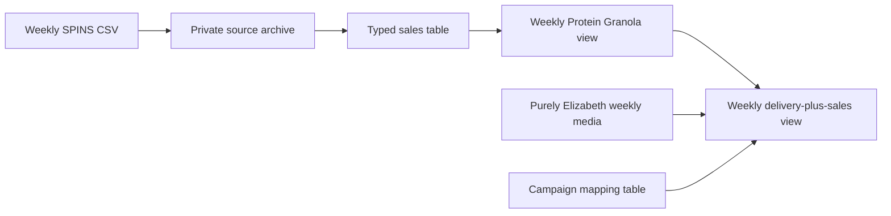

# Purely Elizabeth Sales Reporting

This project turns weekly SPINS sales deliveries into verified BigQuery reporting outputs. The first live output is a weekly Protein Granola sales view that passed both pre-deployment QA and post-deployment verification.

## Pipeline Overview

```text
Weekly SPINS CSV
    -> private Cloud Storage archive
    -> typed BigQuery sales table
    -> weekly product reporting views
    -> weekly media-and-sales comparison view
```



## Source and Output Contract

| Surface | Purpose | Grain | Current state |
|---|---|---|---|
| [Typed SPINS sales table](https://console.cloud.google.com/bigquery?project=looker-studio-pro-452620&ws=!1m5!1m4!4m3!1slooker-studio-pro-452620!2sPE!3ssales_data_260709) | Current loaded source data | Geography, week, and product level | Live |
| [Weekly Protein Granola view](https://console.cloud.google.com/bigquery?project=looker-studio-pro-452620&ws=!1m5!1m4!4m3!1slooker-studio-pro-452620!2sPE!3sprotein_granola_weekly_sales) | Adds Dollar sales and TDP across the approved product and geography set | One row per week | Live and verified |
| [Campaign mapping table](https://console.cloud.google.com/bigquery?project=looker-studio-pro-452620&ws=!1m5!1m4!4m3!1slooker-studio-pro-452620!2sPE!3spurely_elizabeth_campaign_product_mapping) | Explicitly includes or excludes campaigns from product reporting | One row per advertiser and campaign | Live with two approved campaigns |
| [Delivery-plus-sales weekly view](https://console.cloud.google.com/bigquery?project=looker-studio-pro-452620&ws=!1m5!1m4!4m3!1slooker-studio-pro-452620!2smaster_ext_west!3smart_PE_delivery_plus_sales_weekly) | Compares weekly campaign plan and delivery with Protein Granola sales and TDP | One row per Sunday-ending week | Live and verified |
| [Weekly view QA contract](/Users/eugenetsenter/Looker_clonedRepo/looker_personal/purely_elizabeth/protein_granola_weekly_sales.qa.json) | Checks date uniqueness, source coverage, and metric reconciliation | One validation run | Passed on July 14, 2026 |

## Protein Granola Definition

| Filter | Included values |
|---|---|
| Geography | Total US - MULO; Total US - Natural Expanded Channel |
| Brand | Purely Elizabeth |
| Subcategory | Shelf Stable Granola & Muesli |
| Product level | UPC |
| UPCs | 08-10589-03259; 08-10589-03260; 08-10589-03261 |
| Metrics | Sum of Dollar sales; sum of TDP |

The geography result intentionally adds MULO and Natural Expanded. It is a reporting-defined combined total and does not claim that overlapping physical stores have been deduplicated.

## Verification

The SQL Change Guard passed with zero failed checks. It confirmed:

- One output row per week.
- No missing weekly dates.
- All three approved UPCs are present in the live source.
- Weekly Dollar sales reconcile to the filtered source within the allowed rounding tolerance.
- Weekly TDP reconciles to the filtered source within the allowed rounding tolerance.

Post-deployment verification returned 12 unique weekly rows, zero missing dates, $992,033.87 in Dollar sales, and 193.8 total TDP. The live totals matched the approved source calculation.

The delivery-plus-sales view passed all 10 pre-deployment SQL Change Guard checks. Live verification on July 15, 2026 returned 31 distinct Sunday-ending weeks: 11 sales-only, 19 media-only, and one overlapping week. Sales and TDP reconciled exactly, media measures reconciled within floating-point precision, and no campaign multiplication changed the sales totals.

Campaign classification gives exact mapping rows precedence over the normalized-name fallback. Exact exclusions override the fallback; exact included rows supply the product group; unmapped names containing `proteingranola` are included and flagged for review; all other campaigns are excluded. Missing media or sales measures remain null so unavailable values are distinguishable from real zeros.

The joined view reuses the main model's shared media-field names, including `_date`, `_campaign_name`, `_planned_spend`, `_planned_impressions`, `_spend`, `_impressions`, and `_clicks`. Its retail metrics are `sales_dollars` and `sales_tdp`; the selected product remains identified separately by `product_group`.

Production is intentionally metric-only: `_date`, each year-free mapped `product_group` with media delivery, eight approved media measures, `sales_dollars`, and `sales_tdp`. The current Protein Granola sales source joins only to `PROTEIN GRANOLA`; other delivered product groups remain media-only until matching sales sources exist.

## Current State

The weekly Protein Granola sales view, campaign mapping table, and delivery-plus-sales weekly view are live. The original weekly SPINS source-loading process is still manual; design and approval of an automated weekly refresh remain separate future work. Loading a new source week updates the joined view automatically through its sales-view dependency.
