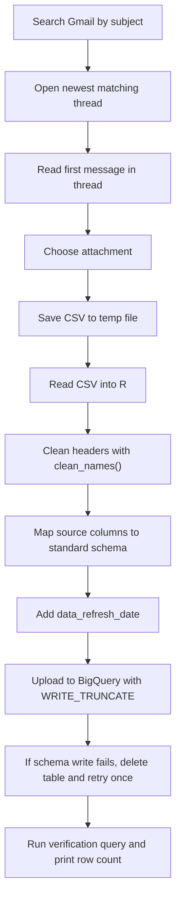

# TV Gmail Loaders

Detailed documentation for the two TV estimate loaders in this folder:

- `gmail_to_bq__tv_local.r`
- `gmail_to_bq__tv_nat.r`

These scripts do one job: they find the newest TV estimate CSV attachment in Gmail, reshape the file into one shared table shape, and upload the result into BigQuery.

## What These Loaders Do

Use these scripts when the latest TV estimate file arrives by email and needs to be refreshed into BigQuery.

- The local loader writes to `looker-studio-pro-452620.landing.tv_local_estimates`
- The national loader writes to `looker-studio-pro-452620.landing.tv_national_estimates`

Both loaders follow the same broad pattern:

1. Search Gmail for the latest matching TV email.
2. Open the newest matching thread.
3. Download one CSV attachment to a temporary local file.
4. Read the CSV into R.
5. Clean the column names with `janitor::clean_names()`.
6. Map source-specific column names into one standard output schema.
7. Add `data_refresh_date = today()`.
8. Replace the full target BigQuery table with the new data.
9. Run a simple verification query to print row count and latest refresh date.

## Files In Scope

```text
util/data_loaders/
├── gmail_to_bq__tv_local.r
├── gmail_to_bq__tv_nat.r
└── README.md
```

## Quick Start

Run these commands from:
`/Users/eugenetsenter/Looker_clonedRepo/looker_personal/util/data_loaders`

```bash
Rscript gmail_to_bq__tv_local.r
Rscript gmail_to_bq__tv_nat.r
```

Expected result if a run succeeds:

- the script finds the latest matching Gmail message
- the attachment downloads without error
- the CSV is converted into the standard output columns
- the BigQuery table is fully refreshed
- the console prints the latest `data_refresh_date` and row count

## Authentication And Access

These scripts depend on your local Google authentication already being set up in R.

They need access to:

- Gmail, to search messages and download attachments
- BigQuery, to replace the destination table

Loaded packages:

- `gmailr`
- `lubridate`
- `googlesheets4`
- `tidyverse`
- `stringr`
- `janitor`
- `bigrquery` during the write step

## Shared Loader Flow



## Standard Output Schema

Both scripts produce the same main output shape before upload:

| Column | Meaning |
| --- | --- |
| `year` | Calendar year from the source file |
| `quarter` | Quarter label from the source file |
| `month` | Numeric month |
| `date` | Daily date for the estimate row |
| `advertiser` | Advertiser name |
| `type` | `Local` or `National` |
| `campaign_name` | Campaign name |
| `program_name` | Program name |
| `market` | Market label |
| `media_outlet` | Network, station, or outlet |
| `net_cost` | Cost value used for reporting |
| `net_impressions` | Impression count after the script multiplies source values by 1,000 |
| `total_units` | Planned units or spots |
| `data_refresh_date` | Run date added just before BigQuery upload |

## Runner-Owned Verification

These loader scripts no longer own the detailed source-vs-table validation.

That verification now lives under the universal runner project:

- `/Users/eugenetsenter/Docs/R_Studio_Projects/universal_cron_runner/verifications/`

When these loaders run through the universal runner, the runner now:

1. snapshots the `Incoming` TV file before the load
2. snapshots the `Pre-update` BigQuery table before overwrite
3. runs the loader
4. snapshots the `Post-update` BigQuery table after overwrite
5. prints one machine-readable `*_VALIDATION|...` line for the status helper

This runner-owned check is meant to catch problems like:

- the incoming file has real impressions but the final table does not
- the post-update table changes by the wrong amount
- the incoming max date and post-update max date no longer line up

## Local Loader

**Script:** `gmail_to_bq__tv_local.r`  
**Target table:** `looker-studio-pro-452620.landing.tv_local_estimates`

### Gmail Search Rule

The local loader searches Gmail with:

```text
subject:"TV | Local | daily scheadule" -National
```

This is intended to keep the search focused on local-TV estimate emails and exclude national ones.

### Attachment Choice

The local script currently takes the first attachment returned from the first message in the newest matching thread.

That means the loader assumes:

- the newest relevant thread is first in the Gmail results
- the first message in that thread has the file you want
- the first attachment in that message is the correct CSV

This is simpler than the national script, but it is also a little more fragile if the email format changes.

### Row Filtering

After loading the CSV and cleaning the headers:

- if a `month` column exists, rows with blank `month` are removed

This is likely being used as a simple way to drop footer rows or incomplete rows.

### Local Column Mapping

The local loader checks multiple possible source names because the incoming CSV headers have changed over time.

#### Cost field

It uses the first matching column from this list:

1. `total_net_cost`
2. `total_net`
3. `total_planned_net`

#### Impressions field

It uses the first matching column from this list:

1. `total_total_impressions_buyers_estimate`
2. `total_planned_impressions_all_demos_000`
3. `total_planned_impressions`

#### Units field

It uses the first matching column from this list:

1. `total_units`
2. `total_planned_spots`

### Local Transform Notes

- `type` is hard-coded to `Local`
- `net_impressions` becomes `0` if the mapped source field is missing
- otherwise `net_impressions` is multiplied by `1000`

## National Loader

**Script:** `gmail_to_bq__tv_nat.r`  
**Target table:** `looker-studio-pro-452620.landing.tv_national_estimates`

### Gmail Search Rule

The national loader searches Gmail with:

```text
subject:"TV | National | daily scheadule" -Local
```

### Attachment Choice

The national script is more defensive than the local one.

It:

- filters attachments to `.csv`
- sorts by file size
- chooses the smallest CSV attachment

The comment says this is meant to avoid hard-coding a filename and stay resilient if attachment names change.

### Row Filtering

After loading the CSV and cleaning the headers:

- if an `advertiser` column exists, rows with blank `advertiser` are removed

This appears to be the national loader's main cleanup rule for dropping empty rows.

### National Column Mapping

#### Media outlet field

The loader checks:

1. `media_outlet`
2. `mediaoutlet`

#### Cost field

The loader checks:

1. `total_cost`
2. `total_planned_amount`

Then it multiplies the chosen value by `0.85`.

This means the national loader is not just renaming the incoming cost field. It is also applying a built-in adjustment before upload.

#### Impressions field

The loader first checks planned-impression fields:

1. `total_impressions_buyers_estimate`
2. `total_planned_impressions_all_demos`
3. `total_planned_impressions_000`
4. `total_planned_impressions`

If none of those produce a value, it falls back to objective-impression fields:

1. `total_objective_impressions`
2. `total_objective_impressions_000`

This fallback behavior is especially important because the national CSV header has changed recently.

#### Units field

The loader checks:

1. `total_units`
2. `total_planned_spots`

### National Transform Notes

- `type` is set from `type <- "National"` near the top of the script
- `net_impressions` becomes `0` if all checked source columns are missing
- otherwise `net_impressions` is multiplied by `1000`
- there is a temporary `net_cost_broken = total_planned_net` assignment inside the mutate step, but it is not selected into the final uploaded table

## Side-By-Side Differences

| Area | Local loader | National loader |
| --- | --- | --- |
| Gmail query | `subject:"TV | Local | daily scheadule" -National` | `subject:"TV | National | daily scheadule" -Local` |
| Output table | `landing.tv_local_estimates` | `landing.tv_national_estimates` |
| Attachment strategy | first attachment | smallest CSV attachment |
| Row filter | drop rows with blank `month` if `month` exists | drop rows with blank `advertiser` if `advertiser` exists |
| Cost mapping | chooses first matching net-cost field | chooses first matching cost field, then multiplies by `0.85` |
| Type label | hard-coded `Local` | set from top-level variable `National` |
| Impressions fallback depth | several planned-impression variants | planned-impression variants, then objective-impression fallback |

## BigQuery Write Behavior

Both scripts use the same write pattern.

### Normal path

1. Create a BigQuery table reference.
2. Upload data with `write_disposition = "WRITE_TRUNCATE"`.
3. Print a success message.
4. Run a verification query grouped by `data_refresh_date`.

### Schema error fallback

If BigQuery returns an error that looks like a schema mismatch, such as a changed column type or incompatible field:

1. the script prints the error
2. it tries to delete the destination table
3. it retries the upload once

If the retry also fails, the script sends a failure email to the authenticated Gmail user.

### Failure email behavior

On write failure, the script attempts to email the authenticated user with:

- timestamp
- project
- dataset
- table
- error type
- error details

Note: the local loader's email body still says the message came from the "TV National data loader script." That text is only in the alert body, but it is misleading for local-loader failures.

## Important Assumptions

These scripts currently assume:

- Gmail returns the newest relevant thread first
- the first message in the thread is the right message to inspect
- the attachment layout is stable enough for the chosen selection rule
- the incoming CSV still contains the expected core business columns
- the impression columns are stored in thousands and should be multiplied by `1000`
- full-table replacement is acceptable for these landing tables

## Common Run Checks

After running a loader, check:

1. Did the console print `matches script run date: TRUE` for the email date?
2. Did the script print a BigQuery success message?
3. Did the verification query show a current `data_refresh_date`?
4. Does the row count look reasonable compared with the previous run?
5. Are `net_impressions` non-zero for rows that should have delivery?

## Troubleshooting

### No Gmail threads found

Possible causes:

- the subject line changed
- the Gmail account is not authenticated
- the latest message is older than expected or archived differently

What to check:

- run the search pieces manually in Gmail
- confirm the exact subject spelling, including the current `scheadule` typo in the hard-coded search string
- confirm your Gmail token still works in R

### Attachment is wrong or missing

Possible causes:

- the email structure changed
- the correct file is no longer the first attachment
- the national email now includes a different "smallest" CSV than before

What to check:

- inspect `gm_attachments(my_msg)` output
- compare filenames and sizes
- confirm the selected attachment is the real TV schedule export

### `net_impressions` is zero everywhere

Possible causes:

- the source column name changed again
- the chosen fallback path missed the real field
- the source file stored impressions in a different unit than expected

What to check:

- print `names(raw_df)`
- compare the actual cleaned column names against the mapping lists in the script
- inspect a few raw CSV rows before the final `mutate()`

### BigQuery schema mismatch

What the script does:

- detects a likely schema error from the message text
- deletes the existing table
- retries the upload once

If that still fails:

- read the failure email details
- compare the new dataframe structure to the existing warehouse expectations
- inspect column classes in `df`

## Suggested Safe Improvements

These are not required for the loaders to work today, but they would make the workflow safer:

1. Use one shared helper function so local and national stay easier to maintain together.
2. Save a copy of the chosen attachment into a dated debug folder before upload.
3. Add a stricter attachment-selection rule for the local loader.
4. Add explicit validation checks for required columns before the BigQuery write.
5. Fix the alert-body text in the local loader so it says "TV Local" instead of "TV National".
6. Add a small dry-run mode that prints the chosen columns and row counts without writing to BigQuery.

## When To Edit These Scripts

Update the scripts when:

- the email subject line changes
- the attachment naming pattern changes
- a source CSV header changes
- the business rule for cost or impressions changes
- the BigQuery destination table changes

If the issue is only documentation, update this file first so future debugging starts from an accurate runbook.

## Related Files

- [`/Users/eugenetsenter/Looker_clonedRepo/looker_personal/util/data_loaders/gmail_to_bq__tv_local.r`](/Users/eugenetsenter/Looker_clonedRepo/looker_personal/util/data_loaders/gmail_to_bq__tv_local.r)
- [`/Users/eugenetsenter/Looker_clonedRepo/looker_personal/util/data_loaders/gmail_to_bq__tv_nat.r`](/Users/eugenetsenter/Looker_clonedRepo/looker_personal/util/data_loaders/gmail_to_bq__tv_nat.r)
- [`/Users/eugenetsenter/Looker_clonedRepo/looker_personal/README.md`](/Users/eugenetsenter/Looker_clonedRepo/looker_personal/README.md)
- [`/Users/eugenetsenter/Looker_clonedRepo/looker_personal/CHANGELOG.md`](/Users/eugenetsenter/Looker_clonedRepo/looker_personal/CHANGELOG.md)
